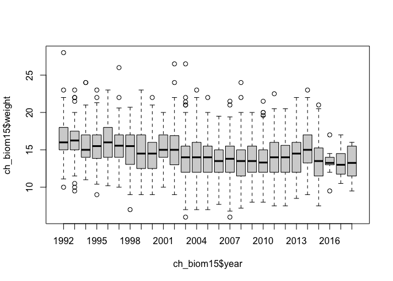
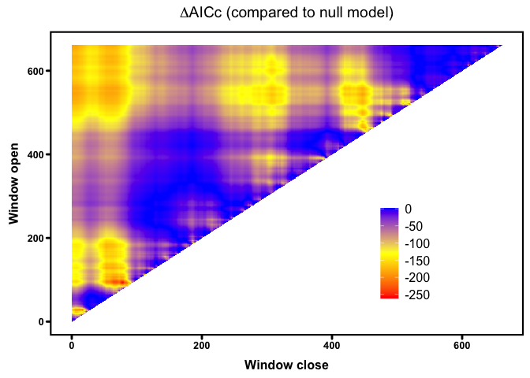
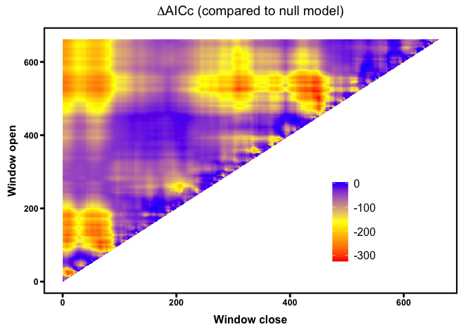
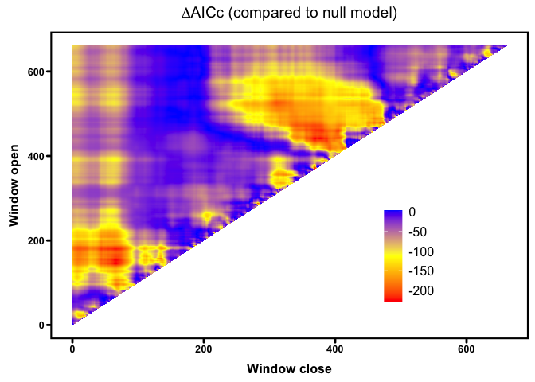
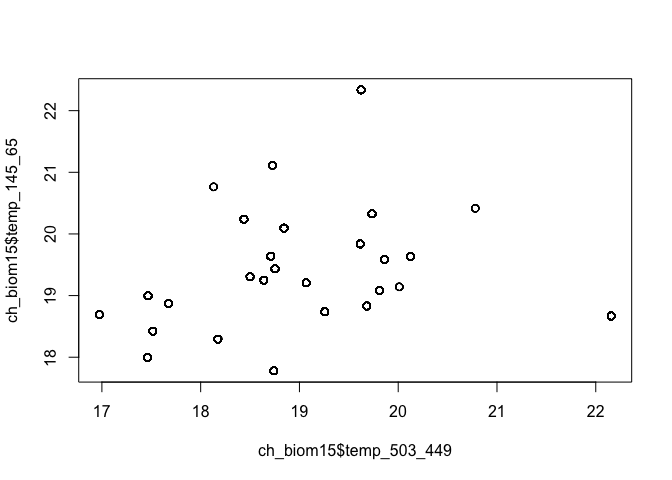
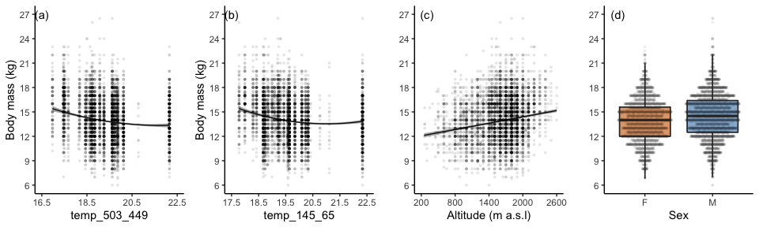
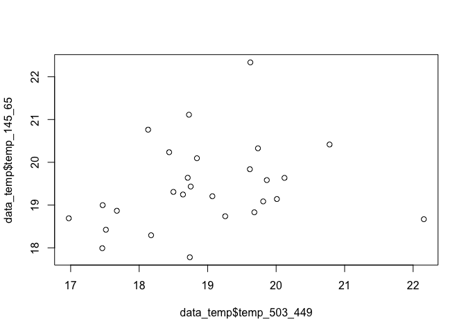
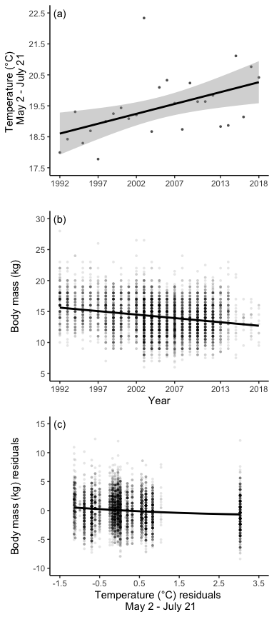

Supplementary materials and codes for the manuscript.


# Libraries and datasets

```r
# load the packages
library(dplyr)
library(snakecase)
library(climwin)
library(tidyr)
library(ggplot2)
library(effects)
library(lme4)
library(lmerTest)
```

R session information is printed here for repeatability.

```r
sessionInfo()
```

```
## R version 4.2.2 (2022-10-31)
## Platform: aarch64-apple-darwin20 (64-bit)
## Running under: macOS Ventura 13.3.1
## 
## Matrix products: default
## LAPACK: /Library/Frameworks/R.framework/Versions/4.2-arm64/Resources/lib/libRlapack.dylib
## 
## locale:
## [1] en_US.UTF-8/en_US.UTF-8/en_US.UTF-8/C/en_US.UTF-8/en_US.UTF-8
## 
## attached base packages:
## [1] stats     graphics  grDevices utils     datasets  methods   base     
## 
## other attached packages:
##  [1] sjPlot_2.8.12    lmerTest_3.1-3   lme4_1.1-31      effects_4.2-2   
##  [5] carData_3.0-5    tidyr_1.2.1      climwin_1.2.3    Matrix_1.5-3    
##  [9] gridExtra_2.3    ggplot2_3.4.0    snakecase_0.11.0 dplyr_1.0.10    
## 
## loaded via a namespace (and not attached):
##  [1] nlme_3.1-161        lubridate_1.9.1     insight_0.18.8     
##  [4] evd_2.3-6.1         numDeriv_2016.8-1.1 bslib_0.4.2        
##  [7] tools_4.2.2         backports_1.4.1     utf8_1.2.2         
## [10] R6_2.5.1            sjlabelled_1.2.0    vipor_0.4.5        
## [13] DBI_1.1.3           mgcv_1.8-41         colorspace_2.1-0   
## [16] nnet_7.3-18         withr_2.5.0         tidyselect_1.2.0   
## [19] emmeans_1.8.4-1     compiler_4.2.2      performance_0.10.2 
## [22] cli_3.6.0           sass_0.4.5          labeling_0.4.2     
## [25] bayestestR_0.13.0   scales_1.2.1        mvtnorm_1.1-3      
## [28] systemfonts_1.0.4   stringr_1.5.0       httpgd_1.3.0       
## [31] digest_0.6.31       minqa_1.2.5         rmarkdown_2.20     
## [34] pkgconfig_2.0.3     htmltools_0.5.4     MuMIn_1.47.1       
## [37] highr_0.10          fastmap_1.1.0       rlang_1.0.6        
## [40] jquerylib_0.1.4     farver_2.1.1        generics_0.1.3     
## [43] jsonlite_1.8.4      magrittr_2.0.3      parameters_0.20.1  
## [46] Rcpp_1.0.10         ggbeeswarm_0.7.1    munsell_0.5.0      
## [49] fansi_1.0.4         lifecycle_1.0.3     stringi_1.7.12     
## [52] yaml_2.3.7          MASS_7.3-58.2       plyr_1.8.8         
## [55] grid_4.2.2          sjmisc_2.8.9        lattice_0.20-45    
## [58] cowplot_1.1.1       ggeffects_1.1.4     splines_4.2.2      
## [61] sjstats_0.18.2      knitr_1.41          pillar_1.8.1       
## [64] boot_1.3-28.1       estimability_1.4.1  effectsize_0.8.2   
## [67] stats4_4.2.2        glue_1.6.2          evaluate_0.20      
## [70] mitools_2.4         modelr_0.1.10       vctrs_0.5.2        
## [73] nloptr_2.0.3        gtable_0.3.1        purrr_1.0.1        
## [76] reshape_0.8.9       assertthat_0.2.1    datawizard_0.6.5   
## [79] cachem_1.0.6        xfun_0.36           xtable_1.8-4       
## [82] broom_1.0.2         survey_4.1-1        coda_0.19-4        
## [85] later_1.3.0         survival_3.5-0      RcppRoll_0.3.0     
## [88] tibble_3.1.8        beeswarm_0.4.0      timechange_0.2.0   
## [91] ellipsis_0.3.2
```

## The datasets
The data analysed in this study are the records of the Ticino hunting bags from 1992 to 2018. In Ticino, hunting starts at the beginning of September and the harvest plan is mostly completed within three weeks.

Data were collected from the Alps in Ticino, the southernmost canton of Switzerland, over an area of 2700 km2 with an altitude varying from 250 to 2700 m asl. The climate in the mountain range is Alpine, with temperatures varying from mean temperatures of -12℃ in winter to mean temperatures of 15.5 ℃ in summer. The hottest and the sunniest month of the year is July with an average maximum temperature of 25℃, measured in the biggest city in the canton Lugano (World Weather & Climate Information, 2021). 

Overall, 34 017 animals were legally shot during the hunting period ranging from an age of 0.5 to 22.5 years old. All animals were sexed, aged and weighted (eviscerated). Both males and females have horns all year-round, even though female ones tend to be shorter. For the estimation of the age of the shot chamois, measurement of the teeth and the growth rings of their horns were used (Schroder and Elsner-Schack 1985).


```r
# load the data
ch_biom <- read.csv("data/data.csv", stringsAsFactors = T, na = c("", "NA"))
clim <- read.csv("data/swiss_weather.csv", stringsAsFactors = T, na = c("", "NA"))

colnames(ch_biom) <- snakecase::to_snake_case(colnames(ch_biom))

# fixing some variables
ch_biom$date_ymd <- as.Date(paste(ch_biom$year, ch_biom$month, ch_biom$day), "%Y %m %d")
clim$date_ymd <- as.Date(clim$date, "%Y/%m/%d")
ch_biom$year_f <- as.factor(ch_biom$year)
```

### Subset

 Due to the nature of the dataset, only information on individuals shot in September was available, so for the purpose of this study, only a 1.5-year-old animals were considered (7127 individuals, 3257 females and 3870 males). As chamois are usually weaned at 3 to 6 months of age (Scornavacca et al. 2018), a 1.5-year-old individual has been feeding on their own for nearly a year, is fully grown but still very vulnerable to external abiotic and biotic threats due to the decrease in maternal care and increase in active grazing behaviour. 


```r
# get only data with 1.5 years old individuals
ch_biom15 <- ch_biom[, c("no", "year", "year_f", "date_ymd", "altitude", "age", "sex", "weight", "district_capture")]

ch_biom15 <- ch_biom15 %>%
    drop_na() %>%
    filter(age == "1.5")

boxplot(ch_biom15$weight ~ ch_biom15$year)
```

<!-- -->

```r
ch_biom15$altitude_sc <- scale(ch_biom15$altitude)
ch_biom15$year_sc <- scale(ch_biom15$year)
```


# Statistical Analysis

As the use of arbitrary climate periods do not always explain the biological response in the best way possible (van de Pol et al. 2016), we investigated the variation weight of 1.5-year-old individuals in relation to the variation of mean ambient temperature using the R package climwin, and the function slidingwin which detects the exact time window when a biological variable is most strongly affected by climate (Bailey and van de Pol 2016). 
The overall approach for the climwin analysis is to compare the support by the data for competing hypotheses and to formalize them into regression models (van de Pol et al., 2016). Competing models are based upon a baseline model (without the addition of weather effects) and ranked using the ΔAICc, or the difference in terms of the Akaike Information Criterion values calculated for a small sample size between the baseline model and the model of interest. The model with the best support from the data has the lowest ΔAICc among competing models. The baseline model was a linear model with the body mass of the yearling chamois in relation to sex and elevation. The function slidingwin creates a candidate set of competing models testing windows of different lengths for the weather variable of interest, in this study the mean daily ambient temperature (℃). Non-linear effects of temperature on body weight were taken into account by checking for both linear and quadratic trends. As most of the chamois was shot during a two-week period at the end of September we chose an absolute time window for the analyses instead of an individual specific time window. As reference day we chose the last date of the shooting period (September 24th) and we looked for windows between September 24th and 661 days before (December 1st of 2 years before) to include the three critical periods of a young chamois life: gestation, lactation and yearling.  

## Selection of the base model


```r
ch_basemod <- lm(
    weight ~
        sex + altitude_sc,
    data = ch_biom15
)
```


## Climwin analysis

### Slidingwin
Using the function slidingwin allows to search for the best climatic window 


```r
# create model with ABSOLUTE time window with temperature for ALWAYS period
# for the period 1 Dec(-2) - 31May(-1)
ch_mass_sw <- slidingwin(
    baseline = ch_basemod,
    xvar = list(Temp = clim$Temp),
    type = "absolute",
    refday = c(24, 9),
    range = c(661, 0),
    stat = "mean",
    cdate = clim$date_ymd,
    bdate = ch_biom15$date_ymd,
    func = c("lin", "quad"),
    cmissing = FALSE,
    cinterval = "day"
)
save(ch_mass_sw, file = "output/ch_mass_sw_sc.rda")
```


#### Investigating the models


```r
load(file = "output/ch_mass_sw.rda")
```
__The best linear and quadratic windows__

For the sex + altitude model

```r
ch_mass_sw$combos
```

<div data-pagedtable="false">
  <script data-pagedtable-source type="application/json">
{"columns":[{"label":[""],"name":["_rn_"],"type":[""],"align":["left"]},{"label":["response"],"name":[1],"type":["chr"],"align":["left"]},{"label":["climate"],"name":[2],"type":["fct"],"align":["left"]},{"label":["type"],"name":[3],"type":["fct"],"align":["left"]},{"label":["stat"],"name":[4],"type":["fct"],"align":["left"]},{"label":["func"],"name":[5],"type":["fct"],"align":["left"]},{"label":["DeltaAICc"],"name":[6],"type":["dbl"],"align":["right"]},{"label":["WindowOpen"],"name":[7],"type":["int"],"align":["right"]},{"label":["WindowClose"],"name":[8],"type":["dbl"],"align":["right"]}],"data":[{"1":"weight","2":"Temp","3":"absolute","4":"mean","5":"lin","6":"-262.02","7":"93","8":"78","_rn_":"1"},{"1":"weight","2":"Temp","3":"absolute","4":"mean","5":"quad","6":"-325.33","7":"503","8":"449","_rn_":"2"}],"options":{"columns":{"min":{},"max":[10]},"rows":{"min":[10],"max":[10]},"pages":{}}}
  </script>
</div>


The 10 best linear models sorted by deltaAICc:

```r
head(ch_mass_sw[[1]]$Dataset, 10)
```

<div data-pagedtable="false">
  <script data-pagedtable-source type="application/json">
{"columns":[{"label":[""],"name":["_rn_"],"type":[""],"align":["left"]},{"label":["deltaAICc"],"name":[1],"type":["dbl"],"align":["right"]},{"label":["WindowOpen"],"name":[2],"type":["int"],"align":["right"]},{"label":["WindowClose"],"name":[3],"type":["dbl"],"align":["right"]},{"label":["ModelBeta"],"name":[4],"type":["dbl"],"align":["right"]},{"label":["Std.Error"],"name":[5],"type":["dbl"],"align":["right"]},{"label":["ModelBetaQ"],"name":[6],"type":["lgl"],"align":["right"]},{"label":["ModelBetaC"],"name":[7],"type":["lgl"],"align":["right"]},{"label":["ModelInt"],"name":[8],"type":["dbl"],"align":["right"]},{"label":["Function"],"name":[9],"type":["chr"],"align":["left"]},{"label":["Furthest"],"name":[10],"type":["dbl"],"align":["right"]},{"label":["Closest"],"name":[11],"type":["dbl"],"align":["right"]},{"label":["Statistics"],"name":[12],"type":["chr"],"align":["left"]},{"label":["Type"],"name":[13],"type":["chr"],"align":["left"]},{"label":["K"],"name":[14],"type":["dbl"],"align":["right"]},{"label":["ModWeight"],"name":[15],"type":["dbl"],"align":["right"]},{"label":["sample.size"],"name":[16],"type":["int"],"align":["right"]},{"label":["Reference.day"],"name":[17],"type":["dbl"],"align":["right"]},{"label":["Reference.month"],"name":[18],"type":["dbl"],"align":["right"]},{"label":["Randomised"],"name":[19],"type":["chr"],"align":["left"]}],"data":[{"1":"-262.0178","2":"93","3":"78","4":"-0.3687283","5":"0.06984322","6":"NA","7":"NA","8":"20.02483","9":"lin","10":"661","11":"0","12":"mean","13":"absolute","14":"0","15":"0.670235058","16":"27","17":"24","18":"9","19":"no","_rn_":"4387"},{"1":"-258.9846","2":"92","3":"78","4":"-0.3697390","5":"0.06985599","6":"NA","7":"NA","8":"20.04881","9":"lin","10":"661","11":"0","12":"mean","13":"absolute","14":"0","15":"0.147081642","16":"27","17":"24","18":"9","19":"no","_rn_":"4293"},{"1":"-257.4804","2":"93","3":"79","4":"-0.3561051","5":"0.06986595","6":"NA","7":"NA","8":"19.75982","9":"lin","10":"661","11":"0","12":"mean","13":"absolute","14":"0","15":"0.069332204","16":"27","17":"24","18":"9","19":"no","_rn_":"4386"},{"1":"-256.9085","2":"93","3":"77","4":"-0.3703596","5":"0.06987779","6":"NA","7":"NA","8":"20.05171","9":"lin","10":"661","11":"0","12":"mean","13":"absolute","14":"0","15":"0.052089702","16":"27","17":"24","18":"9","19":"no","_rn_":"4388"},{"1":"-255.0189","2":"94","3":"78","4":"-0.3612606","5":"0.06989115","6":"NA","7":"NA","8":"19.85934","9":"lin","10":"661","11":"0","12":"mean","13":"absolute","14":"0","15":"0.020249729","16":"27","17":"24","18":"9","19":"no","_rn_":"4482"},{"1":"-254.0068","2":"92","3":"79","4":"-0.3562154","5":"0.06988134","6":"NA","7":"NA","8":"19.76495","9":"lin","10":"661","11":"0","12":"mean","13":"absolute","14":"0","15":"0.012207940","16":"27","17":"24","18":"9","19":"no","_rn_":"4292"},{"1":"-253.1840","2":"93","3":"76","4":"-0.3651544","5":"0.06990195","6":"NA","7":"NA","8":"19.92758","9":"lin","10":"661","11":"0","12":"mean","13":"absolute","14":"0","15":"0.008090647","16":"27","17":"24","18":"9","19":"no","_rn_":"4389"},{"1":"-252.6979","2":"92","3":"77","4":"-0.3699672","5":"0.06989799","6":"NA","7":"NA","8":"20.04401","9":"lin","10":"661","11":"0","12":"mean","13":"absolute","14":"0","15":"0.006344982","16":"27","17":"24","18":"9","19":"no","_rn_":"4294"},{"1":"-252.0185","2":"95","3":"78","4":"-0.3552180","5":"0.06991180","6":"NA","7":"NA","8":"19.73050","9":"lin","10":"661","11":"0","12":"mean","13":"absolute","14":"0","15":"0.004517444","16":"27","17":"24","18":"9","19":"no","_rn_":"4578"},{"1":"-251.1182","2":"94","3":"79","4":"-0.3500659","5":"0.06991023","6":"NA","7":"NA","8":"19.62480","9":"lin","10":"661","11":"0","12":"mean","13":"absolute","14":"0","15":"0.002880107","16":"27","17":"24","18":"9","19":"no","_rn_":"4481"}],"options":{"columns":{"min":{},"max":[10]},"rows":{"min":[10],"max":[10]},"pages":{}}}
  </script>
</div>


The deltaAIC plot for linear and quadratic:

```r
plotdelta(dataset = ch_mass_sw[[1]]$Dataset)
```

<!-- -->

```r
plotdelta(dataset = ch_mass_sw[[2]]$Dataset)
```

<!-- -->

__Choosing the simplest model__

I can add the new variable to the dataset and obtain the dates for the window:

```r
# The best supported climate variable can be attached
# to the original dataset for further analyses
ch_biom15$temp_503_449 <- ch_mass_sw[[2]]$BestModelData$climate
```
Dates of this window

```r
as.Date("2022/09/24", format = "%Y/%m/%d") - 503
```

```
## [1] "2021-05-09"
```

```r
as.Date("2022/09/24", format = "%Y/%m/%d") - 449
```

```
## [1] "2021-07-02"
```


### Testing for other windows

We build a model based the same base model selected before but with the addition of the climatic variable for the considered window. 

We are now able to look for other temporal windows that might be of importance for the chamois growth, but controlling for correlation with the temporal window already in the model.


```r
ch_mass_sw_lm2 <- slidingwin(
    baseline = lm(
        weight ~
            sex + altitude_sc +
            temp_503_449,
        data = ch_biom15
    ),
    xvar = list(Temp = clim$Temp),
    type = "absolute",
    refday = c(24, 9),
    range = c(661, 0),
    stat = "mean",
    cdate = clim$date_ymd,
    bdate = ch_biom15$date_ymd,
    func = c("lin", "quad"),
    cmissing = FALSE,
    cinterval = "day"
)
save(ch_mass_sw_lm2, file = "output/ch_mass_sw_lm2.rda")
```

## results of this second slidingwin 


```r
load("output/ch_mass_sw_lm2.rda")
ch_mass_sw_lm2$combos
```

<div data-pagedtable="false">
  <script data-pagedtable-source type="application/json">
{"columns":[{"label":[""],"name":["_rn_"],"type":[""],"align":["left"]},{"label":["response"],"name":[1],"type":["chr"],"align":["left"]},{"label":["climate"],"name":[2],"type":["fct"],"align":["left"]},{"label":["type"],"name":[3],"type":["fct"],"align":["left"]},{"label":["stat"],"name":[4],"type":["fct"],"align":["left"]},{"label":["func"],"name":[5],"type":["fct"],"align":["left"]},{"label":["DeltaAICc"],"name":[6],"type":["dbl"],"align":["right"]},{"label":["WindowOpen"],"name":[7],"type":["int"],"align":["right"]},{"label":["WindowClose"],"name":[8],"type":["dbl"],"align":["right"]}],"data":[{"1":"weight","2":"Temp","3":"absolute","4":"mean","5":"lin","6":"-166.09","7":"637","8":"637","_rn_":"1"},{"1":"weight","2":"Temp","3":"absolute","4":"mean","5":"quad","6":"-229.21","7":"145","8":"65","_rn_":"2"}],"options":{"columns":{"min":{},"max":[10]},"rows":{"min":[10],"max":[10]},"pages":{}}}
  </script>
</div>

```r
plotdelta(dataset = ch_mass_sw_lm2[[2]]$Dataset)
```

<!-- -->

```r
ch_biom15$temp_145_65 <- ch_mass_sw_lm2[[2]]$BestModelData$climate
```
Dates of this window

```r
as.Date("2022/09/24", format = "%Y/%m/%d") - 145
```

```
## [1] "2022-05-02"
```

```r
as.Date("2022/09/24", format = "%Y/%m/%d") - 65
```

```
## [1] "2022-07-21"
```

## Summary of the model with 2 temperature windows


```r
ch_final <- lm(
    weight ~
        sex + altitude +
        poly(temp_503_449, 2) + poly(temp_145_65, 2),
    data = ch_biom15
)
summary(ch_final)
```

```
## 
## Call:
## lm(formula = weight ~ sex + altitude + poly(temp_503_449, 2) + 
##     poly(temp_145_65, 2), data = ch_biom15)
## 
## Residuals:
##     Min      1Q  Median      3Q     Max 
## -8.0251 -1.7845  0.0111  1.7251 12.3051 
## 
## Coefficients:
##                          Estimate Std. Error t value Pr(>|t|)    
## (Intercept)             1.187e+01  1.526e-01  77.775  < 2e-16 ***
## sexm                    4.958e-01  6.895e-02   7.191 7.27e-13 ***
## altitude                1.296e-03  9.061e-05  14.307  < 2e-16 ***
## poly(temp_503_449, 2)1 -3.195e+01  2.581e+00 -12.378  < 2e-16 ***
## poly(temp_503_449, 2)2  1.429e+01  3.262e+00   4.382 1.20e-05 ***
## poly(temp_145_65, 2)1  -2.215e+01  3.090e+00  -7.168 8.59e-13 ***
## poly(temp_145_65, 2)2   2.182e+01  2.787e+00   7.829 5.86e-15 ***
## ---
## Signif. codes:  0 '***' 0.001 '**' 0.01 '*' 0.05 '.' 0.1 ' ' 1
## 
## Residual standard error: 2.565 on 5628 degrees of freedom
## Multiple R-squared:  0.1119,	Adjusted R-squared:  0.111 
## F-statistic: 118.2 on 6 and 5628 DF,  p-value: < 2.2e-16
```


```r
library(sjPlot)

sjPlot::tab_model(ch_final,
    file = "Tables/Model_res.doc",
    string.est = "Estimate",
    string.se = "SE",
    show.ci = F,
    show.se = T,
    show.stat = T,
    show.df = F,
    digits = 3,
    digits.rsq = 2
)
```

<table style="border-collapse:collapse; border:none;">
<tr>
<th style="border-top: double; text-align:center; font-style:normal; font-weight:bold; padding:0.2cm;  text-align:left; ">&nbsp;</th>
<th colspan="4" style="border-top: double; text-align:center; font-style:normal; font-weight:bold; padding:0.2cm; ">weight</th>
</tr>
<tr>
<td style=" text-align:center; border-bottom:1px solid; font-style:italic; font-weight:normal;  text-align:left; ">Predictors</td>
<td style=" text-align:center; border-bottom:1px solid; font-style:italic; font-weight:normal;  ">Estimate</td>
<td style=" text-align:center; border-bottom:1px solid; font-style:italic; font-weight:normal;  ">SE</td>
<td style=" text-align:center; border-bottom:1px solid; font-style:italic; font-weight:normal;  ">Statistic</td>
<td style=" text-align:center; border-bottom:1px solid; font-style:italic; font-weight:normal;  ">p</td>
</tr>
<tr>
<td style=" padding:0.2cm; text-align:left; vertical-align:top; text-align:left; ">(Intercept)</td>
<td style=" padding:0.2cm; text-align:left; vertical-align:top; text-align:center;  ">11.867</td>
<td style=" padding:0.2cm; text-align:left; vertical-align:top; text-align:center;  ">0.153</td>
<td style=" padding:0.2cm; text-align:left; vertical-align:top; text-align:center;  ">77.775</td>
<td style=" padding:0.2cm; text-align:left; vertical-align:top; text-align:center;  "><strong>&lt;0.001</strong></td>
</tr>
<tr>
<td style=" padding:0.2cm; text-align:left; vertical-align:top; text-align:left; ">sex [m]</td>
<td style=" padding:0.2cm; text-align:left; vertical-align:top; text-align:center;  ">0.496</td>
<td style=" padding:0.2cm; text-align:left; vertical-align:top; text-align:center;  ">0.069</td>
<td style=" padding:0.2cm; text-align:left; vertical-align:top; text-align:center;  ">7.191</td>
<td style=" padding:0.2cm; text-align:left; vertical-align:top; text-align:center;  "><strong>&lt;0.001</strong></td>
</tr>
<tr>
<td style=" padding:0.2cm; text-align:left; vertical-align:top; text-align:left; ">altitude</td>
<td style=" padding:0.2cm; text-align:left; vertical-align:top; text-align:center;  ">0.001</td>
<td style=" padding:0.2cm; text-align:left; vertical-align:top; text-align:center;  ">0.000</td>
<td style=" padding:0.2cm; text-align:left; vertical-align:top; text-align:center;  ">14.307</td>
<td style=" padding:0.2cm; text-align:left; vertical-align:top; text-align:center;  "><strong>&lt;0.001</strong></td>
</tr>
<tr>
<td style=" padding:0.2cm; text-align:left; vertical-align:top; text-align:left; ">temp 503 449 [1st degree]</td>
<td style=" padding:0.2cm; text-align:left; vertical-align:top; text-align:center;  ">&#45;31.948</td>
<td style=" padding:0.2cm; text-align:left; vertical-align:top; text-align:center;  ">2.581</td>
<td style=" padding:0.2cm; text-align:left; vertical-align:top; text-align:center;  ">&#45;12.378</td>
<td style=" padding:0.2cm; text-align:left; vertical-align:top; text-align:center;  "><strong>&lt;0.001</strong></td>
</tr>
<tr>
<td style=" padding:0.2cm; text-align:left; vertical-align:top; text-align:left; ">temp 503 449 [2nd degree]</td>
<td style=" padding:0.2cm; text-align:left; vertical-align:top; text-align:center;  ">14.294</td>
<td style=" padding:0.2cm; text-align:left; vertical-align:top; text-align:center;  ">3.262</td>
<td style=" padding:0.2cm; text-align:left; vertical-align:top; text-align:center;  ">4.382</td>
<td style=" padding:0.2cm; text-align:left; vertical-align:top; text-align:center;  "><strong>&lt;0.001</strong></td>
</tr>
<tr>
<td style=" padding:0.2cm; text-align:left; vertical-align:top; text-align:left; ">temp 145 65 [1st degree]</td>
<td style=" padding:0.2cm; text-align:left; vertical-align:top; text-align:center;  ">&#45;22.150</td>
<td style=" padding:0.2cm; text-align:left; vertical-align:top; text-align:center;  ">3.090</td>
<td style=" padding:0.2cm; text-align:left; vertical-align:top; text-align:center;  ">&#45;7.168</td>
<td style=" padding:0.2cm; text-align:left; vertical-align:top; text-align:center;  "><strong>&lt;0.001</strong></td>
</tr>
<tr>
<td style=" padding:0.2cm; text-align:left; vertical-align:top; text-align:left; ">temp 145 65 [2nd degree]</td>
<td style=" padding:0.2cm; text-align:left; vertical-align:top; text-align:center;  ">21.821</td>
<td style=" padding:0.2cm; text-align:left; vertical-align:top; text-align:center;  ">2.787</td>
<td style=" padding:0.2cm; text-align:left; vertical-align:top; text-align:center;  ">7.829</td>
<td style=" padding:0.2cm; text-align:left; vertical-align:top; text-align:center;  "><strong>&lt;0.001</strong></td>
</tr>
<tr>
<td style=" padding:0.2cm; text-align:left; vertical-align:top; text-align:left; padding-top:0.1cm; padding-bottom:0.1cm; border-top:1px solid;">Observations</td>
<td style=" padding:0.2cm; text-align:left; vertical-align:top; padding-top:0.1cm; padding-bottom:0.1cm; text-align:left; border-top:1px solid;" colspan="4">5635</td>
</tr>
<tr>
<td style=" padding:0.2cm; text-align:left; vertical-align:top; text-align:left; padding-top:0.1cm; padding-bottom:0.1cm;">R<sup>2</sup> / R<sup>2</sup> adjusted</td>
<td style=" padding:0.2cm; text-align:left; vertical-align:top; padding-top:0.1cm; padding-bottom:0.1cm; text-align:left;" colspan="4">0.11 / 0.11</td>
</tr>

</table>


Sex difference estimated by the model:

```r
emmeans::emmeans(ch_final, "sex")
```

```
##  sex emmean     SE   df lower.CL upper.CL
##  f     13.6 0.0595 5628     13.5     13.7
##  m     14.1 0.0560 5628     14.0     14.2
## 
## Confidence level used: 0.95
```

Are the two variables correlated?

```r
cor.test(ch_biom15$temp_503_449, ch_biom15$temp_145_65, method = "pearson")
```

```
## 
## 	Pearson's product-moment correlation
## 
## data:  ch_biom15$temp_503_449 and ch_biom15$temp_145_65
## t = 6.3742, df = 5633, p-value = 1.986e-10
## alternative hypothesis: true correlation is not equal to 0
## 95 percent confidence interval:
##  0.05864304 0.11049066
## sample estimates:
##        cor 
## 0.08462413
```

```r
plot(ch_biom15$temp_503_449, ch_biom15$temp_145_65)
```

<!-- -->

Figure

```r
eff_data <- data.frame(effects::effect("poly(temp_503_449, 2)",
    ch_final,
    partial.residuals = T
))

plot_temp <- ggplot(eff_data, aes(x = temp_503_449, y = fit)) +
    geom_line() +
    geom_ribbon(
        data = eff_data, aes(ymin = lower, ymax = upper),
        linetype = 0, alpha = .4
    ) +
    xlab("Temperature (°C; 503-449)") +
    #    scale_x_continuous(
    #        breaks = c(year_sc$year_sc[c(seq(1, 23, 4))]),
    #        labels = c(year_sc$year[c(seq(1, 23, 4))]),
    #        limits = c(year_sc$year_sc[1], year_sc$year_sc[23])
    #    ) +
    theme(
        legend.position = "none",
        panel.grid.major = element_blank(),
        panel.grid.minor = element_blank(),
        panel.background = element_blank(),
        axis.line = element_line(colour = "black")
    ) +
    geom_point(
        data = ch_biom15,
        aes(x = temp_503_449, y = weight),
        size = 1, shape = 16, alpha = 0.1
    ) +
    ylab("Body mass (kg)") +
    scale_y_continuous(limits = c(6, 27), breaks = seq(0, 35, 3)) +
    scale_x_continuous(limits = c(16.5, 22.5), breaks = seq(16.5, 22.5, 1)) +
    annotate("text", x = 16.8, y = 27, label = "(a)")


eff_data <- data.frame(effects::effect("poly(temp_145_65, 2)",
    ch_final,
    partial.residuals = T
))

plot_temp2 <- ggplot(eff_data, aes(x = temp_145_65, y = fit)) +
    geom_line() +
    geom_ribbon(
        data = eff_data, aes(ymin = lower, ymax = upper),
        linetype = 0, alpha = .4
    ) +
    xlab("Temperature (°C; 145-65)") +
    #    scale_x_continuous(
    #        breaks = c(year_sc$year_sc[c(seq(1, 23, 4))]),
    #        labels = c(year_sc$year[c(seq(1, 23, 4))]),
    #        limits = c(year_sc$year_sc[1], year_sc$year_sc[23])
    #    ) +
    theme(
        legend.position = "none",
        panel.grid.major = element_blank(),
        panel.grid.minor = element_blank(),
        panel.background = element_blank(),
        axis.line = element_line(colour = "black")
    ) +
    geom_point(
        data = ch_biom15,
        aes(x = temp_145_65, y = weight),
        size = 1, shape = 16, alpha = 0.1
    ) +
    ylab("") +
    scale_y_continuous(limits = c(6, 27), breaks = seq(0, 35, 3)) +
    scale_x_continuous(limits = c(17.5, 22.5), breaks = seq(17.5, 22.5, 1)) +
    annotate("text", x = 17.8, y = 27, label = "(b)")


eff_data <- data.frame(effects::effect("altitude",
    ch_final,
    partial.residuals = T
))

plot_alt <- ggplot(eff_data, aes(x = altitude, y = fit)) +
    geom_line() +
    geom_ribbon(
        data = eff_data, aes(ymin = lower, ymax = upper),
        linetype = 0, alpha = .4
    ) +
    xlab("Altitude (m a.s.l)") +
    ylab("") +
    scale_y_continuous(limits = c(6, 27), breaks = seq(0, 35, 3)) +
    scale_x_continuous(limits = c(200, 2600), breaks = seq(200, 2600, 600)) +
    theme(
        legend.position = "none",
        panel.grid.major = element_blank(),
        panel.grid.minor = element_blank(),
        panel.background = element_blank(),
        axis.line = element_line(colour = "black")
    ) +
    geom_point(
        data = ch_biom15,
        aes(x = altitude, y = weight),
        size = 1, shape = 16, alpha = 0.1
    ) +
    annotate("text", x = 300, y = 27, label = "(c)")


eff_data <- data.frame(effects::effect("sex",
    ch_final,
    partial.residuals = T
))
par_col_af <- "darkorange3"
par_col_am <- "steelblue"
plot_sex <- ggplot(ch_biom15, aes(x = sex, y = weight, fill = sex)) +
    geom_boxplot(outlier.shape = NA, alpha = 0.5) +
    xlab("Sex") +
    theme(
        legend.position = "none",
        panel.grid.major = element_blank(),
        panel.grid.minor = element_blank(),
        panel.background = element_blank(),
        axis.line = element_line(colour = "black")
    ) +
    ggbeeswarm::geom_quasirandom(
        data = ch_biom15,
        aes(x = sex, y = weight, colour = "black"),
        size = 1, shape = 16, alpha = 0.07
    ) +
    ylab("") +
    scale_fill_manual(values = c(par_col_af, par_col_am)) +
    scale_color_manual(values = "black") +
    scale_y_continuous(limits = c(6, 27), breaks = seq(0, 35, 3)) +
    scale_x_discrete(labels = c("F", "M")) +
    annotate("text", x = 0.6, y = 27, label = "(d)") +
    geom_boxplot(outlier.shape = NA, alpha = 0.2)
```


```r
cowplot::plot_grid(
    plot_temp, plot_temp2, plot_alt, # plot_sex,
    nrow = 1, align = "v"
)
```




### Randwin

Using randwin to randomize the identity of the chamois (XXX ???) we are able to check if the window that wos found before is actually important, or the relationship was just random.


```r
# Performing randamization to identify
# likelyhood of of dignals occuring by chance

ch_mass_rand100 <- randwin(
    repeats = 100,
    baseline = ch_basemod,
    xvar = list(Temp = clim$Temp),
    type = "absolute",
    refday = c(24, 9),
    range = c(661, 0),
    stat = "mean",
    cdate = clim$date_ymd,
    bdate = ch_biom15$date_ymd,
    func = c("lin", "quad"),
    cmissing = FALSE,
    cinterval = "day",
    window = "sliding"
)
save(ch_mass_rand100, file = "output/ch_mass_rand100.rda")
```


```r
load("output/ch_mass_rand100.rda")

pvalue(
    datasetrand = ch_mass_rand100[[1]],
    dataset = ch_mass_sw[[1]]$Dataset, metric = "C", sample.size = 27
)
```

```
## [1] 0.0008034275
```

```r
pvalue(
    datasetrand = ch_mass_rand100[[2]],
    dataset = ch_mass_sw[[2]]$Dataset, metric = "C", sample.size = 27
)
```

```
## [1] 0.0002638776
```


## Long term trends


```r
data_temp <- subset(ch_biom15, !duplicated(year))
temp_lm <- lm(temp_503_449 ~ year, data_temp)
temp2_lm <- lm(temp_145_65 ~ year, data_temp)
weight_lm <- lm(weight ~ year, ch_biom15)


cor.test(data_temp$temp_503_449, data_temp$temp_145_65, method = "pearson")
```

```
## 
## 	Pearson's product-moment correlation
## 
## data:  data_temp$temp_503_449 and data_temp$temp_145_65
## t = 1.2381, df = 25, p-value = 0.2272
## alternative hypothesis: true correlation is not equal to 0
## 95 percent confidence interval:
##  -0.1536988  0.5684470
## sample estimates:
##       cor 
## 0.2403537
```

```r
plot(data_temp$temp_503_449, data_temp$temp_145_65)
```

<!-- -->

Decrease in weight (kg):

```r
(weight_lm$coeff[1] + 2018 * weight_lm$coeff[2]) - (weight_lm$coeff[1] + 1992 * weight_lm$coeff[2])
```

```
## (Intercept) 
##   -2.919858
```

Increase in temperature (°C):

```r
(temp_lm$coeff[1] + 2018 * temp_lm$coeff[2]) - (temp_lm$coeff[1] + 1992 * temp_lm$coeff[2])
```

```
## (Intercept) 
##     1.61847
```

Increase in temperature (°C):

```r
(temp2_lm$coeff[1] + 2018 * temp2_lm$coeff[2]) - (temp2_lm$coeff[1] + 1992 * temp2_lm$coeff[2])
```

```
## (Intercept) 
##    1.659338
```


```r
library(sjPlot)

sjPlot::tab_model(temp_lm,
    file = "Tables/model_temp_503_449s.doc",
    string.est = "Estimate",
    string.se = "SE",
    show.ci = F,
    show.se = T,
    show.stat = T,
    show.df = F,
    digits = 4,
    digits.rsq = 4
)
```

<table style="border-collapse:collapse; border:none;">
<tr>
<th style="border-top: double; text-align:center; font-style:normal; font-weight:bold; padding:0.2cm;  text-align:left; ">&nbsp;</th>
<th colspan="4" style="border-top: double; text-align:center; font-style:normal; font-weight:bold; padding:0.2cm; ">temp 503 449</th>
</tr>
<tr>
<td style=" text-align:center; border-bottom:1px solid; font-style:italic; font-weight:normal;  text-align:left; ">Predictors</td>
<td style=" text-align:center; border-bottom:1px solid; font-style:italic; font-weight:normal;  ">Estimate</td>
<td style=" text-align:center; border-bottom:1px solid; font-style:italic; font-weight:normal;  ">SE</td>
<td style=" text-align:center; border-bottom:1px solid; font-style:italic; font-weight:normal;  ">Statistic</td>
<td style=" text-align:center; border-bottom:1px solid; font-style:italic; font-weight:normal;  ">p</td>
</tr>
<tr>
<td style=" padding:0.2cm; text-align:left; vertical-align:top; text-align:left; ">(Intercept)</td>
<td style=" padding:0.2cm; text-align:left; vertical-align:top; text-align:center;  ">&#45;105.8285</td>
<td style=" padding:0.2cm; text-align:left; vertical-align:top; text-align:center;  ">51.9905</td>
<td style=" padding:0.2cm; text-align:left; vertical-align:top; text-align:center;  ">&#45;2.0355</td>
<td style=" padding:0.2cm; text-align:left; vertical-align:top; text-align:center;  ">0.053</td>
</tr>
<tr>
<td style=" padding:0.2cm; text-align:left; vertical-align:top; text-align:left; ">year</td>
<td style=" padding:0.2cm; text-align:left; vertical-align:top; text-align:center;  ">0.0622</td>
<td style=" padding:0.2cm; text-align:left; vertical-align:top; text-align:center;  ">0.0259</td>
<td style=" padding:0.2cm; text-align:left; vertical-align:top; text-align:center;  ">2.4006</td>
<td style=" padding:0.2cm; text-align:left; vertical-align:top; text-align:center;  "><strong>0.024</strong></td>
</tr>
<tr>
<td style=" padding:0.2cm; text-align:left; vertical-align:top; text-align:left; padding-top:0.1cm; padding-bottom:0.1cm; border-top:1px solid;">Observations</td>
<td style=" padding:0.2cm; text-align:left; vertical-align:top; padding-top:0.1cm; padding-bottom:0.1cm; text-align:left; border-top:1px solid;" colspan="4">27</td>
</tr>
<tr>
<td style=" padding:0.2cm; text-align:left; vertical-align:top; text-align:left; padding-top:0.1cm; padding-bottom:0.1cm;">R<sup>2</sup> / R<sup>2</sup> adjusted</td>
<td style=" padding:0.2cm; text-align:left; vertical-align:top; padding-top:0.1cm; padding-bottom:0.1cm; text-align:left;" colspan="4">0.1873 / 0.1548</td>
</tr>

</table>


```r
library(sjPlot)

sjPlot::tab_model(weight_lm,
    file = "Tables/model_weight.doc",
    string.est = "Estimate",
    string.se = "SE",
    show.ci = F,
    show.se = T,
    show.stat = T,
    show.df = F,
    digits = 4,
    digits.rsq = 4
)
```

<table style="border-collapse:collapse; border:none;">
<tr>
<th style="border-top: double; text-align:center; font-style:normal; font-weight:bold; padding:0.2cm;  text-align:left; ">&nbsp;</th>
<th colspan="4" style="border-top: double; text-align:center; font-style:normal; font-weight:bold; padding:0.2cm; ">weight</th>
</tr>
<tr>
<td style=" text-align:center; border-bottom:1px solid; font-style:italic; font-weight:normal;  text-align:left; ">Predictors</td>
<td style=" text-align:center; border-bottom:1px solid; font-style:italic; font-weight:normal;  ">Estimate</td>
<td style=" text-align:center; border-bottom:1px solid; font-style:italic; font-weight:normal;  ">SE</td>
<td style=" text-align:center; border-bottom:1px solid; font-style:italic; font-weight:normal;  ">Statistic</td>
<td style=" text-align:center; border-bottom:1px solid; font-style:italic; font-weight:normal;  ">p</td>
</tr>
<tr>
<td style=" padding:0.2cm; text-align:left; vertical-align:top; text-align:left; ">(Intercept)</td>
<td style=" padding:0.2cm; text-align:left; vertical-align:top; text-align:center;  ">239.3263</td>
<td style=" padding:0.2cm; text-align:left; vertical-align:top; text-align:center;  ">12.6384</td>
<td style=" padding:0.2cm; text-align:left; vertical-align:top; text-align:center;  ">18.9365</td>
<td style=" padding:0.2cm; text-align:left; vertical-align:top; text-align:center;  "><strong>&lt;0.001</strong></td>
</tr>
<tr>
<td style=" padding:0.2cm; text-align:left; vertical-align:top; text-align:left; ">year</td>
<td style=" padding:0.2cm; text-align:left; vertical-align:top; text-align:center;  ">&#45;0.1123</td>
<td style=" padding:0.2cm; text-align:left; vertical-align:top; text-align:center;  ">0.0063</td>
<td style=" padding:0.2cm; text-align:left; vertical-align:top; text-align:center;  ">&#45;17.8114</td>
<td style=" padding:0.2cm; text-align:left; vertical-align:top; text-align:center;  "><strong>&lt;0.001</strong></td>
</tr>
<tr>
<td style=" padding:0.2cm; text-align:left; vertical-align:top; text-align:left; padding-top:0.1cm; padding-bottom:0.1cm; border-top:1px solid;">Observations</td>
<td style=" padding:0.2cm; text-align:left; vertical-align:top; padding-top:0.1cm; padding-bottom:0.1cm; text-align:left; border-top:1px solid;" colspan="4">5635</td>
</tr>
<tr>
<td style=" padding:0.2cm; text-align:left; vertical-align:top; text-align:left; padding-top:0.1cm; padding-bottom:0.1cm;">R<sup>2</sup> / R<sup>2</sup> adjusted</td>
<td style=" padding:0.2cm; text-align:left; vertical-align:top; padding-top:0.1cm; padding-bottom:0.1cm; text-align:left;" colspan="4">0.0533 / 0.0531</td>
</tr>

</table>


```r
plot_yr_temp <- ggplot(data_temp, aes(x = year, y = temp_145_65)) +
    geom_point(size = 1, shape = 16, alpha = 0.7) +
    geom_smooth(method = "lm", formula = "y ~ x", col = "black") +
    scale_x_continuous(limits = c(1992, 2018), breaks = c(1992, 1997, 2002, 2007, 2013, 2018)) +
    xlab("") +
    ylab("Temperature (°C; 145-65)") +
    theme(
        legend.position = "none",
        panel.grid.major = element_blank(),
        panel.grid.minor = element_blank(),
        panel.background = element_blank(),
        axis.line = element_line(colour = "black")
    ) +
    scale_y_continuous(limits = c(17.5, 22.5), breaks = seq(17.5, 22.5, 1)) +
    annotate("text", x = 1992, y = 22.5, label = "(a)")

plot_yr_bm <- ggplot(ch_biom15, aes(x = year, y = weight)) +
    geom_point(size = 1, shape = 16, alpha = 0.1) +
    geom_smooth(method = "lm", formula = "y ~ x", col = "black") +
    scale_x_continuous(limits = c(1992, 2018), breaks = c(1992, 1997, 2002, 2007, 2013, 2018)) +
    xlab("Year") +
    ylab("Body mass of yearling Alpine chamois (kg)") +
    theme(
        legend.position = "none",
        panel.grid.major = element_blank(),
        panel.grid.minor = element_blank(),
        panel.background = element_blank(),
        axis.line = element_line(colour = "black")
    ) +
    scale_y_continuous(limits = c(5, 30), breaks = seq(5, 30, 5)) +
    annotate("text", x = 1992, y = 30, label = "(b)")
```


## Residuals
Testing for detrended 


```r
data_temp$temp_503_449_resid <- temp_lm$resid
data_temp$temp_145_65_resid <- temp2_lm$resid
ch_biom15$weight_resid <- weight_lm$resid

ch_biom152 <- merge(
    ch_biom15,
    data_temp[c(
        "year",
        "temp_503_449_resid",
        "temp_145_65_resid"
    )]
)
```


Temperature 503-449 quadratic

```r
resid_qlm1 <- lm(weight_resid ~ poly(temp_503_449_resid, 2), ch_biom152)
summary(resid_qlm1)
```

```
## 
## Call:
## lm(formula = weight_resid ~ poly(temp_503_449_resid, 2), data = ch_biom152)
## 
## Residuals:
##     Min      1Q  Median      3Q     Max 
## -8.5904 -1.8183 -0.0258  1.7628 12.3874 
## 
## Coefficients:
##                                Estimate Std. Error t value Pr(>|t|)    
## (Intercept)                  -2.560e-15  3.499e-02   0.000        1    
## poly(temp_503_449_resid, 2)1 -1.857e+01  2.626e+00  -7.072 1.71e-12 ***
## poly(temp_503_449_resid, 2)2  1.668e+01  2.626e+00   6.350 2.32e-10 ***
## ---
## Signif. codes:  0 '***' 0.001 '**' 0.01 '*' 0.05 '.' 0.1 ' ' 1
## 
## Residual standard error: 2.626 on 5632 degrees of freedom
## Multiple R-squared:  0.01579,	Adjusted R-squared:  0.01544 
## F-statistic: 45.17 on 2 and 5632 DF,  p-value: < 2.2e-16
```

```r
plot_resid_qlm1 <- ggplot(ch_biom152, aes(x = temp_503_449_resid, y = weight_resid)) +
    geom_point(size = 1, shape = 16, alpha = 0.1) +
    geom_smooth(method = "lm", formula = "y ~ poly(x,2)", col = "black") +
    xlab("Temperature (°C; 503-449) residuals") +
    ylab("Body mass residuals") +
    theme(
        legend.position = "none",
        panel.grid.major = element_blank(),
        panel.grid.minor = element_blank(),
        panel.background = element_blank(),
        axis.line = element_line(colour = "black")
    ) +
    scale_x_continuous(limits = c(-2, 3.5)) +
    annotate("text", x = 1992, y = 30, label = "(c)")
```


Temperature 145-65 quadratic

```r
resid_qlm2 <- lm(weight_resid ~ poly(temp_145_65_resid, 2), ch_biom152)
summary(resid_qlm2)
```

```
## 
## Call:
## lm(formula = weight_resid ~ poly(temp_145_65_resid, 2), data = ch_biom152)
## 
## Residuals:
##     Min      1Q  Median      3Q     Max 
## -7.9778 -1.7994  0.0271  1.8155 12.7953 
## 
## Coefficients:
##                               Estimate Std. Error t value Pr(>|t|)    
## (Intercept)                  9.230e-16  3.503e-02   0.000   1.0000    
## poly(temp_145_65_resid, 2)1 -2.237e+01  2.630e+00  -8.506   <2e-16 ***
## poly(temp_145_65_resid, 2)2  4.626e+00  2.630e+00   1.759   0.0786 .  
## ---
## Signif. codes:  0 '***' 0.001 '**' 0.01 '*' 0.05 '.' 0.1 ' ' 1
## 
## Residual standard error: 2.63 on 5632 degrees of freedom
## Multiple R-squared:  0.01322,	Adjusted R-squared:  0.01287 
## F-statistic: 37.72 on 2 and 5632 DF,  p-value: < 2.2e-16
```

```r
plot_resid_qlm2 <- ggplot(ch_biom152, aes(x = temp_145_65_resid, y = weight_resid)) +
    geom_point(size = 1, shape = 16, alpha = 0.1) +
    geom_smooth(method = "lm", formula = "y ~ poly(x, 2)", col = "black") +
    xlab("Temperature (°C; 145-65) residuals") +
    ylab("Body mass (kg) residuals") +
    theme(
        legend.position = "none",
        panel.grid.major = element_blank(),
        panel.grid.minor = element_blank(),
        panel.background = element_blank(),
        axis.line = element_line(colour = "black")
    ) +
    scale_y_continuous(limits = c(-10, 15), breaks = seq(-10, 15, 5)) +
    scale_x_continuous(limits = c(-1.5, 3.5), breaks = seq(-1.5, 3.5, 1)) +
    annotate("text", x = -1.5, y = 15, label = "(c)")
```


```r
cowplot::plot_grid(
    plot_yr_temp, plot_yr_bm, plot_resid_qlm2,
    ncol = 1, align = "v"
)
```


