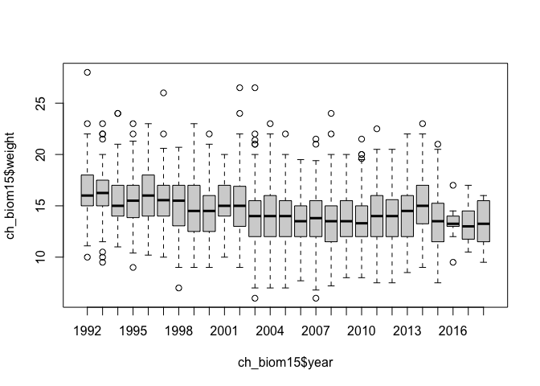
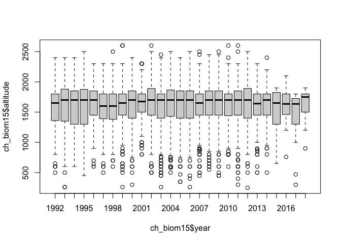
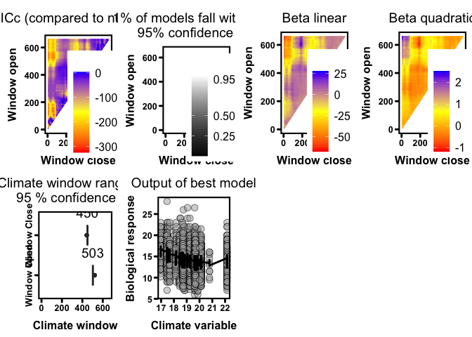
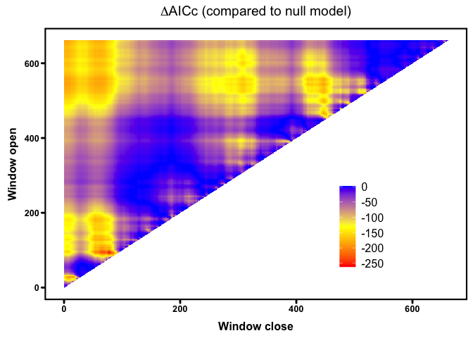
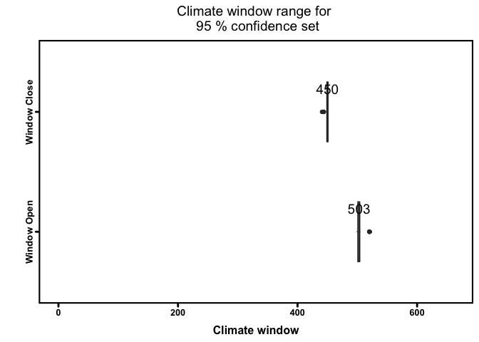
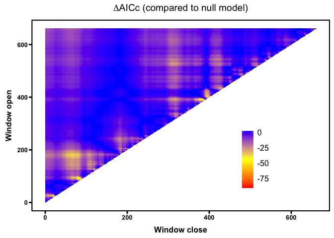
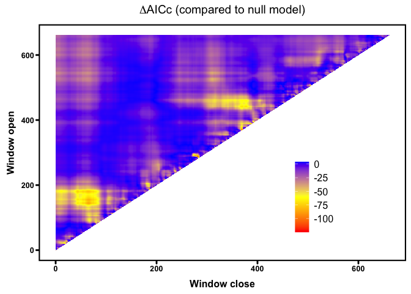

Supplementary materials and codes for the manuscript.


# Libraries and datasets

```r
# load the packages
library(dplyr)
library(snakecase)
library(climwin)
library(tidyr)
library(ggplot2)
library(effects)
library(lme4)
library(lmerTest)
```

R session information is printed here for repeatability.

```r
sessionInfo()
```

```
## R version 4.2.1 (2022-06-23)
## Platform: aarch64-apple-darwin20 (64-bit)
## Running under: macOS Monterey 12.5.1
## 
## Matrix products: default
## BLAS:   /Library/Frameworks/R.framework/Versions/4.2-arm64/Resources/lib/libRblas.0.dylib
## LAPACK: /Library/Frameworks/R.framework/Versions/4.2-arm64/Resources/lib/libRlapack.dylib
## 
## locale:
## [1] en_GB.UTF-8/en_GB.UTF-8/en_GB.UTF-8/C/en_GB.UTF-8/en_GB.UTF-8
## 
## attached base packages:
## [1] stats     graphics  grDevices utils     datasets  methods   base     
## 
## other attached packages:
##  [1] sjPlot_2.8.10    lmerTest_3.1-3   lme4_1.1-30      effects_4.2-1    carData_3.0-5    tidyr_1.2.0      climwin_1.2.3   
##  [8] Matrix_1.4-1     gridExtra_2.3    ggplot2_3.3.6    snakecase_0.11.0 dplyr_1.0.9     
## 
## loaded via a namespace (and not attached):
##   [1] nlme_3.1-157        visreg_2.7.0        lubridate_1.8.0     insight_0.17.1      RColorBrewer_1.1-3  evd_2.3-6          
##   [7] numDeriv_2016.8-1.1 backports_1.4.1     tools_4.2.1         bslib_0.3.1         utf8_1.2.2          R6_2.5.1           
##  [13] sjlabelled_1.2.0    vipor_0.4.5         DBI_1.1.3           mgcv_1.8-40         colorspace_2.0-3    nnet_7.3-17        
##  [19] withr_2.5.0         tidyselect_1.1.2    emmeans_1.8.0       compiler_4.2.1      performance_0.9.1   cli_3.3.0          
##  [25] bayestestR_0.12.1   labeling_0.4.2      sass_0.4.1          scales_1.2.0        mvtnorm_1.1-3       systemfonts_1.0.4  
##  [31] stringr_1.4.0       httpgd_1.3.0        digest_0.6.29       minqa_1.2.4         rmarkdown_2.14      pkgconfig_2.0.3    
##  [37] htmltools_0.5.2     MuMIn_1.46.0        fastmap_1.1.0       highr_0.9           htmlwidgets_1.5.4   rlang_1.0.2        
##  [43] jquerylib_0.1.4     farver_2.1.0        generics_0.1.2      jsonlite_1.8.0      magrittr_2.0.3      parameters_0.18.1  
##  [49] Rcpp_1.0.9          ggbeeswarm_0.6.0    munsell_0.5.0       fansi_1.0.3         lifecycle_1.0.1     stringi_1.7.6      
##  [55] yaml_2.3.5          MASS_7.3-57         plyr_1.8.7          grid_4.2.1          sjmisc_2.8.9        crayon_1.5.1       
##  [61] ppcor_1.1           lattice_0.20-45     ggeffects_1.1.2     splines_4.2.1       sjstats_0.18.1      ggiraphExtra_0.3.0 
##  [67] knitr_1.39          pillar_1.7.0        uuid_1.1-0          boot_1.3-28         estimability_1.4.1  effectsize_0.7.0   
##  [73] reshape2_1.4.4      stats4_4.2.1        glue_1.6.2          ggiraph_0.8.3       beepr_1.3           evaluate_0.15      
##  [79] mycor_0.1.1         mitools_2.4         modelr_0.1.8        vctrs_0.4.1         nloptr_2.0.3        gtable_0.3.0       
##  [85] purrr_0.3.4         datawizard_0.4.1    reshape_0.8.9       assertthat_0.2.1    xfun_0.31           broom_0.8.0        
##  [91] xtable_1.8-4        survey_4.1-1        coda_0.19-4         later_1.3.0         survival_3.3-1      audio_0.1-10       
##  [97] RcppRoll_0.3.0      tibble_3.1.7        beeswarm_0.4.0      ellipsis_0.3.2
```

## The datasets
The data analysed in this study are the records of the Ticino hunting bags from 1992 to 2018. In Ticino, hunting starts at the beginning of September and the harvest plan is mostly completed within three weeks.

Data were collected from the Alps in Ticino, the southernmost canton of Switzerland, over an area of 2700 km2 with an altitude varying from 250 to 2700 m asl. The climate in the mountain range is Alpine, with temperatures varying from mean temperatures of -12℃ in winter to mean temperatures of 15.5 ℃ in summer. The hottest and the sunniest month of the year is July with an average maximum temperature of 25℃, measured in the biggest city in the canton Lugano (World Weather & Climate Information, 2021). 

Overall, 34 017 animals were legally shot during the hunting period ranging from an age of 0.5 to 22.5 years old. All animals were sexed, aged and weighted (eviscerated). Both males and females have horns all year-round, even though female ones tend to be shorter. For the estimation of the age of the shot chamois, measurement of the teeth and the growth rings of their horns were used (Schroder and Elsner-Schack 1985).


```r
# load the data
ch_biom <- read.csv("data/data.csv", stringsAsFactors = T, na = c("", "NA"))
clim <- read.csv("data/swiss_weather.csv", stringsAsFactors = T, na = c("", "NA"))

colnames(ch_biom) <- snakecase::to_snake_case(colnames(ch_biom))

# fixing some variables
ch_biom$date_ymd <- as.Date(paste(ch_biom$year, ch_biom$month, ch_biom$day), "%Y %m %d")
clim$date_ymd <- as.Date(clim$date, "%Y/%m/%d")
ch_biom$year_f <- as.factor(ch_biom$year)
```

### Subset

 Due to the nature of the dataset, only information on individuals shot in September was available, so for the purpose of this study, only a 1.5-year-old animals were considered (7127 individuals, 3257 females and 3870 males). As chamois are usually weaned at 3 to 6 months of age (Scornavacca et al. 2018), a 1.5-year-old individual has been feeding on their own for nearly a year, is fully grown but still very vulnerable to external abiotic and biotic threats due to the decrease in maternal care and increase in active grazing behaviour. 


```r
# get only data with 1.5 years old individuals
ch_biom15 <- ch_biom[, c("no", "year", "year_f", "date_ymd", "altitude", "age", "sex", "weight", "district_capture")]

ch_biom15 <- ch_biom15 %>%
    drop_na() %>%
    filter(age == "1.5")

hist(ch_biom15$altitude)
```

<!-- -->

```r
boxplot(ch_biom15$weight ~ ch_biom15$year)
```

<!-- -->

```r
boxplot(ch_biom15$altitude ~ ch_biom15$year)
```

<!-- -->


# Statistical Analsis

## Selection of the base model


```r
ch_basemod <- lm(weight ~
    sex + altitude,
data = ch_biom15
)
```


## Climwin analysis

### Slidingwin
Using the function slidingwin allows to search for the best climatic window 


```r
# create model with ABSOLUTE time window with temperature for ALWAYS period
# for the period 1 Dec(-2) - 31May(-1)
ch_mass_sw <- slidingwin(
    baseline = ch_basemod,
    xvar = list(Temp = clim$Temp),
    type = "absolute",
    refday = c(24, 9),
    range = c(661, 0),
    stat = "mean",
    cdate = clim$date_ymd,
    bdate = ch_biom15$date_ymd,
    func = c("lin", "quad"),
    cmissing = FALSE,
    cinterval = "day"
)

save(ch_mass_sw, file = "output/ch_mass_sw.rda")

beepr::beep("treasure")
```


#### Investigating the models


```r
load(file = "output/ch_mass_sw.rda")
```
The best linear and quadratic windows:

```r
ch_mass_sw$combos
```

<div data-pagedtable="false">
  <script data-pagedtable-source type="application/json">
{"columns":[{"label":[""],"name":["_rn_"],"type":[""],"align":["left"]},{"label":["response"],"name":[1],"type":["chr"],"align":["left"]},{"label":["climate"],"name":[2],"type":["fct"],"align":["left"]},{"label":["type"],"name":[3],"type":["fct"],"align":["left"]},{"label":["stat"],"name":[4],"type":["fct"],"align":["left"]},{"label":["func"],"name":[5],"type":["fct"],"align":["left"]},{"label":["DeltaAICc"],"name":[6],"type":["dbl"],"align":["right"]},{"label":["WindowOpen"],"name":[7],"type":["int"],"align":["right"]},{"label":["WindowClose"],"name":[8],"type":["dbl"],"align":["right"]}],"data":[{"1":"weight","2":"Temp","3":"absolute","4":"mean","5":"lin","6":"-262.02","7":"93","8":"78","_rn_":"1"},{"1":"weight","2":"Temp","3":"absolute","4":"mean","5":"quad","6":"-325.33","7":"503","8":"449","_rn_":"2"}],"options":{"columns":{"min":{},"max":[10]},"rows":{"min":[10],"max":[10]},"pages":{}}}
  </script>
</div>
The quadratic model seems to receive better support.

The 10 best linear models sorted by deltaAICc:

```r
head(ch_mass_sw[[1]]$Dataset, 10)
```

<div data-pagedtable="false">
  <script data-pagedtable-source type="application/json">
{"columns":[{"label":[""],"name":["_rn_"],"type":[""],"align":["left"]},{"label":["deltaAICc"],"name":[1],"type":["dbl"],"align":["right"]},{"label":["WindowOpen"],"name":[2],"type":["int"],"align":["right"]},{"label":["WindowClose"],"name":[3],"type":["dbl"],"align":["right"]},{"label":["ModelBeta"],"name":[4],"type":["dbl"],"align":["right"]},{"label":["Std.Error"],"name":[5],"type":["dbl"],"align":["right"]},{"label":["ModelBetaQ"],"name":[6],"type":["lgl"],"align":["right"]},{"label":["ModelBetaC"],"name":[7],"type":["lgl"],"align":["right"]},{"label":["ModelInt"],"name":[8],"type":["dbl"],"align":["right"]},{"label":["Function"],"name":[9],"type":["chr"],"align":["left"]},{"label":["Furthest"],"name":[10],"type":["dbl"],"align":["right"]},{"label":["Closest"],"name":[11],"type":["dbl"],"align":["right"]},{"label":["Statistics"],"name":[12],"type":["chr"],"align":["left"]},{"label":["Type"],"name":[13],"type":["chr"],"align":["left"]},{"label":["K"],"name":[14],"type":["dbl"],"align":["right"]},{"label":["ModWeight"],"name":[15],"type":["dbl"],"align":["right"]},{"label":["sample.size"],"name":[16],"type":["int"],"align":["right"]},{"label":["Reference.day"],"name":[17],"type":["dbl"],"align":["right"]},{"label":["Reference.month"],"name":[18],"type":["dbl"],"align":["right"]},{"label":["Randomised"],"name":[19],"type":["chr"],"align":["left"]}],"data":[{"1":"-262.0178","2":"93","3":"78","4":"-0.3687283","5":"0.06984322","6":"NA","7":"NA","8":"20.02483","9":"lin","10":"661","11":"0","12":"mean","13":"absolute","14":"0","15":"0.670235058","16":"27","17":"24","18":"9","19":"no","_rn_":"4387"},{"1":"-258.9846","2":"92","3":"78","4":"-0.3697390","5":"0.06985599","6":"NA","7":"NA","8":"20.04881","9":"lin","10":"661","11":"0","12":"mean","13":"absolute","14":"0","15":"0.147081642","16":"27","17":"24","18":"9","19":"no","_rn_":"4293"},{"1":"-257.4804","2":"93","3":"79","4":"-0.3561051","5":"0.06986595","6":"NA","7":"NA","8":"19.75982","9":"lin","10":"661","11":"0","12":"mean","13":"absolute","14":"0","15":"0.069332204","16":"27","17":"24","18":"9","19":"no","_rn_":"4386"},{"1":"-256.9085","2":"93","3":"77","4":"-0.3703596","5":"0.06987779","6":"NA","7":"NA","8":"20.05171","9":"lin","10":"661","11":"0","12":"mean","13":"absolute","14":"0","15":"0.052089702","16":"27","17":"24","18":"9","19":"no","_rn_":"4388"},{"1":"-255.0189","2":"94","3":"78","4":"-0.3612606","5":"0.06989115","6":"NA","7":"NA","8":"19.85934","9":"lin","10":"661","11":"0","12":"mean","13":"absolute","14":"0","15":"0.020249729","16":"27","17":"24","18":"9","19":"no","_rn_":"4482"},{"1":"-254.0068","2":"92","3":"79","4":"-0.3562154","5":"0.06988134","6":"NA","7":"NA","8":"19.76495","9":"lin","10":"661","11":"0","12":"mean","13":"absolute","14":"0","15":"0.012207940","16":"27","17":"24","18":"9","19":"no","_rn_":"4292"},{"1":"-253.1840","2":"93","3":"76","4":"-0.3651544","5":"0.06990195","6":"NA","7":"NA","8":"19.92758","9":"lin","10":"661","11":"0","12":"mean","13":"absolute","14":"0","15":"0.008090647","16":"27","17":"24","18":"9","19":"no","_rn_":"4389"},{"1":"-252.6979","2":"92","3":"77","4":"-0.3699672","5":"0.06989799","6":"NA","7":"NA","8":"20.04401","9":"lin","10":"661","11":"0","12":"mean","13":"absolute","14":"0","15":"0.006344982","16":"27","17":"24","18":"9","19":"no","_rn_":"4294"},{"1":"-252.0185","2":"95","3":"78","4":"-0.3552180","5":"0.06991180","6":"NA","7":"NA","8":"19.73050","9":"lin","10":"661","11":"0","12":"mean","13":"absolute","14":"0","15":"0.004517444","16":"27","17":"24","18":"9","19":"no","_rn_":"4578"},{"1":"-251.1182","2":"94","3":"79","4":"-0.3500659","5":"0.06991023","6":"NA","7":"NA","8":"19.62480","9":"lin","10":"661","11":"0","12":"mean","13":"absolute","14":"0","15":"0.002880107","16":"27","17":"24","18":"9","19":"no","_rn_":"4481"}],"options":{"columns":{"min":{},"max":[10]},"rows":{"min":[10],"max":[10]},"pages":{}}}
  </script>
</div>

The 10 best quadratic models sorted by deltaAICc:

```r
head(ch_mass_sw[[2]]$Dataset, 10)
```

<div data-pagedtable="false">
  <script data-pagedtable-source type="application/json">
{"columns":[{"label":[""],"name":["_rn_"],"type":[""],"align":["left"]},{"label":["deltaAICc"],"name":[1],"type":["dbl"],"align":["right"]},{"label":["WindowOpen"],"name":[2],"type":["int"],"align":["right"]},{"label":["WindowClose"],"name":[3],"type":["dbl"],"align":["right"]},{"label":["ModelBeta"],"name":[4],"type":["dbl"],"align":["right"]},{"label":["Std.Error"],"name":[5],"type":["dbl"],"align":["right"]},{"label":["ModelBetaQ"],"name":[6],"type":["dbl"],"align":["right"]},{"label":["Std.ErrorQ"],"name":[7],"type":["dbl"],"align":["right"]},{"label":["ModelBetaC"],"name":[8],"type":["lgl"],"align":["right"]},{"label":["ModelInt"],"name":[9],"type":["dbl"],"align":["right"]},{"label":["Function"],"name":[10],"type":["chr"],"align":["left"]},{"label":["Furthest"],"name":[11],"type":["dbl"],"align":["right"]},{"label":["Closest"],"name":[12],"type":["dbl"],"align":["right"]},{"label":["Statistics"],"name":[13],"type":["chr"],"align":["left"]},{"label":["Type"],"name":[14],"type":["chr"],"align":["left"]},{"label":["K"],"name":[15],"type":["dbl"],"align":["right"]},{"label":["ModWeight"],"name":[16],"type":["dbl"],"align":["right"]},{"label":["sample.size"],"name":[17],"type":["int"],"align":["right"]},{"label":["Reference.day"],"name":[18],"type":["dbl"],"align":["right"]},{"label":["Reference.month"],"name":[19],"type":["dbl"],"align":["right"]},{"label":["Randomised"],"name":[20],"type":["chr"],"align":["left"]}],"data":[{"1":"-325.3275","2":"503","3":"449","4":"-8.526073","5":"0.06945118","6":"0.2059814","7":"9.132948e-05","8":"NA","9":"99.40562","10":"quad","11":"661","12":"0","13":"mean","14":"absolute","15":"0","16":"0.19730404","17":"27","18":"24","19":"9","20":"no","_rn_":"126811"},{"1":"-324.3307","2":"504","3":"449","4":"-8.531009","5":"0.06945764","6":"0.2066512","7":"9.134003e-05","8":"NA","9":"99.20689","10":"quad","11":"661","12":"0","13":"mean","14":"absolute","15":"0","16":"0.11986598","17":"27","18":"24","19":"9","20":"no","_rn_":"127316"},{"1":"-324.1087","2":"503","3":"450","4":"-8.433980","5":"0.06946480","6":"0.2040657","7":"9.133873e-05","8":"NA","9":"98.31144","10":"quad","11":"661","12":"0","13":"mean","14":"absolute","15":"0","16":"0.10727304","17":"27","18":"24","19":"9","20":"no","_rn_":"126810"},{"1":"-323.9020","2":"503","3":"451","4":"-8.289906","5":"0.06947091","6":"0.2008679","7":"9.133960e-05","8":"NA","9":"96.69394","10":"quad","11":"661","12":"0","13":"mean","14":"absolute","15":"0","16":"0.09674092","17":"27","18":"24","19":"9","20":"no","_rn_":"126809"},{"1":"-322.4771","2":"500","3":"451","4":"-8.012148","5":"0.06947658","6":"0.1919002","7":"9.134618e-05","8":"NA","9":"94.80927","10":"quad","11":"661","12":"0","13":"mean","14":"absolute","15":"0","16":"0.04744406","17":"27","18":"24","19":"9","20":"no","_rn_":"125300"},{"1":"-322.4249","2":"502","3":"449","4":"-8.362830","5":"0.06946858","6":"0.2011678","7":"9.135045e-05","8":"NA","9":"98.10043","10":"quad","11":"661","12":"0","13":"mean","14":"absolute","15":"0","16":"0.04622274","17":"27","18":"24","19":"9","20":"no","_rn_":"126307"},{"1":"-322.3136","2":"504","3":"450","4":"-8.415984","5":"0.06947628","6":"0.2041668","7":"9.135570e-05","8":"NA","9":"97.88342","10":"quad","11":"661","12":"0","13":"mean","14":"absolute","15":"0","16":"0.04372079","17":"27","18":"24","19":"9","20":"no","_rn_":"127315"},{"1":"-321.9411","2":"504","3":"451","4":"-8.276014","5":"0.06948357","6":"0.2010699","7":"9.135782e-05","8":"NA","9":"96.30829","10":"quad","11":"661","12":"0","13":"mean","14":"absolute","15":"0","16":"0.03629161","17":"27","18":"24","19":"9","20":"no","_rn_":"127314"},{"1":"-321.6449","2":"502","3":"450","4":"-8.280076","5":"0.06947898","6":"0.1994706","7":"9.135620e-05","8":"NA","9":"97.10428","10":"quad","11":"661","12":"0","13":"mean","14":"absolute","15":"0","16":"0.03129540","17":"27","18":"24","19":"9","20":"no","_rn_":"126306"},{"1":"-321.6095","2":"500","3":"450","4":"-8.142425","5":"0.06947810","6":"0.1947678","7":"9.135374e-05","8":"NA","9":"96.28649","10":"quad","11":"661","12":"0","13":"mean","14":"absolute","15":"0","16":"0.03074654","17":"27","18":"24","19":"9","20":"no","_rn_":"125301"}],"options":{"columns":{"min":{},"max":[10]},"rows":{"min":[10],"max":[10]},"pages":{}}}
  </script>
</div>
A series of plot (should I keep?)

```r
# plot results from best model
plotall(
    dataset = ch_mass_sw[[2]]$Dataset,
    bestmodel = ch_mass_sw[[2]]$BestModel,
    bestmodeldata = ch_mass_sw[[2]]$BestModelData
)
```

<!-- -->

The deltaAIC plot for linear and quadratic:

```r
plotdelta(dataset = ch_mass_sw[[1]]$Dataset)
```

<!-- -->

```r
plotdelta(dataset = ch_mass_sw[[2]]$Dataset)
```

<!-- -->

The windows for linear and quadratic:

```r
plotwin(dataset = ch_mass_sw[[1]]$Dataset)
```

<!-- -->

```r
plotwin(dataset = ch_mass_sw[[2]]$Dataset)
```

<!-- -->


I can add the new variable to the dataset and obtain the dates for the window:

```r
# The best supported climate variable can be attached
# to the original dataset for further analyses
ch_biom15$temp_503_449 <- ch_mass_sw[[2]]$BestModelData$climate

as.Date("2022/09/24", format = "%Y/%m/%d") - 503
```

```
## [1] "2021-05-09"
```

```r
as.Date("2022/09/24", format = "%Y/%m/%d") - 449
```

```
## [1] "2021-07-02"
```

Summary and figure for our updated model:

```r
ch_final <- lm(weight ~
    sex + altitude + temp_503_449 + I(temp_503_449^2),
data = ch_biom15
)
```


```r
library(sjPlot)

sjPlot::tab_model(ch_final,
    file = "Tables/wicm_models.doc",
    string.est = "Estimate",
    string.se = "SE",
    show.ci = F,
    show.se = T,
    show.stat = T,
    show.df = F,
    digits = 4,
    digits.rsq = 4
)
```

<table style="border-collapse:collapse; border:none;">
<tr>
<th style="border-top: double; text-align:center; font-style:normal; font-weight:bold; padding:0.2cm;  text-align:left; ">&nbsp;</th>
<th colspan="4" style="border-top: double; text-align:center; font-style:normal; font-weight:bold; padding:0.2cm; ">weight</th>
</tr>
<tr>
<td style=" text-align:center; border-bottom:1px solid; font-style:italic; font-weight:normal;  text-align:left; ">Predictors</td>
<td style=" text-align:center; border-bottom:1px solid; font-style:italic; font-weight:normal;  ">Estimate</td>
<td style=" text-align:center; border-bottom:1px solid; font-style:italic; font-weight:normal;  ">SE</td>
<td style=" text-align:center; border-bottom:1px solid; font-style:italic; font-weight:normal;  ">Statistic</td>
<td style=" text-align:center; border-bottom:1px solid; font-style:italic; font-weight:normal;  ">p</td>
</tr>
<tr>
<td style=" padding:0.2cm; text-align:left; vertical-align:top; text-align:left; ">(Intercept)</td>
<td style=" padding:0.2cm; text-align:left; vertical-align:top; text-align:center;  ">99.4056</td>
<td style=" padding:0.2cm; text-align:left; vertical-align:top; text-align:center;  ">6.3050</td>
<td style=" padding:0.2cm; text-align:left; vertical-align:top; text-align:center;  ">15.7662</td>
<td style=" padding:0.2cm; text-align:left; vertical-align:top; text-align:center;  "><strong>&lt;0.001</strong></td>
</tr>
<tr>
<td style=" padding:0.2cm; text-align:left; vertical-align:top; text-align:left; ">sex [m]</td>
<td style=" padding:0.2cm; text-align:left; vertical-align:top; text-align:center;  ">0.5212</td>
<td style=" padding:0.2cm; text-align:left; vertical-align:top; text-align:center;  ">0.0695</td>
<td style=" padding:0.2cm; text-align:left; vertical-align:top; text-align:center;  ">7.5045</td>
<td style=" padding:0.2cm; text-align:left; vertical-align:top; text-align:center;  "><strong>&lt;0.001</strong></td>
</tr>
<tr>
<td style=" padding:0.2cm; text-align:left; vertical-align:top; text-align:left; ">altitude</td>
<td style=" padding:0.2cm; text-align:left; vertical-align:top; text-align:center;  ">0.0013</td>
<td style=" padding:0.2cm; text-align:left; vertical-align:top; text-align:center;  ">0.0001</td>
<td style=" padding:0.2cm; text-align:left; vertical-align:top; text-align:center;  ">14.1934</td>
<td style=" padding:0.2cm; text-align:left; vertical-align:top; text-align:center;  "><strong>&lt;0.001</strong></td>
</tr>
<tr>
<td style=" padding:0.2cm; text-align:left; vertical-align:top; text-align:left; ">temp 503 449</td>
<td style=" padding:0.2cm; text-align:left; vertical-align:top; text-align:center;  ">&#45;8.5261</td>
<td style=" padding:0.2cm; text-align:left; vertical-align:top; text-align:center;  ">0.6389</td>
<td style=" padding:0.2cm; text-align:left; vertical-align:top; text-align:center;  ">&#45;13.3458</td>
<td style=" padding:0.2cm; text-align:left; vertical-align:top; text-align:center;  "><strong>&lt;0.001</strong></td>
</tr>
<tr>
<td style=" padding:0.2cm; text-align:left; vertical-align:top; text-align:left; ">temp 503 449^2</td>
<td style=" padding:0.2cm; text-align:left; vertical-align:top; text-align:center;  ">0.2060</td>
<td style=" padding:0.2cm; text-align:left; vertical-align:top; text-align:center;  ">0.0162</td>
<td style=" padding:0.2cm; text-align:left; vertical-align:top; text-align:center;  ">12.7502</td>
<td style=" padding:0.2cm; text-align:left; vertical-align:top; text-align:center;  "><strong>&lt;0.001</strong></td>
</tr>
<tr>
<td style=" padding:0.2cm; text-align:left; vertical-align:top; text-align:left; padding-top:0.1cm; padding-bottom:0.1cm; border-top:1px solid;">Observations</td>
<td style=" padding:0.2cm; text-align:left; vertical-align:top; padding-top:0.1cm; padding-bottom:0.1cm; text-align:left; border-top:1px solid;" colspan="4">5635</td>
</tr>
<tr>
<td style=" padding:0.2cm; text-align:left; vertical-align:top; text-align:left; padding-top:0.1cm; padding-bottom:0.1cm;">R<sup>2</sup> / R<sup>2</sup> adjusted</td>
<td style=" padding:0.2cm; text-align:left; vertical-align:top; padding-top:0.1cm; padding-bottom:0.1cm; text-align:left;" colspan="4">0.0973 / 0.0966</td>
</tr>

</table>

Sex difference estimated by the model:

```r
emmeans::emmeans(ch_final, "sex")
```

```
##  sex emmean     SE   df lower.CL upper.CL
##  f     13.6 0.0559 5630     13.5     13.8
##  m     14.2 0.0517 5630     14.1     14.3
## 
## Confidence level used: 0.95
```


```r
eff_data <- data.frame(effects::effect("temp_503_449",
    ch_final,
    partial.residuals = T
))

plot_temp <- ggplot(eff_data, aes(x = temp_503_449, y = fit)) +
    geom_line() +
    geom_ribbon(
        data = eff_data, aes(ymin = lower, ymax = upper),
        linetype = 0, alpha = .4
    ) +
    xlab("Mean temperature (°C) between May 9th and July 2nd") +
    #    scale_x_continuous(
    #        breaks = c(year_sc$year_sc[c(seq(1, 23, 4))]),
    #        labels = c(year_sc$year[c(seq(1, 23, 4))]),
    #        limits = c(year_sc$year_sc[1], year_sc$year_sc[23])
    #    ) +
    theme(
        legend.position = "none",
        panel.grid.major = element_blank(),
        panel.grid.minor = element_blank(),
        panel.background = element_blank(),
        axis.line = element_line(colour = "black")
    ) +
    geom_point(
        data = ch_biom15,
        aes(x = temp_503_449, y = weight),
        size = 1, shape = 16, alpha = 0.1
    ) +
    ylab("") +
    scale_y_continuous(limits = c(4.6, 30), breaks = seq(0, 35, 5)) +
    annotate("text", x = 17, y = 30, label = "(a)")


eff_data <- data.frame(effects::effect("altitude",
    ch_final,
    partial.residuals = T
))

plot_alt <- ggplot(eff_data, aes(x = altitude, y = fit)) +
    geom_line() +
    geom_ribbon(
        data = eff_data, aes(ymin = lower, ymax = upper),
        linetype = 0, alpha = .4
    ) +
    xlab("Altitude (m a.s.l)") +
    scale_x_continuous(limits = c(250, 2600), breaks = seq(250, 2750, 500)) +
    theme(
        legend.position = "none",
        panel.grid.major = element_blank(),
        panel.grid.minor = element_blank(),
        panel.background = element_blank(),
        axis.line = element_line(colour = "black")
    ) +
    geom_point(
        data = ch_biom15,
        aes(x = altitude, y = weight),
        size = 1, shape = 16, alpha = 0.1
    ) +
    ylab("Body mass (kg)") +
    scale_y_continuous(limits = c(4.6, 30), breaks = seq(0, 35, 5)) +
    annotate("text", x = 250, y = 30, label = "(b)")

eff_data <- data.frame(effects::effect("sex",
    ch_final,
    partial.residuals = T
))
par_col_af <- "darkorange3"
par_col_am <- "steelblue"
plot_sex <- ggplot(ch_biom15, aes(x = sex, y = weight, color = sex)) +
    geom_boxplot() +
    xlab("Sex") +
    theme(
        legend.position = "none",
        panel.grid.major = element_blank(),
        panel.grid.minor = element_blank(),
        panel.background = element_blank(),
        axis.line = element_line(colour = "black")
    ) +
    ggbeeswarm::geom_quasirandom(
        data = ch_biom15,
        aes(x = sex, y = weight),
        size = 1, shape = 16, alpha = 0.1
    ) +
    ylab("") +
    scale_color_manual(values = c(par_col_af, par_col_am)) +
    scale_y_continuous(limits = c(4.6, 30), breaks = seq(0, 35, 5)) +
    scale_x_discrete(labels = c("F", "M")) +
    annotate("text", x = 0.5, y = 30, label = "(c)")
```


```r
grid.arrange(
    plot_temp, plot_alt, plot_sex,
    nrow = 3
)
```


### Testing for other windows

We build a model based the same base model selected before but with the addition of the climatic variable for the considered window. 

We are now able to look for other temporal windows that might be of importance for the chamois growth, but controlling for correlation with the temporal window already in the model.


```r
ch_mass_sw_2 <- slidingwin(
    baseline = ch_final,
    xvar = list(Temp = clim$Temp),
    type = "absolute",
    refday = c(24, 9),
    range = c(661, 0),
    stat = "mean",
    cdate = clim$date_ymd,
    bdate = ch_biom15$date_ymd,
    func = c("lin", "quad"),
    cmissing = FALSE,
    cinterval = "day"
)

save(ch_mass_sw_2, file = "output/ch_mass_sw_2.rda")

beepr::beep("treasure")
```


#### Investigating the models


```r
load(file = "output/ch_mass_sw_2.rda")

ch_mass_sw_2$combos
```

<div data-pagedtable="false">
  <script data-pagedtable-source type="application/json">
{"columns":[{"label":[""],"name":["_rn_"],"type":[""],"align":["left"]},{"label":["response"],"name":[1],"type":["chr"],"align":["left"]},{"label":["climate"],"name":[2],"type":["fct"],"align":["left"]},{"label":["type"],"name":[3],"type":["fct"],"align":["left"]},{"label":["stat"],"name":[4],"type":["fct"],"align":["left"]},{"label":["func"],"name":[5],"type":["fct"],"align":["left"]},{"label":["DeltaAICc"],"name":[6],"type":["dbl"],"align":["right"]},{"label":["WindowOpen"],"name":[7],"type":["int"],"align":["right"]},{"label":["WindowClose"],"name":[8],"type":["dbl"],"align":["right"]}],"data":[{"1":"weight","2":"Temp","3":"absolute","4":"mean","5":"lin","6":"-90.09","7":"187","8":"186","_rn_":"1"},{"1":"weight","2":"Temp","3":"absolute","4":"mean","5":"quad","6":"-124.87","7":"289","8":"281","_rn_":"2"}],"options":{"columns":{"min":{},"max":[10]},"rows":{"min":[10],"max":[10]},"pages":{}}}
  </script>
</div>

```r
# provides a summary of all tested climate window hypotheses,
# with the key statistics from the best model included

head(ch_mass_sw_2[[1]]$Dataset)
```

<div data-pagedtable="false">
  <script data-pagedtable-source type="application/json">
{"columns":[{"label":[""],"name":["_rn_"],"type":[""],"align":["left"]},{"label":["deltaAICc"],"name":[1],"type":["dbl"],"align":["right"]},{"label":["WindowOpen"],"name":[2],"type":["int"],"align":["right"]},{"label":["WindowClose"],"name":[3],"type":["dbl"],"align":["right"]},{"label":["ModelBeta"],"name":[4],"type":["dbl"],"align":["right"]},{"label":["Std.Error"],"name":[5],"type":["dbl"],"align":["right"]},{"label":["ModelBetaQ"],"name":[6],"type":["lgl"],"align":["right"]},{"label":["ModelBetaC"],"name":[7],"type":["lgl"],"align":["right"]},{"label":["ModelInt"],"name":[8],"type":["dbl"],"align":["right"]},{"label":["Function"],"name":[9],"type":["chr"],"align":["left"]},{"label":["Furthest"],"name":[10],"type":["dbl"],"align":["right"]},{"label":["Closest"],"name":[11],"type":["dbl"],"align":["right"]},{"label":["Statistics"],"name":[12],"type":["chr"],"align":["left"]},{"label":["Type"],"name":[13],"type":["chr"],"align":["left"]},{"label":["K"],"name":[14],"type":["dbl"],"align":["right"]},{"label":["ModWeight"],"name":[15],"type":["dbl"],"align":["right"]},{"label":["sample.size"],"name":[16],"type":["int"],"align":["right"]},{"label":["Reference.day"],"name":[17],"type":["dbl"],"align":["right"]},{"label":["Reference.month"],"name":[18],"type":["dbl"],"align":["right"]},{"label":["Randomised"],"name":[19],"type":["chr"],"align":["left"]}],"data":[{"1":"-90.08688","2":"187","3":"186","4":"0.1577973","5":"0.06889317","6":"NA","7":"NA","8":"83.54775","9":"lin","10":"661","11":"0","12":"mean","13":"absolute","14":"0","15":"9.798954e-01","16":"27","17":"24","18":"9","19":"no","_rn_":"17580"},{"1":"-80.97216","2":"187","3":"187","4":"0.1245552","5":"0.06894850","6":"NA","7":"NA","8":"85.22363","9":"lin","10":"661","11":"0","12":"mean","13":"absolute","14":"0","15":"1.027883e-02","16":"27","17":"24","18":"9","19":"no","_rn_":"17579"},{"1":"-80.22031","2":"188","3":"186","4":"0.1556428","5":"0.06895444","6":"NA","7":"NA","8":"83.12207","9":"lin","10":"661","11":"0","12":"mean","13":"absolute","14":"0","15":"7.057994e-03","16":"27","17":"24","18":"9","19":"no","_rn_":"17769"},{"1":"-78.22361","2":"186","3":"186","4":"0.1604678","5":"0.06896608","6":"NA","7":"NA","8":"85.42416","9":"lin","10":"661","11":"0","12":"mean","13":"absolute","14":"0","15":"2.600778e-03","16":"27","17":"24","18":"9","19":"no","_rn_":"17392"},{"1":"-70.99579","2":"188","3":"185","4":"0.1678514","5":"0.06901210","6":"NA","7":"NA","8":"88.21804","9":"lin","10":"661","11":"0","12":"mean","13":"absolute","14":"0","15":"7.008138e-05","16":"27","17":"24","18":"9","19":"no","_rn_":"17770"},{"1":"-70.19923","2":"187","3":"185","4":"0.1639495","5":"0.06901622","6":"NA","7":"NA","8":"91.00412","9":"lin","10":"661","11":"0","12":"mean","13":"absolute","14":"0","15":"4.705771e-05","16":"27","17":"24","18":"9","19":"no","_rn_":"17581"}],"options":{"columns":{"min":{},"max":[10]},"rows":{"min":[10],"max":[10]},"pages":{}}}
  </script>
</div>

```r
head(ch_mass_sw_2[[2]]$Dataset)
```

<div data-pagedtable="false">
  <script data-pagedtable-source type="application/json">
{"columns":[{"label":[""],"name":["_rn_"],"type":[""],"align":["left"]},{"label":["deltaAICc"],"name":[1],"type":["dbl"],"align":["right"]},{"label":["WindowOpen"],"name":[2],"type":["int"],"align":["right"]},{"label":["WindowClose"],"name":[3],"type":["dbl"],"align":["right"]},{"label":["ModelBeta"],"name":[4],"type":["dbl"],"align":["right"]},{"label":["Std.Error"],"name":[5],"type":["dbl"],"align":["right"]},{"label":["ModelBetaQ"],"name":[6],"type":["dbl"],"align":["right"]},{"label":["Std.ErrorQ"],"name":[7],"type":["dbl"],"align":["right"]},{"label":["ModelBetaC"],"name":[8],"type":["lgl"],"align":["right"]},{"label":["ModelInt"],"name":[9],"type":["dbl"],"align":["right"]},{"label":["Function"],"name":[10],"type":["chr"],"align":["left"]},{"label":["Furthest"],"name":[11],"type":["dbl"],"align":["right"]},{"label":["Closest"],"name":[12],"type":["dbl"],"align":["right"]},{"label":["Statistics"],"name":[13],"type":["chr"],"align":["left"]},{"label":["Type"],"name":[14],"type":["chr"],"align":["left"]},{"label":["K"],"name":[15],"type":["dbl"],"align":["right"]},{"label":["ModWeight"],"name":[16],"type":["dbl"],"align":["right"]},{"label":["sample.size"],"name":[17],"type":["int"],"align":["right"]},{"label":["Reference.day"],"name":[18],"type":["dbl"],"align":["right"]},{"label":["Reference.month"],"name":[19],"type":["dbl"],"align":["right"]},{"label":["Randomised"],"name":[20],"type":["chr"],"align":["left"]}],"data":[{"1":"-124.8694","2":"289","3":"281","4":"-1.0842886","5":"0.06870302","6":"0.1354079","7":"9.032224e-05","8":"NA","9":"91.41405","10":"quad","11":"661","12":"0","13":"mean","14":"absolute","15":"0","16":"0.6650443388","17":"27","18":"24","19":"9","20":"no","_rn_":"41914"},{"1":"-122.6590","2":"288","3":"281","4":"-1.0313943","5":"0.06869810","6":"0.1332909","7":"9.034101e-05","8":"NA","9":"86.01063","10":"quad","11":"661","12":"0","13":"mean","14":"absolute","15":"0","16":"0.2202194510","17":"27","18":"24","19":"9","20":"no","_rn_":"41624"},{"1":"-120.7174","2":"289","3":"282","4":"-0.9762963","5":"0.06871927","6":"0.1180527","7":"9.035058e-05","8":"NA","9":"87.42955","10":"quad","11":"661","12":"0","13":"mean","14":"absolute","15":"0","16":"0.0834145495","17":"27","18":"24","19":"9","20":"no","_rn_":"41913"},{"1":"-118.5510","2":"288","3":"282","4":"-0.9266975","5":"0.06871497","6":"0.1145024","7":"9.036880e-05","8":"NA","9":"81.17522","10":"quad","11":"661","12":"0","13":"mean","14":"absolute","15":"0","16":"0.0282365637","17":"27","18":"24","19":"9","20":"no","_rn_":"41623"},{"1":"-113.5161","2":"290","3":"281","4":"-1.1247784","5":"0.06879665","6":"0.1350995","7":"9.041110e-05","8":"NA","9":"98.80050","10":"quad","11":"661","12":"0","13":"mean","14":"absolute","15":"0","16":"0.0022777592","17":"27","18":"24","19":"9","20":"no","_rn_":"42205"},{"1":"-109.3424","2":"287","3":"281","4":"-0.9814564","5":"0.06877455","6":"0.1297272","7":"9.045080e-05","8":"NA","9":"87.53559","10":"quad","11":"661","12":"0","13":"mean","14":"absolute","15":"0","16":"0.0002826105","17":"27","18":"24","19":"9","20":"no","_rn_":"41335"}],"options":{"columns":{"min":{},"max":[10]},"rows":{"min":[10],"max":[10]},"pages":{}}}
  </script>
</div>

```r
# we can look at the full dataset of all fitted climate windows.
# in this list the models are sorted by deltaAICc,
# such that the best supported model is on top.


names(ch_mass_sw_2[[2]]$BestModel)
```

```
##  [1] "coefficients"  "residuals"     "effects"       "rank"          "fitted.values" "assign"        "qr"            "df.residual"  
##  [9] "contrasts"     "xlevels"       "call"          "terms"         "model"
```

```r
# Finally, the object BestModel stores the values of the climate signal
# that was best supported by the data and the row numbers correspond
# to the original row numbers of the Biol dataset.


# plot results from best model
plotall(
    dataset = ch_mass_sw_2[[1]]$Dataset,
    bestmodel = ch_mass_sw_2[[1]]$BestModel,
    bestmodeldata = ch_mass_sw_2[[1]]$BestModelData
)
```

```
## Warning in plotwin(dataset = dataset, cw = cwa): Top window has a weight greater than 0.95. Plotting single best window only.
```

<!-- -->

```r
# plot results from best model
plotall(
    dataset = ch_mass_sw_2[[2]]$Dataset,
    bestmodel = ch_mass_sw_2[[2]]$BestModel,
    bestmodeldata = ch_mass_sw_2[[2]]$BestModelData
)
```

<!-- -->

```r
plotwin(dataset = ch_mass_sw_2[[2]]$Dataset)
```

<!-- -->

```r
plotdelta(dataset = ch_mass_sw_2[[1]]$Dataset)
```

<!-- -->

```r
plotdelta(dataset = ch_mass_sw_2[[2]]$Dataset)
```

<!-- -->


### Randwin

Using randwin to randomize the identity of the chamois (XXX ???) we are able to check if the window that wos found before is actually important, or the relationship was just random.


```r
# Performing randamization to identify
# likelyhood of of dignals occuring by chance

ch_mass_rand <- randwin(
    repeats = 1000,
    baseline = ch_basemod,
    xvar = list(Temp = clim$Temp),
    type = "absolute",
    refday = c(24, 9),
    range = c(661, 0),
    stat = "mean",
    cdate = clim$date_ymd,
    bdate = ch_biom15$date_ymd,
    func = c("lin", "quad"),
    cmissing = FALSE,
    cinterval = "day",
    window = "sliding"
)
save(ch_mass_rand, file = "output/ch_mass_rand.rda")
```


```r
load("output/ch_mass_rand.rda")

pvalue(
    datasetrand = ch_mass_rand[[1]],
    dataset = ch_mass_rand[[1]]$Dataset, metric = "C", sample.size = 27
) # 0.0006408258

pvalue(
    datasetrand = ch_mass_rand[[2]],
    dataset = ch_mass_rand[[2]]$Dataset, metric = "C", sample.size = 27
)
```


## Long term trends


```r
data_temp <- subset(ch_biom15, !duplicated(year))
temp_lm <- lm(temp_503_449 ~ year, data_temp)
weight_lm <- lm(weight ~ year, ch_biom15)
```

Decrease in weight (kg):

```r
(weight_lm$coeff[1] + 2018 * weight_lm$coeff[2]) - (weight_lm$coeff[1] + 1992 * weight_lm$coeff[2])
```

```
## (Intercept) 
##   -2.919858
```

Increase in temperature (°C):

```r
(temp_lm$coeff[1] + 2018 * temp_lm$coeff[2]) - (temp_lm$coeff[1] + 1992 * temp_lm$coeff[2])
```

```
## (Intercept) 
##     1.61847
```


```r
library(sjPlot)

sjPlot::tab_model(temp_lm,
    file = "Tables/model_temp_503_449s.doc",
    string.est = "Estimate",
    string.se = "SE",
    show.ci = F,
    show.se = T,
    show.stat = T,
    show.df = F,
    digits = 4,
    digits.rsq = 4
)
```

<table style="border-collapse:collapse; border:none;">
<tr>
<th style="border-top: double; text-align:center; font-style:normal; font-weight:bold; padding:0.2cm;  text-align:left; ">&nbsp;</th>
<th colspan="4" style="border-top: double; text-align:center; font-style:normal; font-weight:bold; padding:0.2cm; ">temp 503 449</th>
</tr>
<tr>
<td style=" text-align:center; border-bottom:1px solid; font-style:italic; font-weight:normal;  text-align:left; ">Predictors</td>
<td style=" text-align:center; border-bottom:1px solid; font-style:italic; font-weight:normal;  ">Estimate</td>
<td style=" text-align:center; border-bottom:1px solid; font-style:italic; font-weight:normal;  ">SE</td>
<td style=" text-align:center; border-bottom:1px solid; font-style:italic; font-weight:normal;  ">Statistic</td>
<td style=" text-align:center; border-bottom:1px solid; font-style:italic; font-weight:normal;  ">p</td>
</tr>
<tr>
<td style=" padding:0.2cm; text-align:left; vertical-align:top; text-align:left; ">(Intercept)</td>
<td style=" padding:0.2cm; text-align:left; vertical-align:top; text-align:center;  ">&#45;105.8285</td>
<td style=" padding:0.2cm; text-align:left; vertical-align:top; text-align:center;  ">51.9905</td>
<td style=" padding:0.2cm; text-align:left; vertical-align:top; text-align:center;  ">&#45;2.0355</td>
<td style=" padding:0.2cm; text-align:left; vertical-align:top; text-align:center;  ">0.053</td>
</tr>
<tr>
<td style=" padding:0.2cm; text-align:left; vertical-align:top; text-align:left; ">year</td>
<td style=" padding:0.2cm; text-align:left; vertical-align:top; text-align:center;  ">0.0622</td>
<td style=" padding:0.2cm; text-align:left; vertical-align:top; text-align:center;  ">0.0259</td>
<td style=" padding:0.2cm; text-align:left; vertical-align:top; text-align:center;  ">2.4006</td>
<td style=" padding:0.2cm; text-align:left; vertical-align:top; text-align:center;  "><strong>0.024</strong></td>
</tr>
<tr>
<td style=" padding:0.2cm; text-align:left; vertical-align:top; text-align:left; padding-top:0.1cm; padding-bottom:0.1cm; border-top:1px solid;">Observations</td>
<td style=" padding:0.2cm; text-align:left; vertical-align:top; padding-top:0.1cm; padding-bottom:0.1cm; text-align:left; border-top:1px solid;" colspan="4">27</td>
</tr>
<tr>
<td style=" padding:0.2cm; text-align:left; vertical-align:top; text-align:left; padding-top:0.1cm; padding-bottom:0.1cm;">R<sup>2</sup> / R<sup>2</sup> adjusted</td>
<td style=" padding:0.2cm; text-align:left; vertical-align:top; padding-top:0.1cm; padding-bottom:0.1cm; text-align:left;" colspan="4">0.1873 / 0.1548</td>
</tr>

</table>


```r
library(sjPlot)

sjPlot::tab_model(weight_lm,
    file = "Tables/model_weight.doc",
    string.est = "Estimate",
    string.se = "SE",
    show.ci = F,
    show.se = T,
    show.stat = T,
    show.df = F,
    digits = 4,
    digits.rsq = 4
)
```

<table style="border-collapse:collapse; border:none;">
<tr>
<th style="border-top: double; text-align:center; font-style:normal; font-weight:bold; padding:0.2cm;  text-align:left; ">&nbsp;</th>
<th colspan="4" style="border-top: double; text-align:center; font-style:normal; font-weight:bold; padding:0.2cm; ">weight</th>
</tr>
<tr>
<td style=" text-align:center; border-bottom:1px solid; font-style:italic; font-weight:normal;  text-align:left; ">Predictors</td>
<td style=" text-align:center; border-bottom:1px solid; font-style:italic; font-weight:normal;  ">Estimate</td>
<td style=" text-align:center; border-bottom:1px solid; font-style:italic; font-weight:normal;  ">SE</td>
<td style=" text-align:center; border-bottom:1px solid; font-style:italic; font-weight:normal;  ">Statistic</td>
<td style=" text-align:center; border-bottom:1px solid; font-style:italic; font-weight:normal;  ">p</td>
</tr>
<tr>
<td style=" padding:0.2cm; text-align:left; vertical-align:top; text-align:left; ">(Intercept)</td>
<td style=" padding:0.2cm; text-align:left; vertical-align:top; text-align:center;  ">239.3263</td>
<td style=" padding:0.2cm; text-align:left; vertical-align:top; text-align:center;  ">12.6384</td>
<td style=" padding:0.2cm; text-align:left; vertical-align:top; text-align:center;  ">18.9365</td>
<td style=" padding:0.2cm; text-align:left; vertical-align:top; text-align:center;  "><strong>&lt;0.001</strong></td>
</tr>
<tr>
<td style=" padding:0.2cm; text-align:left; vertical-align:top; text-align:left; ">year</td>
<td style=" padding:0.2cm; text-align:left; vertical-align:top; text-align:center;  ">&#45;0.1123</td>
<td style=" padding:0.2cm; text-align:left; vertical-align:top; text-align:center;  ">0.0063</td>
<td style=" padding:0.2cm; text-align:left; vertical-align:top; text-align:center;  ">&#45;17.8114</td>
<td style=" padding:0.2cm; text-align:left; vertical-align:top; text-align:center;  "><strong>&lt;0.001</strong></td>
</tr>
<tr>
<td style=" padding:0.2cm; text-align:left; vertical-align:top; text-align:left; padding-top:0.1cm; padding-bottom:0.1cm; border-top:1px solid;">Observations</td>
<td style=" padding:0.2cm; text-align:left; vertical-align:top; padding-top:0.1cm; padding-bottom:0.1cm; text-align:left; border-top:1px solid;" colspan="4">5635</td>
</tr>
<tr>
<td style=" padding:0.2cm; text-align:left; vertical-align:top; text-align:left; padding-top:0.1cm; padding-bottom:0.1cm;">R<sup>2</sup> / R<sup>2</sup> adjusted</td>
<td style=" padding:0.2cm; text-align:left; vertical-align:top; padding-top:0.1cm; padding-bottom:0.1cm; text-align:left;" colspan="4">0.0533 / 0.0531</td>
</tr>

</table>


```r
data_temp$year_temp <- data_temp$year - 1
plot_yr_temp <- ggplot(data_temp, aes(x = year_temp, y = temp_503_449)) +
    geom_point(size = 1, shape = 16, alpha = 0.7) +
    geom_smooth(method = "lm", formula = "y ~ x", col = "black") +
    scale_x_continuous(limits = c(1991, 2019), breaks = c(1992, 1997, 2002, 2007, 2013, 2018)) +
    xlab("") +
    ylab("Mean temperature (°C) between May 9th and July 2nd") +
    theme(
        legend.position = "none",
        panel.grid.major = element_blank(),
        panel.grid.minor = element_blank(),
        panel.background = element_blank(),
        axis.line = element_line(colour = "black")
    ) +
    annotate("text", x = 1991, y = 22.156, label = "(a)")

plot_yr_bm <- ggplot(ch_biom15, aes(x = year, y = weight)) +
    geom_point(size = 1, shape = 16, alpha = 0.1) +
    geom_smooth(method = "lm", formula = "y ~ x", col = "black") +
    scale_x_continuous(limits = c(1991, 2019), breaks = c(1992, 1997, 2002, 2007, 2013, 2018)) +
    xlab("Year") +
    ylab("Body mass of juvenile Alpine Chamois (kg)") +
    theme(
        legend.position = "none",
        panel.grid.major = element_blank(),
        panel.grid.minor = element_blank(),
        panel.background = element_blank(),
        axis.line = element_line(colour = "black")
    ) +
    annotate("text", x = 1991, y = 30, label = "(b)")
```


```r
grid.arrange(
    plot_yr_temp, plot_yr_bm,
    nrow = 2
)
```


