Supplementary materials and codes for the manuscript.


# Libraries and datasets

```r
# load the packages
library(dplyr)
library(snakecase)
library(climwin)
library(tidyr)
library(ggplot2)
library(effects)
library(lme4)
library(lmerTest)
```

R session information is printed here for repeatability.

```r
sessionInfo()
```

```
## R version 4.2.2 (2022-10-31)
## Platform: aarch64-apple-darwin20 (64-bit)
## Running under: macOS Ventura 13.1
## 
## Matrix products: default
## LAPACK: /Library/Frameworks/R.framework/Versions/4.2-arm64/Resources/lib/libRlapack.dylib
## 
## locale:
## [1] en_GB.UTF-8/en_GB.UTF-8/en_GB.UTF-8/C/en_GB.UTF-8/en_GB.UTF-8
## 
## attached base packages:
## [1] stats     graphics  grDevices utils     datasets  methods   base     
## 
## other attached packages:
##  [1] sjPlot_2.8.11    lmerTest_3.1-3   lme4_1.1-30      effects_4.2-2    carData_3.0-5    tidyr_1.2.1      climwin_1.2.3    Matrix_1.5-1     gridExtra_2.3    ggplot2_3.3.6    snakecase_0.11.0 dplyr_1.0.10    
## 
## loaded via a namespace (and not attached):
##  [1] nlme_3.1-160        visreg_2.7.0        lubridate_1.8.0     insight_0.18.8      evd_2.3-6.1         numDeriv_2016.8-1.1 backports_1.4.1     tools_4.2.2         bslib_0.4.0         utf8_1.2.2         
## [11] R6_2.5.1            sjlabelled_1.2.0    vipor_0.4.5         mgcv_1.8-41         DBI_1.1.3           colorspace_2.0-3    nnet_7.3-18         withr_2.5.0         tidyselect_1.2.0    emmeans_1.8.1-1    
## [21] compiler_4.2.2      performance_0.10.0  cli_3.4.1           labeling_0.4.2      bayestestR_0.13.0   sass_0.4.2          scales_1.2.1        mvtnorm_1.1-3       systemfonts_1.0.4   stringr_1.5.0      
## [31] httpgd_1.3.0        digest_0.6.29       minqa_1.2.4         rmarkdown_2.17      pkgconfig_2.0.3     htmltools_0.5.3     MuMIn_1.47.1        fastmap_1.1.0       highr_0.9           rlang_1.0.6        
## [41] jquerylib_0.1.4     farver_2.1.1        generics_0.1.3      jsonlite_1.8.2      magrittr_2.0.3      parameters_0.19.0   Rcpp_1.0.9          ggbeeswarm_0.6.0    munsell_0.5.0       fansi_1.0.3        
## [51] lifecycle_1.0.3     stringi_1.7.8       yaml_2.3.5          MASS_7.3-58.1       plyr_1.8.7          grid_4.2.2          sjmisc_2.8.9        lattice_0.20-45     ggeffects_1.1.3     splines_4.2.2      
## [61] sjstats_0.18.1      knitr_1.40          pillar_1.8.1        boot_1.3-28         estimability_1.4.1  effectsize_0.8.0    stats4_4.2.2        glue_1.6.2          evaluate_0.17       mitools_2.4        
## [71] modelr_0.1.9        vctrs_0.4.2         nloptr_2.0.3        gtable_0.3.1        purrr_0.3.5         datawizard_0.6.2    reshape_0.8.9       assertthat_0.2.1    cachem_1.0.6        xfun_0.33          
## [81] broom_1.0.1         xtable_1.8-4        survey_4.1-1        coda_0.19-4         later_1.3.0         survival_3.4-0      RcppRoll_0.3.0      tibble_3.1.8        beeswarm_0.4.0      ellipsis_0.3.2
```

## The datasets
The data analysed in this study are the records of the Ticino hunting bags from 1992 to 2018. In Ticino, hunting starts at the beginning of September and the harvest plan is mostly completed within three weeks.

Data were collected from the Alps in Ticino, the southernmost canton of Switzerland, over an area of 2700 km2 with an altitude varying from 250 to 2700 m asl. The climate in the mountain range is Alpine, with temperatures varying from mean temperatures of -12℃ in winter to mean temperatures of 15.5 ℃ in summer. The hottest and the sunniest month of the year is July with an average maximum temperature of 25℃, measured in the biggest city in the canton Lugano (World Weather & Climate Information, 2021). 

Overall, 34 017 animals were legally shot during the hunting period ranging from an age of 0.5 to 22.5 years old. All animals were sexed, aged and weighted (eviscerated). Both males and females have horns all year-round, even though female ones tend to be shorter. For the estimation of the age of the shot chamois, measurement of the teeth and the growth rings of their horns were used (Schroder and Elsner-Schack 1985).


```r
# load the data
ch_biom <- read.csv("data/data.csv", stringsAsFactors = T, na = c("", "NA"))
clim <- read.csv("data/swiss_weather.csv", stringsAsFactors = T, na = c("", "NA"))

colnames(ch_biom) <- snakecase::to_snake_case(colnames(ch_biom))

# fixing some variables
ch_biom$date_ymd <- as.Date(paste(ch_biom$year, ch_biom$month, ch_biom$day), "%Y %m %d")
clim$date_ymd <- as.Date(clim$date, "%Y/%m/%d")
ch_biom$year_f <- as.factor(ch_biom$year)
```

### Subset

 Due to the nature of the dataset, only information on individuals shot in September was available, so for the purpose of this study, only a 1.5-year-old animals were considered (7127 individuals, 3257 females and 3870 males). As chamois are usually weaned at 3 to 6 months of age (Scornavacca et al. 2018), a 1.5-year-old individual has been feeding on their own for nearly a year, is fully grown but still very vulnerable to external abiotic and biotic threats due to the decrease in maternal care and increase in active grazing behaviour. 


```r
# get only data with 1.5 years old individuals
ch_biom15 <- ch_biom[, c("no", "year", "year_f", "date_ymd", "altitude", "age", "sex", "weight", "district_capture")]

ch_biom15 <- ch_biom15 %>%
    drop_na() %>%
    filter(age == "1.5")

boxplot(ch_biom15$weight ~ ch_biom15$year)
```

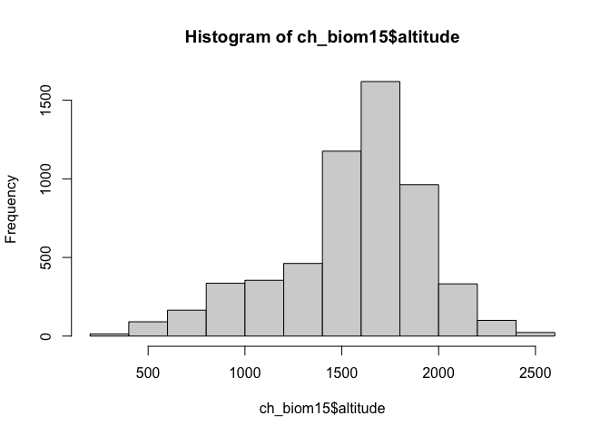<!-- -->

```r
ch_biom15$altitude_sc <- scale(ch_biom15$altitude)
ch_biom15$year_sc <- scale(ch_biom15$year)
```


# Statistical Analysis

As the use of arbitrary climate periods do not always explain the biological response in the best way possible (van de Pol et al. 2016), we investigated the variation weight of 1.5-year-old individuals in relation to the variation of mean ambient temperature using the R package climwin, and the function slidingwin which detects the exact time window when a biological variable is most strongly affected by climate (Bailey and van de Pol 2016). 
The overall approach for the climwin analysis is to compare the support by the data for competing hypotheses and to formalize them into regression models (van de Pol et al., 2016). Competing models are based upon a baseline model (without the addition of weather effects) and ranked using the ΔAICc, or the difference in terms of the Akaike Information Criterion values calculated for a small sample size between the baseline model and the model of interest. The model with the best support from the data has the lowest ΔAICc among competing models. The baseline model was a linear model with the body mass of the juvenile chamois in relation to sex and elevation. The function slidingwin creates a candidate set of competing models testing windows of different lengths for the weather variable of interest, in this study the mean daily ambient temperature (℃). Non-linear effects of temperature on body weight were taken into account by checking for both linear and quadratic trends. As most of the chamois was shot during a two-week period at the end of September we chose an absolute time window for the analyses instead of an individual specific time window. As reference day we chose the last date of the shooting period (September 24th) and we looked for windows between September 24th and 661 days before (December 1st of 2 years before) to include the three critical periods of a young chamois life: gestation, lactation and juvenile.  

## Selection of the base model


```r
ch_basemod <- lm(weight ~
    sex + altitude_sc,
data = ch_biom15
)

ch_basemod_yr <- lm(weight ~
    sex + altitude_sc + year,
data = ch_biom15
)

ch_basemod_lmer <- lme4::lmer(weight ~
    sex + altitude_sc + year_sc + (1 | year_f),
control = lmerControl(optimizer = "bobyqa", optCtrl = list(maxfun = 1e+07)),
data = ch_biom15
)
```


## Climwin analysis

### Slidingwin
Using the function slidingwin allows to search for the best climatic window 


```r
# create model with ABSOLUTE time window with temperature for ALWAYS period
# for the period 1 Dec(-2) - 31May(-1)
ch_mass_sw <- slidingwin(
    baseline = ch_basemod,
    xvar = list(Temp = clim$Temp),
    type = "absolute",
    refday = c(24, 9),
    range = c(661, 0),
    stat = "mean",
    cdate = clim$date_ymd,
    bdate = ch_biom15$date_ymd,
    func = c("lin", "quad"),
    cmissing = FALSE,
    cinterval = "day"
)
save(ch_mass_sw, file = "output/ch_mass_sw_sc.rda")

ch_mass_sw_yr <- slidingwin(
    baseline = ch_basemod_yr,
    xvar = list(Temp = clim$Temp),
    type = "absolute",
    refday = c(24, 9),
    range = c(661, 0),
    stat = "mean",
    cdate = clim$date_ymd,
    bdate = ch_biom15$date_ymd,
    func = c("lin", "quad"),
    cmissing = FALSE,
    cinterval = "day"
)
save(ch_mass_sw_yr, file = "output/ch_mass_sw_yr_sc.rda")

ch_mass_sw_lmer <- slidingwin(
    baseline = ch_basemod_lmer,
    xvar = list(Temp = clim$Temp),
    type = "absolute",
    refday = c(24, 9),
    range = c(661, 0),
    stat = "mean",
    cdate = clim$date_ymd,
    bdate = ch_biom15$date_ymd,
    func = c("lin", "quad"),
    cmissing = FALSE,
    cinterval = "day"
)
save(ch_mass_sw_lmer, file = "output/ch_mass_sw_lmer.rda")

beepr::beep("treasure")
```


17.421= x: 18


NOTES


I want to try to see with the model that is running now if there are other climatic windows affecting the body mass.


Coping with a changing climate: exploring bird responses using long-term studies
The fast growth in human population and activities over the past century has led to fast changes in the global climate system. These global climatic changes are predicted to be even stronger during the 21st century and become one of the major threats to living organisms. Long-term studies in wild bird populations can help us investigate the effect of weather on population size and individual behaviour and morphology. 


#### Investigating the models


```r
load(file = "output/ch_mass_sw.rda")
load(file = "output/ch_mass_sw_yr_sc.rda")
load(file = "output/ch_mass_sw_lmer.rda")
```
__The best linear and quadratic windows__

For the sex + altitude model

```r
ch_mass_sw$combos
```

<div data-pagedtable="false">
  <script data-pagedtable-source type="application/json">
{"columns":[{"label":[""],"name":["_rn_"],"type":[""],"align":["left"]},{"label":["response"],"name":[1],"type":["chr"],"align":["left"]},{"label":["climate"],"name":[2],"type":["fct"],"align":["left"]},{"label":["type"],"name":[3],"type":["fct"],"align":["left"]},{"label":["stat"],"name":[4],"type":["fct"],"align":["left"]},{"label":["func"],"name":[5],"type":["fct"],"align":["left"]},{"label":["DeltaAICc"],"name":[6],"type":["dbl"],"align":["right"]},{"label":["WindowOpen"],"name":[7],"type":["int"],"align":["right"]},{"label":["WindowClose"],"name":[8],"type":["dbl"],"align":["right"]}],"data":[{"1":"weight","2":"Temp","3":"absolute","4":"mean","5":"lin","6":"-262.02","7":"93","8":"78","_rn_":"1"},{"1":"weight","2":"Temp","3":"absolute","4":"mean","5":"quad","6":"-325.33","7":"503","8":"449","_rn_":"2"}],"options":{"columns":{"min":{},"max":[10]},"rows":{"min":[10],"max":[10]},"pages":{}}}
  </script>
</div>
For the sex + altitude + year model 

```r
ch_mass_sw_yr$combos
```

<div data-pagedtable="false">
  <script data-pagedtable-source type="application/json">
{"columns":[{"label":[""],"name":["_rn_"],"type":[""],"align":["left"]},{"label":["response"],"name":[1],"type":["chr"],"align":["left"]},{"label":["climate"],"name":[2],"type":["fct"],"align":["left"]},{"label":["type"],"name":[3],"type":["fct"],"align":["left"]},{"label":["stat"],"name":[4],"type":["fct"],"align":["left"]},{"label":["func"],"name":[5],"type":["fct"],"align":["left"]},{"label":["DeltaAICc"],"name":[6],"type":["dbl"],"align":["right"]},{"label":["WindowOpen"],"name":[7],"type":["int"],"align":["right"]},{"label":["WindowClose"],"name":[8],"type":["dbl"],"align":["right"]}],"data":[{"1":"weight","2":"Temp","3":"absolute","4":"mean","5":"lin","6":"-95.53","7":"93","8":"78","_rn_":"1"},{"1":"weight","2":"Temp","3":"absolute","4":"mean","5":"quad","6":"-138.66","7":"202","8":"167","_rn_":"2"}],"options":{"columns":{"min":{},"max":[10]},"rows":{"min":[10],"max":[10]},"pages":{}}}
  </script>
</div>
For the sex + altitude model with year as random

```r
ch_mass_sw_lmer$combos
```

<div data-pagedtable="false">
  <script data-pagedtable-source type="application/json">
{"columns":[{"label":[""],"name":["_rn_"],"type":[""],"align":["left"]},{"label":["response"],"name":[1],"type":["chr"],"align":["left"]},{"label":["climate"],"name":[2],"type":["fct"],"align":["left"]},{"label":["type"],"name":[3],"type":["fct"],"align":["left"]},{"label":["stat"],"name":[4],"type":["fct"],"align":["left"]},{"label":["func"],"name":[5],"type":["fct"],"align":["left"]},{"label":["DeltaAICc"],"name":[6],"type":["dbl"],"align":["right"]},{"label":["WindowOpen"],"name":[7],"type":["int"],"align":["right"]},{"label":["WindowClose"],"name":[8],"type":["dbl"],"align":["right"]}],"data":[{"1":"weight","2":"Temp","3":"absolute","4":"mean","5":"lin","6":"-7.01","7":"93","8":"78","_rn_":"1"},{"1":"weight","2":"Temp","3":"absolute","4":"mean","5":"quad","6":"-4.16","7":"197","8":"162","_rn_":"2"}],"options":{"columns":{"min":{},"max":[10]},"rows":{"min":[10],"max":[10]},"pages":{}}}
  </script>
</div>

The window for the linear effect is the same for all models, whereas the window for the quadratic effect changes quite a lot!
Windows are also in very different moments of the growth of young chamois!


The 10 best linear models sorted by deltaAICc:

```r
head(ch_mass_sw[[1]]$Dataset, 10)
```

<div data-pagedtable="false">
  <script data-pagedtable-source type="application/json">
{"columns":[{"label":[""],"name":["_rn_"],"type":[""],"align":["left"]},{"label":["deltaAICc"],"name":[1],"type":["dbl"],"align":["right"]},{"label":["WindowOpen"],"name":[2],"type":["int"],"align":["right"]},{"label":["WindowClose"],"name":[3],"type":["dbl"],"align":["right"]},{"label":["ModelBeta"],"name":[4],"type":["dbl"],"align":["right"]},{"label":["Std.Error"],"name":[5],"type":["dbl"],"align":["right"]},{"label":["ModelBetaQ"],"name":[6],"type":["lgl"],"align":["right"]},{"label":["ModelBetaC"],"name":[7],"type":["lgl"],"align":["right"]},{"label":["ModelInt"],"name":[8],"type":["dbl"],"align":["right"]},{"label":["Function"],"name":[9],"type":["chr"],"align":["left"]},{"label":["Furthest"],"name":[10],"type":["dbl"],"align":["right"]},{"label":["Closest"],"name":[11],"type":["dbl"],"align":["right"]},{"label":["Statistics"],"name":[12],"type":["chr"],"align":["left"]},{"label":["Type"],"name":[13],"type":["chr"],"align":["left"]},{"label":["K"],"name":[14],"type":["dbl"],"align":["right"]},{"label":["ModWeight"],"name":[15],"type":["dbl"],"align":["right"]},{"label":["sample.size"],"name":[16],"type":["int"],"align":["right"]},{"label":["Reference.day"],"name":[17],"type":["dbl"],"align":["right"]},{"label":["Reference.month"],"name":[18],"type":["dbl"],"align":["right"]},{"label":["Randomised"],"name":[19],"type":["chr"],"align":["left"]}],"data":[{"1":"-262.0178","2":"93","3":"78","4":"-0.3687283","5":"0.06984322","6":"NA","7":"NA","8":"20.02483","9":"lin","10":"661","11":"0","12":"mean","13":"absolute","14":"0","15":"0.670235058","16":"27","17":"24","18":"9","19":"no","_rn_":"4387"},{"1":"-258.9846","2":"92","3":"78","4":"-0.3697390","5":"0.06985599","6":"NA","7":"NA","8":"20.04881","9":"lin","10":"661","11":"0","12":"mean","13":"absolute","14":"0","15":"0.147081642","16":"27","17":"24","18":"9","19":"no","_rn_":"4293"},{"1":"-257.4804","2":"93","3":"79","4":"-0.3561051","5":"0.06986595","6":"NA","7":"NA","8":"19.75982","9":"lin","10":"661","11":"0","12":"mean","13":"absolute","14":"0","15":"0.069332204","16":"27","17":"24","18":"9","19":"no","_rn_":"4386"},{"1":"-256.9085","2":"93","3":"77","4":"-0.3703596","5":"0.06987779","6":"NA","7":"NA","8":"20.05171","9":"lin","10":"661","11":"0","12":"mean","13":"absolute","14":"0","15":"0.052089702","16":"27","17":"24","18":"9","19":"no","_rn_":"4388"},{"1":"-255.0189","2":"94","3":"78","4":"-0.3612606","5":"0.06989115","6":"NA","7":"NA","8":"19.85934","9":"lin","10":"661","11":"0","12":"mean","13":"absolute","14":"0","15":"0.020249729","16":"27","17":"24","18":"9","19":"no","_rn_":"4482"},{"1":"-254.0068","2":"92","3":"79","4":"-0.3562154","5":"0.06988134","6":"NA","7":"NA","8":"19.76495","9":"lin","10":"661","11":"0","12":"mean","13":"absolute","14":"0","15":"0.012207940","16":"27","17":"24","18":"9","19":"no","_rn_":"4292"},{"1":"-253.1840","2":"93","3":"76","4":"-0.3651544","5":"0.06990195","6":"NA","7":"NA","8":"19.92758","9":"lin","10":"661","11":"0","12":"mean","13":"absolute","14":"0","15":"0.008090647","16":"27","17":"24","18":"9","19":"no","_rn_":"4389"},{"1":"-252.6979","2":"92","3":"77","4":"-0.3699672","5":"0.06989799","6":"NA","7":"NA","8":"20.04401","9":"lin","10":"661","11":"0","12":"mean","13":"absolute","14":"0","15":"0.006344982","16":"27","17":"24","18":"9","19":"no","_rn_":"4294"},{"1":"-252.0185","2":"95","3":"78","4":"-0.3552180","5":"0.06991180","6":"NA","7":"NA","8":"19.73050","9":"lin","10":"661","11":"0","12":"mean","13":"absolute","14":"0","15":"0.004517444","16":"27","17":"24","18":"9","19":"no","_rn_":"4578"},{"1":"-251.1182","2":"94","3":"79","4":"-0.3500659","5":"0.06991023","6":"NA","7":"NA","8":"19.62480","9":"lin","10":"661","11":"0","12":"mean","13":"absolute","14":"0","15":"0.002880107","16":"27","17":"24","18":"9","19":"no","_rn_":"4481"}],"options":{"columns":{"min":{},"max":[10]},"rows":{"min":[10],"max":[10]},"pages":{}}}
  </script>
</div>

The 10 best quadratic models sorted by deltaAICc:

```r
head(ch_mass_sw[[2]]$Dataset, 10)
```

<div data-pagedtable="false">
  <script data-pagedtable-source type="application/json">
{"columns":[{"label":[""],"name":["_rn_"],"type":[""],"align":["left"]},{"label":["deltaAICc"],"name":[1],"type":["dbl"],"align":["right"]},{"label":["WindowOpen"],"name":[2],"type":["int"],"align":["right"]},{"label":["WindowClose"],"name":[3],"type":["dbl"],"align":["right"]},{"label":["ModelBeta"],"name":[4],"type":["dbl"],"align":["right"]},{"label":["Std.Error"],"name":[5],"type":["dbl"],"align":["right"]},{"label":["ModelBetaQ"],"name":[6],"type":["dbl"],"align":["right"]},{"label":["Std.ErrorQ"],"name":[7],"type":["dbl"],"align":["right"]},{"label":["ModelBetaC"],"name":[8],"type":["lgl"],"align":["right"]},{"label":["ModelInt"],"name":[9],"type":["dbl"],"align":["right"]},{"label":["Function"],"name":[10],"type":["chr"],"align":["left"]},{"label":["Furthest"],"name":[11],"type":["dbl"],"align":["right"]},{"label":["Closest"],"name":[12],"type":["dbl"],"align":["right"]},{"label":["Statistics"],"name":[13],"type":["chr"],"align":["left"]},{"label":["Type"],"name":[14],"type":["chr"],"align":["left"]},{"label":["K"],"name":[15],"type":["dbl"],"align":["right"]},{"label":["ModWeight"],"name":[16],"type":["dbl"],"align":["right"]},{"label":["sample.size"],"name":[17],"type":["int"],"align":["right"]},{"label":["Reference.day"],"name":[18],"type":["dbl"],"align":["right"]},{"label":["Reference.month"],"name":[19],"type":["dbl"],"align":["right"]},{"label":["Randomised"],"name":[20],"type":["chr"],"align":["left"]}],"data":[{"1":"-325.3275","2":"503","3":"449","4":"-8.526073","5":"0.06945118","6":"0.2059814","7":"9.132948e-05","8":"NA","9":"99.40562","10":"quad","11":"661","12":"0","13":"mean","14":"absolute","15":"0","16":"0.19730404","17":"27","18":"24","19":"9","20":"no","_rn_":"126811"},{"1":"-324.3307","2":"504","3":"449","4":"-8.531009","5":"0.06945764","6":"0.2066512","7":"9.134003e-05","8":"NA","9":"99.20689","10":"quad","11":"661","12":"0","13":"mean","14":"absolute","15":"0","16":"0.11986598","17":"27","18":"24","19":"9","20":"no","_rn_":"127316"},{"1":"-324.1087","2":"503","3":"450","4":"-8.433980","5":"0.06946480","6":"0.2040657","7":"9.133873e-05","8":"NA","9":"98.31144","10":"quad","11":"661","12":"0","13":"mean","14":"absolute","15":"0","16":"0.10727304","17":"27","18":"24","19":"9","20":"no","_rn_":"126810"},{"1":"-323.9020","2":"503","3":"451","4":"-8.289906","5":"0.06947091","6":"0.2008679","7":"9.133960e-05","8":"NA","9":"96.69394","10":"quad","11":"661","12":"0","13":"mean","14":"absolute","15":"0","16":"0.09674092","17":"27","18":"24","19":"9","20":"no","_rn_":"126809"},{"1":"-322.4771","2":"500","3":"451","4":"-8.012148","5":"0.06947658","6":"0.1919002","7":"9.134618e-05","8":"NA","9":"94.80927","10":"quad","11":"661","12":"0","13":"mean","14":"absolute","15":"0","16":"0.04744406","17":"27","18":"24","19":"9","20":"no","_rn_":"125300"},{"1":"-322.4249","2":"502","3":"449","4":"-8.362830","5":"0.06946858","6":"0.2011678","7":"9.135045e-05","8":"NA","9":"98.10043","10":"quad","11":"661","12":"0","13":"mean","14":"absolute","15":"0","16":"0.04622274","17":"27","18":"24","19":"9","20":"no","_rn_":"126307"},{"1":"-322.3136","2":"504","3":"450","4":"-8.415984","5":"0.06947628","6":"0.2041668","7":"9.135570e-05","8":"NA","9":"97.88342","10":"quad","11":"661","12":"0","13":"mean","14":"absolute","15":"0","16":"0.04372079","17":"27","18":"24","19":"9","20":"no","_rn_":"127315"},{"1":"-321.9411","2":"504","3":"451","4":"-8.276014","5":"0.06948357","6":"0.2010699","7":"9.135782e-05","8":"NA","9":"96.30829","10":"quad","11":"661","12":"0","13":"mean","14":"absolute","15":"0","16":"0.03629161","17":"27","18":"24","19":"9","20":"no","_rn_":"127314"},{"1":"-321.6449","2":"502","3":"450","4":"-8.280076","5":"0.06947898","6":"0.1994706","7":"9.135620e-05","8":"NA","9":"97.10428","10":"quad","11":"661","12":"0","13":"mean","14":"absolute","15":"0","16":"0.03129540","17":"27","18":"24","19":"9","20":"no","_rn_":"126306"},{"1":"-321.6095","2":"500","3":"450","4":"-8.142425","5":"0.06947810","6":"0.1947678","7":"9.135374e-05","8":"NA","9":"96.28649","10":"quad","11":"661","12":"0","13":"mean","14":"absolute","15":"0","16":"0.03074654","17":"27","18":"24","19":"9","20":"no","_rn_":"125301"}],"options":{"columns":{"min":{},"max":[10]},"rows":{"min":[10],"max":[10]},"pages":{}}}
  </script>
</div>

```r
head(ch_mass_sw_lmer[[2]]$Dataset, 10)
```

<div data-pagedtable="false">
  <script data-pagedtable-source type="application/json">
{"columns":[{"label":[""],"name":["_rn_"],"type":[""],"align":["left"]},{"label":["deltaAICc"],"name":[1],"type":["dbl"],"align":["right"]},{"label":["WindowOpen"],"name":[2],"type":["int"],"align":["right"]},{"label":["WindowClose"],"name":[3],"type":["dbl"],"align":["right"]},{"label":["ModelBeta"],"name":[4],"type":["dbl"],"align":["right"]},{"label":["Std.Error"],"name":[5],"type":["dbl"],"align":["right"]},{"label":["ModelBetaQ"],"name":[6],"type":["dbl"],"align":["right"]},{"label":["Std.ErrorQ"],"name":[7],"type":["dbl"],"align":["right"]},{"label":["ModelBetaC"],"name":[8],"type":["lgl"],"align":["right"]},{"label":["ModelInt"],"name":[9],"type":["dbl"],"align":["right"]},{"label":["Function"],"name":[10],"type":["chr"],"align":["left"]},{"label":["Furthest"],"name":[11],"type":["dbl"],"align":["right"]},{"label":["Closest"],"name":[12],"type":["dbl"],"align":["right"]},{"label":["Statistics"],"name":[13],"type":["chr"],"align":["left"]},{"label":["Type"],"name":[14],"type":["chr"],"align":["left"]},{"label":["K"],"name":[15],"type":["dbl"],"align":["right"]},{"label":["ModWeight"],"name":[16],"type":["dbl"],"align":["right"]},{"label":["sample.size"],"name":[17],"type":["int"],"align":["right"]},{"label":["Reference.day"],"name":[18],"type":["dbl"],"align":["right"]},{"label":["Reference.month"],"name":[19],"type":["dbl"],"align":["right"]},{"label":["Randomised"],"name":[20],"type":["chr"],"align":["left"]}],"data":[{"1":"-4.164624","2":"197","3":"162","4":"-4.426008","5":"0.06872991","6":"0.2198315","7":"0.03389060","8":"NA","9":"36.06300","10":"quad","11":"661","12":"0","13":"mean","14":"absolute","15":"0","16":"0.0001770354","17":"27","18":"24","19":"9","20":"no","_rn_":"19539"},{"1":"-4.049678","2":"199","3":"162","4":"-4.800117","5":"0.06873231","6":"0.2406550","7":"0.03389406","8":"NA","9":"37.70169","10":"quad","11":"661","12":"0","13":"mean","14":"absolute","15":"0","16":"0.0001671474","17":"27","18":"24","19":"9","20":"no","_rn_":"19938"},{"1":"-4.031874","2":"198","3":"162","4":"-4.588755","5":"0.06873144","6":"0.2287504","7":"0.03389246","8":"NA","9":"36.79016","10":"quad","11":"661","12":"0","13":"mean","14":"absolute","15":"0","16":"0.0001656661","17":"27","18":"24","19":"9","20":"no","_rn_":"19738"},{"1":"-3.943327","2":"199","3":"163","4":"-4.511304","5":"0.06873222","6":"0.2279184","7":"0.03389360","8":"NA","9":"36.09599","10":"quad","11":"661","12":"0","13":"mean","14":"absolute","15":"0","16":"0.0001584915","17":"27","18":"24","19":"9","20":"no","_rn_":"19937"},{"1":"-3.883506","2":"200","3":"163","4":"-4.668184","5":"0.06873391","6":"0.2374601","7":"0.03389435","8":"NA","9":"36.70784","10":"quad","11":"661","12":"0","13":"mean","14":"absolute","15":"0","16":"0.0001538211","17":"27","18":"24","19":"9","20":"no","_rn_":"20138"},{"1":"-3.854535","2":"197","3":"161","4":"-4.677412","5":"0.06873293","6":"0.2306537","7":"0.03389147","8":"NA","9":"37.50159","10":"quad","11":"661","12":"0","13":"mean","14":"absolute","15":"0","16":"0.0001516090","17":"27","18":"24","19":"9","20":"no","_rn_":"19540"},{"1":"-3.811257","2":"200","3":"162","4":"-4.926529","5":"0.06873491","6":"0.2486379","7":"0.03389465","8":"NA","9":"38.16543","10":"quad","11":"661","12":"0","13":"mean","14":"absolute","15":"0","16":"0.0001483636","17":"27","18":"24","19":"9","20":"no","_rn_":"20139"},{"1":"-3.764582","2":"198","3":"163","4":"-4.276947","5":"0.06873215","6":"0.2148497","7":"0.03389199","8":"NA","9":"35.07165","10":"quad","11":"661","12":"0","13":"mean","14":"absolute","15":"0","16":"0.0001449412","17":"27","18":"24","19":"9","20":"no","_rn_":"19737"},{"1":"-3.626191","2":"197","3":"163","4":"-4.063315","5":"0.06873200","6":"0.2034732","7":"0.03389028","8":"NA","9":"34.08374","10":"quad","11":"661","12":"0","13":"mean","14":"absolute","15":"0","16":"0.0001352511","17":"27","18":"24","19":"9","20":"no","_rn_":"19538"},{"1":"-3.362361","2":"198","3":"161","4":"-4.748604","5":"0.06873626","6":"0.2351500","7":"0.03389340","8":"NA","9":"37.76008","10":"quad","11":"661","12":"0","13":"mean","14":"absolute","15":"0","16":"0.0001185361","17":"27","18":"24","19":"9","20":"no","_rn_":"19739"}],"options":{"columns":{"min":{},"max":[10]},"rows":{"min":[10],"max":[10]},"pages":{}}}
  </script>
</div>


The deltaAIC plot for linear and quadratic:

```r
plotdelta(dataset = ch_mass_sw[[1]]$Dataset)
```

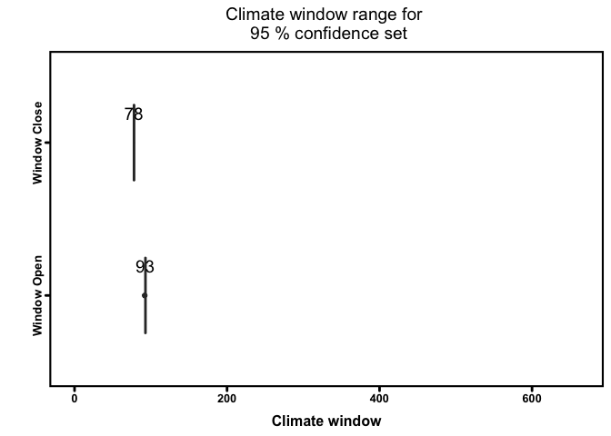<!-- -->

```r
plotdelta(dataset = ch_mass_sw[[2]]$Dataset)
```

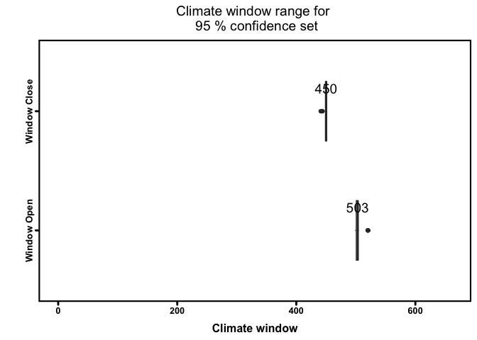<!-- -->

```r
plotdelta(dataset = ch_mass_sw_yr[[1]]$Dataset)
```

<!-- -->

```r
plotdelta(dataset = ch_mass_sw_yr[[1]]$Dataset)
```

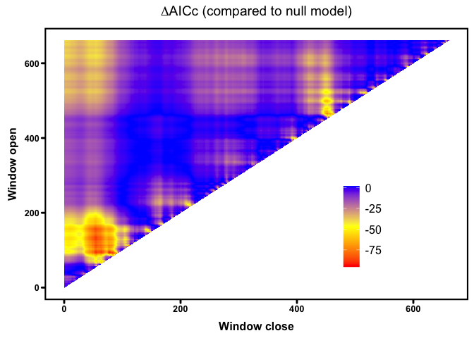<!-- -->

```r
plotdelta(dataset = ch_mass_sw_lmer[[1]]$Dataset)
```

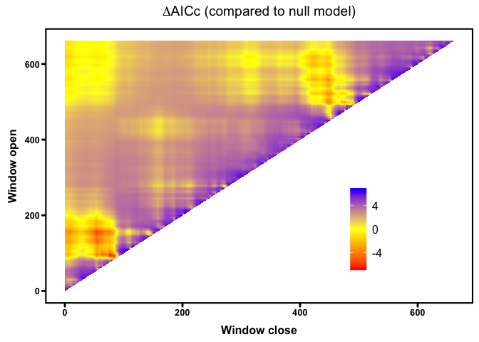<!-- -->

```r
plotdelta(dataset = ch_mass_sw_lmer[[2]]$Dataset)
```

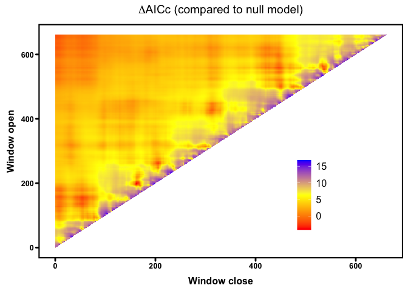<!-- -->


I can add the new variable to the dataset and obtain the dates for the window:

```r
# The best supported climate variable can be attached
# to the original dataset for further analyses
ch_biom15$temp_503_449 <- ch_mass_sw[[2]]$BestModelData$climate

ch_biom15$temp_93_78 <- ch_mass_sw_lmer[[1]]$BestModelData$climate


as.Date("2022/09/24", format = "%Y/%m/%d") - 503
```

```
## [1] "2021-05-09"
```

```r
as.Date("2022/09/24", format = "%Y/%m/%d") - 449
```

```
## [1] "2021-07-02"
```

```r
as.Date("2022/09/24", format = "%Y/%m/%d") - 93
```

```
## [1] "2022-06-23"
```

```r
as.Date("2022/09/24", format = "%Y/%m/%d") - 78
```

```
## [1] "2022-07-08"
```

```r
as.Date("2022/09/24", format = "%Y/%m/%d") - 197
```

```
## [1] "2022-03-11"
```

```r
as.Date("2022/09/24", format = "%Y/%m/%d") - 162
```

```
## [1] "2022-04-15"
```

Summary and figure for our updated model:

```r
ch_final <- lm(weight ~
    sex + altitude + poly(temp_503_449, 2),
data = ch_biom15
)

summary(ch_final)
```

```
## 
## Call:
## lm(formula = weight ~ sex + altitude + poly(temp_503_449, 2), 
##     data = ch_biom15)
## 
## Residuals:
##     Min      1Q  Median      3Q     Max 
## -7.9864 -1.8197  0.0229  1.7639 12.2317 
## 
## Coefficients:
##                          Estimate Std. Error t value Pr(>|t|)    
## (Intercept)             1.185e+01  1.538e-01  77.076  < 2e-16 ***
## sexm                    5.212e-01  6.945e-02   7.504 7.13e-14 ***
## altitude                1.296e-03  9.133e-05  14.193  < 2e-16 ***
## poly(temp_503_449, 2)1 -3.435e+01  2.586e+00 -13.282  < 2e-16 ***
## poly(temp_503_449, 2)2  3.298e+01  2.587e+00  12.750  < 2e-16 ***
## ---
## Signif. codes:  0 '***' 0.001 '**' 0.01 '*' 0.05 '.' 0.1 ' ' 1
## 
## Residual standard error: 2.586 on 5630 degrees of freedom
## Multiple R-squared:  0.09729,	Adjusted R-squared:  0.09665 
## F-statistic: 151.7 on 4 and 5630 DF,  p-value: < 2.2e-16
```

```r
visreg::visreg(ch_final)
```

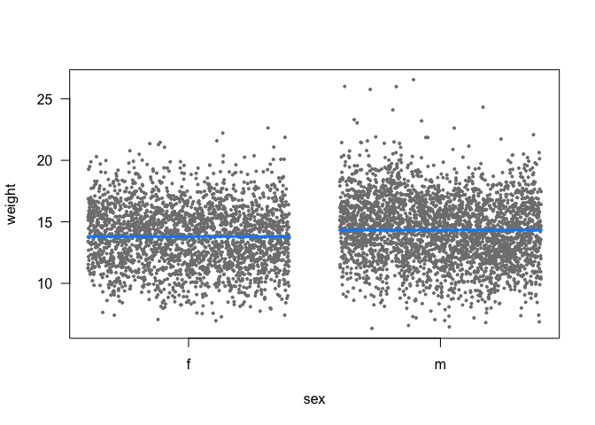<!-- -->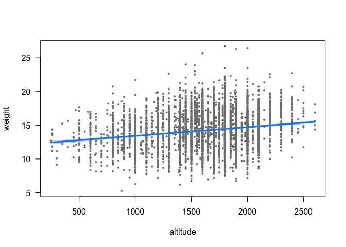<!-- -->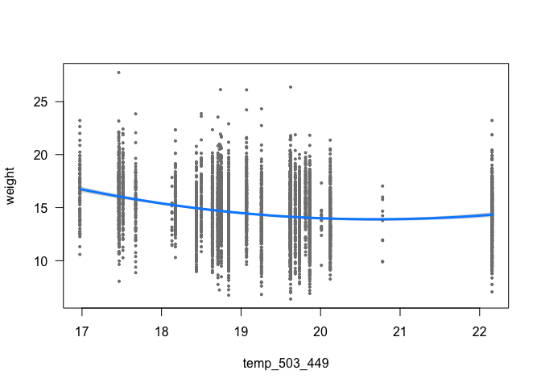<!-- -->

```r
ch_climmod_lmer <- lmer(weight ~
    sex + altitude_sc + year_sc +
    temp_93_78 +
    (1 | year_f),
control = lmerControl(optimizer = "bobyqa", optCtrl = list(maxfun = 1e+07)),
data = ch_biom15
)
summary(ch_climmod_lmer)
```

```
## Linear mixed model fit by REML. t-tests use Satterthwaite's method ['lmerModLmerTest']
## Formula: weight ~ sex + altitude_sc + year_sc + temp_93_78 + (1 | year_f)
##    Data: ch_biom15
## Control: lmerControl(optimizer = "bobyqa", optCtrl = list(maxfun = 1e+07))
## 
## REML criterion at convergence: 26549.1
## 
## Scaled residuals: 
##     Min      1Q  Median      3Q     Max 
## -3.0407 -0.6945  0.0029  0.6777  4.8314 
## 
## Random effects:
##  Groups   Name        Variance Std.Dev.
##  year_f   (Intercept) 0.1772   0.421   
##  Residual             6.4437   2.538   
## Number of obs: 5635, groups:  year_f, 27
## 
## Fixed effects:
##               Estimate Std. Error         df t value Pr(>|t|)    
## (Intercept)   19.32722    1.27862   25.51670  15.116 3.04e-14 ***
## sexm           0.48914    0.06874 5629.24345   7.116 1.25e-12 ***
## altitude_sc    0.48812    0.03388 5614.58589  14.406  < 2e-16 ***
## year_sc       -0.43765    0.08268   29.89412  -5.293 1.03e-05 ***
## temp_93_78    -0.23708    0.05861   25.15617  -4.045 0.000437 ***
## ---
## Signif. codes:  0 '***' 0.001 '**' 0.01 '*' 0.05 '.' 0.1 ' ' 1
## 
## Correlation of Fixed Effects:
##             (Intr) sexm   alttd_ yer_sc
## sexm        -0.030                     
## altitude_sc  0.005 -0.040              
## year_sc      0.437  0.024  0.002       
## temp_93_78  -0.997  0.000 -0.003 -0.435
```

```r
visreg::visreg(ch_climmod_lmer)
```

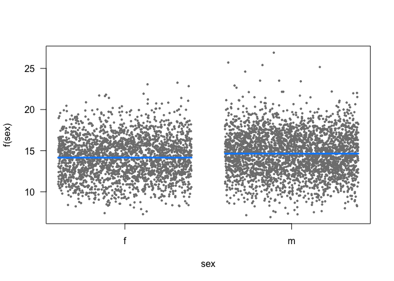<!-- -->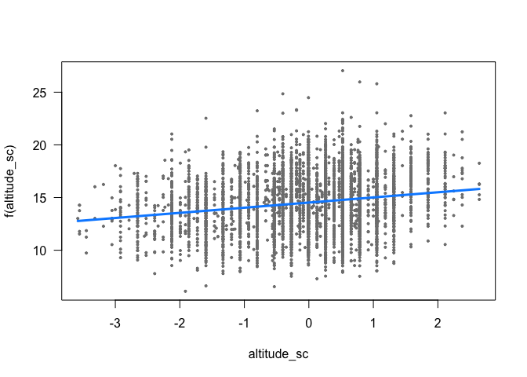<!-- -->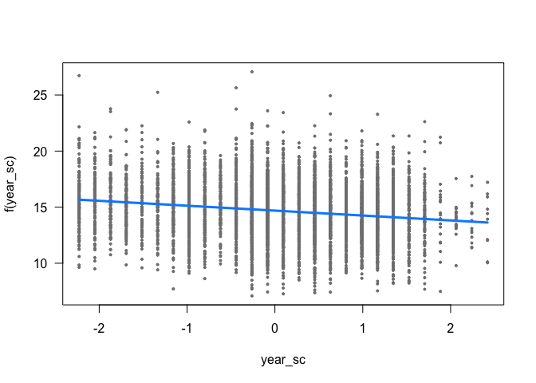<!-- -->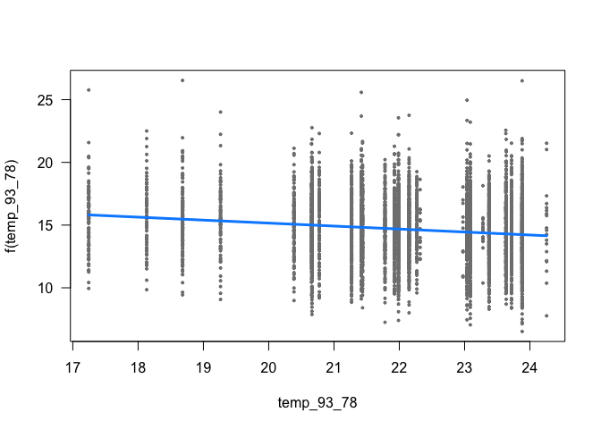<!-- -->


```r
ch_mass_sw_lmer2 <- slidingwin(
    baseline = lme4::lmer(weight ~
        sex + altitude_sc + year_sc +
        temp_93_78 +
        (1 | year_f),
    control = lmerControl(optimizer = "bobyqa", optCtrl = list(maxfun = 1e+07)),
    data = ch_biom15
    ),
    xvar = list(Temp = clim$Temp),
    type = "absolute",
    refday = c(24, 9),
    range = c(661, 0),
    stat = "mean",
    cdate = clim$date_ymd,
    bdate = ch_biom15$date_ymd,
    func = c("lin", "quad"),
    cmissing = FALSE,
    cinterval = "day"
)
save(ch_mass_sw_lmer2, file = "output/ch_mass_sw_lmer2.rda")
```


```r
library(sjPlot)

sjPlot::tab_model(ch_final,
    file = "Tables/wicm_models.doc",
    string.est = "Estimate",
    string.se = "SE",
    show.ci = F,
    show.se = T,
    show.stat = T,
    show.df = F,
    digits = 3,
    digits.rsq = 2
)
```

<table style="border-collapse:collapse; border:none;">
<tr>
<th style="border-top: double; text-align:center; font-style:normal; font-weight:bold; padding:0.2cm;  text-align:left; ">&nbsp;</th>
<th colspan="4" style="border-top: double; text-align:center; font-style:normal; font-weight:bold; padding:0.2cm; ">weight</th>
</tr>
<tr>
<td style=" text-align:center; border-bottom:1px solid; font-style:italic; font-weight:normal;  text-align:left; ">Predictors</td>
<td style=" text-align:center; border-bottom:1px solid; font-style:italic; font-weight:normal;  ">Estimate</td>
<td style=" text-align:center; border-bottom:1px solid; font-style:italic; font-weight:normal;  ">SE</td>
<td style=" text-align:center; border-bottom:1px solid; font-style:italic; font-weight:normal;  ">Statistic</td>
<td style=" text-align:center; border-bottom:1px solid; font-style:italic; font-weight:normal;  ">p</td>
</tr>
<tr>
<td style=" padding:0.2cm; text-align:left; vertical-align:top; text-align:left; ">(Intercept)</td>
<td style=" padding:0.2cm; text-align:left; vertical-align:top; text-align:center;  ">11.853</td>
<td style=" padding:0.2cm; text-align:left; vertical-align:top; text-align:center;  ">0.154</td>
<td style=" padding:0.2cm; text-align:left; vertical-align:top; text-align:center;  ">77.076</td>
<td style=" padding:0.2cm; text-align:left; vertical-align:top; text-align:center;  "><strong>&lt;0.001</strong></td>
</tr>
<tr>
<td style=" padding:0.2cm; text-align:left; vertical-align:top; text-align:left; ">sex [m]</td>
<td style=" padding:0.2cm; text-align:left; vertical-align:top; text-align:center;  ">0.521</td>
<td style=" padding:0.2cm; text-align:left; vertical-align:top; text-align:center;  ">0.069</td>
<td style=" padding:0.2cm; text-align:left; vertical-align:top; text-align:center;  ">7.504</td>
<td style=" padding:0.2cm; text-align:left; vertical-align:top; text-align:center;  "><strong>&lt;0.001</strong></td>
</tr>
<tr>
<td style=" padding:0.2cm; text-align:left; vertical-align:top; text-align:left; ">altitude</td>
<td style=" padding:0.2cm; text-align:left; vertical-align:top; text-align:center;  ">0.001</td>
<td style=" padding:0.2cm; text-align:left; vertical-align:top; text-align:center;  ">0.000</td>
<td style=" padding:0.2cm; text-align:left; vertical-align:top; text-align:center;  ">14.193</td>
<td style=" padding:0.2cm; text-align:left; vertical-align:top; text-align:center;  "><strong>&lt;0.001</strong></td>
</tr>
<tr>
<td style=" padding:0.2cm; text-align:left; vertical-align:top; text-align:left; ">temp 503 449 [1st degree]</td>
<td style=" padding:0.2cm; text-align:left; vertical-align:top; text-align:center;  ">&#45;34.348</td>
<td style=" padding:0.2cm; text-align:left; vertical-align:top; text-align:center;  ">2.586</td>
<td style=" padding:0.2cm; text-align:left; vertical-align:top; text-align:center;  ">&#45;13.282</td>
<td style=" padding:0.2cm; text-align:left; vertical-align:top; text-align:center;  "><strong>&lt;0.001</strong></td>
</tr>
<tr>
<td style=" padding:0.2cm; text-align:left; vertical-align:top; text-align:left; ">temp 503 449 [2nd degree]</td>
<td style=" padding:0.2cm; text-align:left; vertical-align:top; text-align:center;  ">32.985</td>
<td style=" padding:0.2cm; text-align:left; vertical-align:top; text-align:center;  ">2.587</td>
<td style=" padding:0.2cm; text-align:left; vertical-align:top; text-align:center;  ">12.750</td>
<td style=" padding:0.2cm; text-align:left; vertical-align:top; text-align:center;  "><strong>&lt;0.001</strong></td>
</tr>
<tr>
<td style=" padding:0.2cm; text-align:left; vertical-align:top; text-align:left; padding-top:0.1cm; padding-bottom:0.1cm; border-top:1px solid;">Observations</td>
<td style=" padding:0.2cm; text-align:left; vertical-align:top; padding-top:0.1cm; padding-bottom:0.1cm; text-align:left; border-top:1px solid;" colspan="4">5635</td>
</tr>
<tr>
<td style=" padding:0.2cm; text-align:left; vertical-align:top; text-align:left; padding-top:0.1cm; padding-bottom:0.1cm;">R<sup>2</sup> / R<sup>2</sup> adjusted</td>
<td style=" padding:0.2cm; text-align:left; vertical-align:top; padding-top:0.1cm; padding-bottom:0.1cm; text-align:left;" colspan="4">0.10 / 0.10</td>
</tr>

</table>

Sex difference estimated by the model:

```r
emmeans::emmeans(ch_climmod_lmer, "sex")
```

```
## Note: D.f. calculations have been disabled because the number of observations exceeds 3000.
## To enable adjustments, add the argument 'pbkrtest.limit = 5635' (or larger)
## [or, globally, 'set emm_options(pbkrtest.limit = 5635)' or larger];
## but be warned that this may result in large computation time and memory use.
```

```
## Note: D.f. calculations have been disabled because the number of observations exceeds 3000.
## To enable adjustments, add the argument 'lmerTest.limit = 5635' (or larger)
## [or, globally, 'set emm_options(lmerTest.limit = 5635)' or larger];
## but be warned that this may result in large computation time and memory use.
```

```
##  sex emmean    SE  df asymp.LCL asymp.UCL
##  f     14.1 0.103 Inf      13.9      14.3
##  m     14.6 0.100 Inf      14.4      14.8
## 
## Degrees-of-freedom method: asymptotic 
## Confidence level used: 0.95
```


```r
ch_final <- lm(weight ~
    sex + scale(altitude) + poly((temp_503_449), 2),
data = ch_biom15
)

ch_climmod_lmer <- lmer(weight ~
    sex + altitude + year +
    temp_93_78 +
    (1 | year_f),
control = lmerControl(optimizer = "bobyqa", optCtrl = list(maxfun = 1e+07)),
data = ch_biom15
)


eff_data <- data.frame(effects::effect("temp_93_78",
    ch_climmod_lmer,
    partial.residuals = T
))

plot_temp <- ggplot(eff_data, aes(x = temp_93_78, y = fit)) +
    geom_line() +
    geom_ribbon(
        data = eff_data, aes(ymin = lower, ymax = upper),
        linetype = 0, alpha = .4
    ) +
    xlab("Mean temperature (°C; 23.6 - 8.7)") +
    #    scale_x_continuous(
    #        breaks = c(year_sc$year_sc[c(seq(1, 23, 4))]),
    #        labels = c(year_sc$year[c(seq(1, 23, 4))]),
    #        limits = c(year_sc$year_sc[1], year_sc$year_sc[23])
    #    ) +
    theme(
        legend.position = "none",
        panel.grid.major = element_blank(),
        panel.grid.minor = element_blank(),
        panel.background = element_blank(),
        axis.line = element_line(colour = "black")
    ) +
    geom_point(
        data = ch_biom15,
        aes(x = temp_93_78, y = weight),
        size = 1, shape = 16, alpha = 0.1
    ) +
    ylab("Body mass (kg)") +
    scale_y_continuous(limits = c(6, 27), breaks = seq(0, 35, 3)) +
    scale_x_continuous(limits = c(16, 25), breaks = seq(16, 25, 3)) +
    annotate("text", x = 16.5, y = 27, label = "(a)")


eff_data <- data.frame(effects::effect("altitude",
    ch_climmod_lmer,
    partial.residuals = T
))

plot_alt <- ggplot(eff_data, aes(x = altitude, y = fit)) +
    geom_line() +
    geom_ribbon(
        data = eff_data, aes(ymin = lower, ymax = upper),
        linetype = 0, alpha = .4
    ) +
    xlab("Altitude (m a.s.l)") +
    ylab("") +
    scale_y_continuous(limits = c(6, 27), breaks = seq(0, 35, 3)) +
    scale_x_continuous(limits = c(200, 2600), breaks = seq(200, 2600, 600)) +
    theme(
        legend.position = "none",
        panel.grid.major = element_blank(),
        panel.grid.minor = element_blank(),
        panel.background = element_blank(),
        axis.line = element_line(colour = "black")
    ) +
    geom_point(
        data = ch_biom15,
        aes(x = altitude, y = weight),
        size = 1, shape = 16, alpha = 0.1
    ) +
    annotate("text", x = 300, y = 27, label = "(b)")

eff_data <- data.frame(effects::effect("year",
    ch_climmod_lmer,
    partial.residuals = TRUE
))

plot_yr <- ggplot(eff_data, aes(x = year, y = fit)) +
    geom_line() +
    geom_ribbon(
        data = eff_data, aes(ymin = lower, ymax = upper),
        linetype = 0, alpha = .4
    ) +
    xlab("Year") +
    ylab("") +
    scale_x_continuous(limits = c(1992, 2018), breaks = seq(1992, 2018, 6)) +
    theme(
        legend.position = "none",
        panel.grid.major = element_blank(),
        panel.grid.minor = element_blank(),
        panel.background = element_blank(),
        axis.line = element_line(colour = "black")
    ) +
    geom_point(
        data = ch_biom15,
        aes(x = year, y = weight),
        size = 1, shape = 16, alpha = 0.1
    ) +
    scale_y_continuous(limits = c(6, 27), breaks = seq(0, 35, 3)) +
    annotate("text", x = 1993, y = 27, label = "(c)")


eff_data <- data.frame(effects::effect("sex",
    ch_final,
    partial.residuals = T
))
```

```
## Warning in Analyze.model(focal.predictors, mod, xlevels, default.levels, : the predictor scale(altitude) is a one-column matrix that was converted to a vector
```

```r
par_col_af <- "darkorange3"
par_col_am <- "steelblue"
plot_sex <- ggplot(ch_biom15, aes(x = sex, y = weight, fill = sex)) +
    geom_boxplot(outlier.shape = NA, alpha = 0.5) +
    xlab("Sex") +
    theme(
        legend.position = "none",
        panel.grid.major = element_blank(),
        panel.grid.minor = element_blank(),
        panel.background = element_blank(),
        axis.line = element_line(colour = "black")
    ) +
    ggbeeswarm::geom_quasirandom(
        data = ch_biom15,
        aes(x = sex, y = weight, colour = "black"),
        size = 1, shape = 16, alpha = 0.07
    ) +
    ylab("") +
    scale_fill_manual(values = c(par_col_af, par_col_am)) +
    scale_color_manual(values = "black") +
    scale_y_continuous(limits = c(6, 27), breaks = seq(0, 35, 3)) +
    scale_x_discrete(labels = c("F", "M")) +
    annotate("text", x = 0.6, y = 27, label = "(d)") +
    geom_boxplot(outlier.shape = NA, alpha = 0.2)
```


```r
grid.arrange(
    plot_temp, plot_alt, plot_yr, plot_sex,
    nrow = 1
)
```

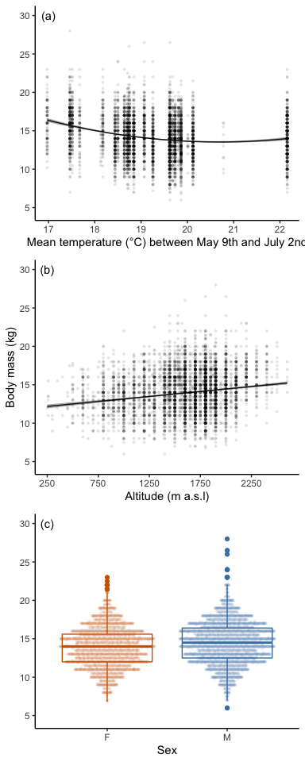


### Randwin

Using randwin to randomize the identity of the chamois (XXX ???) we are able to check if the window that wos found before is actually important, or the relationship was just random.


```r
# Performing randamization to identify
# likelyhood of of dignals occuring by chance

ch_mass_rand100 <- randwin(
    repeats = 100,
    baseline = ch_basemod,
    xvar = list(Temp = clim$Temp),
    type = "absolute",
    refday = c(24, 9),
    range = c(661, 0),
    stat = "mean",
    cdate = clim$date_ymd,
    bdate = ch_biom15$date_ymd,
    func = c("lin", "quad"),
    cmissing = FALSE,
    cinterval = "day",
    window = "sliding"
)
save(ch_mass_rand100, file = "output/ch_mass_rand100.rda")
```


```r
load("output/ch_mass_rand100.rda")

pvalue(
    datasetrand = ch_mass_rand100[[1]],
    dataset = ch_mass_sw[[1]]$Dataset, metric = "C", sample.size = 27
)
```

```
## [1] 0.0008034275
```

```r
pvalue(
    datasetrand = ch_mass_rand100[[2]],
    dataset = ch_mass_sw[[2]]$Dataset, metric = "C", sample.size = 27
)
```

```
## [1] 0.0002638776
```


### Testing for other windows

We build a model based the same base model selected before but with the addition of the climatic variable for the considered window. 

We are now able to look for other temporal windows that might be of importance for the chamois growth, but controlling for correlation with the temporal window already in the model.


```r
ch_basemod_lmer <- lme4::lmer(weight ~
    sex + altitude_sc + scale(year) +
    temp_93_78 +
    (1 | year_f),
control = lmerControl(optimizer = "bobyqa", optCtrl = list(maxfun = 1e+07)),
data = ch_biom15
)
summary(ch_basemod_lmer)

visreg::visreg(ch_basemod_lmer)

ch_mass_sw_2 <- slidingwin(
    baseline = ch_basemod_lmer,
    xvar = list(Temp = clim$Temp),
    type = "absolute",
    refday = c(24, 9),
    range = c(661, 0),
    stat = "mean",
    cdate = clim$date_ymd,
    bdate = ch_biom15$date_ymd,
    func = c("lin", "quad"),
    cmissing = FALSE,
    cinterval = "day"
)

save(ch_mass_sw_2, file = "output/ch_mass_sw_2.rda")

beepr::beep("treasure")
```


#### Investigating the models


```r
load(file = "output/ch_mass_sw_2.rda")

ch_mass_sw_2$combos
```

<div data-pagedtable="false">
  <script data-pagedtable-source type="application/json">
{"columns":[{"label":[""],"name":["_rn_"],"type":[""],"align":["left"]},{"label":["response"],"name":[1],"type":["chr"],"align":["left"]},{"label":["climate"],"name":[2],"type":["fct"],"align":["left"]},{"label":["type"],"name":[3],"type":["fct"],"align":["left"]},{"label":["stat"],"name":[4],"type":["fct"],"align":["left"]},{"label":["func"],"name":[5],"type":["fct"],"align":["left"]},{"label":["DeltaAICc"],"name":[6],"type":["dbl"],"align":["right"]},{"label":["WindowOpen"],"name":[7],"type":["int"],"align":["right"]},{"label":["WindowClose"],"name":[8],"type":["dbl"],"align":["right"]}],"data":[{"1":"weight","2":"Temp","3":"absolute","4":"mean","5":"lin","6":"-2.44","7":"429","8":"425","_rn_":"1"},{"1":"weight","2":"Temp","3":"absolute","4":"mean","5":"quad","6":"-2.26","7":"431","8":"31","_rn_":"2"}],"options":{"columns":{"min":{},"max":[10]},"rows":{"min":[10],"max":[10]},"pages":{}}}
  </script>
</div>

```r
# provides a summary of all tested climate window hypotheses,
# with the key statistics from the best model included

head(ch_mass_sw_2[[1]]$Dataset)
```

<div data-pagedtable="false">
  <script data-pagedtable-source type="application/json">
{"columns":[{"label":[""],"name":["_rn_"],"type":[""],"align":["left"]},{"label":["deltaAICc"],"name":[1],"type":["dbl"],"align":["right"]},{"label":["WindowOpen"],"name":[2],"type":["int"],"align":["right"]},{"label":["WindowClose"],"name":[3],"type":["dbl"],"align":["right"]},{"label":["ModelBeta"],"name":[4],"type":["dbl"],"align":["right"]},{"label":["Std.Error"],"name":[5],"type":["dbl"],"align":["right"]},{"label":["ModelBetaQ"],"name":[6],"type":["lgl"],"align":["right"]},{"label":["ModelBetaC"],"name":[7],"type":["lgl"],"align":["right"]},{"label":["ModelInt"],"name":[8],"type":["dbl"],"align":["right"]},{"label":["Function"],"name":[9],"type":["chr"],"align":["left"]},{"label":["Furthest"],"name":[10],"type":["dbl"],"align":["right"]},{"label":["Closest"],"name":[11],"type":["dbl"],"align":["right"]},{"label":["Statistics"],"name":[12],"type":["chr"],"align":["left"]},{"label":["Type"],"name":[13],"type":["chr"],"align":["left"]},{"label":["K"],"name":[14],"type":["dbl"],"align":["right"]},{"label":["ModWeight"],"name":[15],"type":["dbl"],"align":["right"]},{"label":["sample.size"],"name":[16],"type":["int"],"align":["right"]},{"label":["Reference.day"],"name":[17],"type":["dbl"],"align":["right"]},{"label":["Reference.month"],"name":[18],"type":["dbl"],"align":["right"]},{"label":["Randomised"],"name":[19],"type":["chr"],"align":["left"]}],"data":[{"1":"-2.440039","2":"429","3":"425","4":"-0.1602892","5":"0.06872262","6":"NA","7":"NA","8":"22.31653","9":"lin","10":"661","11":"0","12":"mean","13":"absolute","14":"0","15":"6.793228e-05","16":"27","17":"24","18":"9","19":"no","_rn_":"92240"},{"1":"-2.191362","2":"430","3":"425","4":"-0.1576598","5":"0.06873100","6":"NA","7":"NA","8":"22.26486","9":"lin","10":"661","11":"0","12":"mean","13":"absolute","14":"0","15":"5.998969e-05","16":"27","17":"24","18":"9","19":"no","_rn_":"92671"},{"1":"-2.190508","2":"500","3":"420","4":"-0.2750269","5":"0.06871959","6":"NA","7":"NA","8":"22.70229","9":"lin","10":"661","11":"0","12":"mean","13":"absolute","14":"0","15":"5.996408e-05","16":"27","17":"24","18":"9","19":"no","_rn_":"125331"},{"1":"-2.152996","2":"501","3":"420","4":"-0.2763060","5":"0.06871973","6":"NA","7":"NA","8":"22.71249","9":"lin","10":"661","11":"0","12":"mean","13":"absolute","14":"0","15":"5.884988e-05","16":"27","17":"24","18":"9","19":"no","_rn_":"125833"},{"1":"-2.127023","2":"499","3":"420","4":"-0.2717648","5":"0.06872013","6":"NA","7":"NA","8":"22.64009","9":"lin","10":"661","11":"0","12":"mean","13":"absolute","14":"0","15":"5.809055e-05","16":"27","17":"24","18":"9","19":"no","_rn_":"124830"},{"1":"-2.067744","2":"500","3":"419","4":"-0.2745040","5":"0.06872078","6":"NA","7":"NA","8":"22.73522","9":"lin","10":"661","11":"0","12":"mean","13":"absolute","14":"0","15":"5.639404e-05","16":"27","17":"24","18":"9","19":"no","_rn_":"125332"}],"options":{"columns":{"min":{},"max":[10]},"rows":{"min":[10],"max":[10]},"pages":{}}}
  </script>
</div>

```r
head(ch_mass_sw_2[[2]]$Dataset)
```

<div data-pagedtable="false">
  <script data-pagedtable-source type="application/json">
{"columns":[{"label":[""],"name":["_rn_"],"type":[""],"align":["left"]},{"label":["deltaAICc"],"name":[1],"type":["dbl"],"align":["right"]},{"label":["WindowOpen"],"name":[2],"type":["int"],"align":["right"]},{"label":["WindowClose"],"name":[3],"type":["dbl"],"align":["right"]},{"label":["ModelBeta"],"name":[4],"type":["dbl"],"align":["right"]},{"label":["Std.Error"],"name":[5],"type":["dbl"],"align":["right"]},{"label":["ModelBetaQ"],"name":[6],"type":["dbl"],"align":["right"]},{"label":["Std.ErrorQ"],"name":[7],"type":["dbl"],"align":["right"]},{"label":["ModelBetaC"],"name":[8],"type":["lgl"],"align":["right"]},{"label":["ModelInt"],"name":[9],"type":["dbl"],"align":["right"]},{"label":["Function"],"name":[10],"type":["chr"],"align":["left"]},{"label":["Furthest"],"name":[11],"type":["dbl"],"align":["right"]},{"label":["Closest"],"name":[12],"type":["dbl"],"align":["right"]},{"label":["Statistics"],"name":[13],"type":["chr"],"align":["left"]},{"label":["Type"],"name":[14],"type":["chr"],"align":["left"]},{"label":["K"],"name":[15],"type":["dbl"],"align":["right"]},{"label":["ModWeight"],"name":[16],"type":["dbl"],"align":["right"]},{"label":["sample.size"],"name":[17],"type":["int"],"align":["right"]},{"label":["Reference.day"],"name":[18],"type":["dbl"],"align":["right"]},{"label":["Reference.month"],"name":[19],"type":["dbl"],"align":["right"]},{"label":["Randomised"],"name":[20],"type":["chr"],"align":["left"]}],"data":[{"1":"-2.259739","2":"431","3":"31","4":"36.07549","5":"0.06870987","6":"-1.284621","7":"8.975727e-05","8":"NA","9":"-234.9888","10":"quad","11":"661","12":"0","13":"mean","14":"absolute","15":"0","16":"8.670967e-05","17":"27","18":"24","19":"9","20":"no","_rn_":"93497"},{"1":"-2.238495","2":"431","3":"30","4":"35.94294","5":"0.06871001","6":"-1.278192","7":"8.975735e-05","8":"NA","9":"-234.4311","10":"quad","11":"661","12":"0","13":"mean","14":"absolute","15":"0","16":"8.579352e-05","17":"27","18":"24","19":"9","20":"no","_rn_":"93498"},{"1":"-2.235189","2":"431","3":"32","4":"36.01423","5":"0.06870992","6":"-1.284109","7":"8.975749e-05","8":"NA","9":"-234.2071","10":"quad","11":"661","12":"0","13":"mean","14":"absolute","15":"0","16":"8.565182e-05","17":"27","18":"24","19":"9","20":"no","_rn_":"93496"},{"1":"-2.218860","2":"431","3":"29","4":"35.74187","5":"0.06870999","6":"-1.269237","7":"8.975739e-05","8":"NA","9":"-233.3819","10":"quad","11":"661","12":"0","13":"mean","14":"absolute","15":"0","16":"8.495537e-05","17":"27","18":"24","19":"9","20":"no","_rn_":"93499"},{"1":"-2.202582","2":"432","3":"31","4":"36.24940","5":"0.06871029","6":"-1.288904","7":"8.975763e-05","8":"NA","9":"-236.5981","10":"quad","11":"661","12":"0","13":"mean","14":"absolute","15":"0","16":"8.426671e-05","17":"27","18":"24","19":"9","20":"no","_rn_":"93930"},{"1":"-2.186240","2":"431","3":"35","4":"34.81770","5":"0.06871006","6":"-1.246623","7":"8.975740e-05","8":"NA","9":"-224.7669","10":"quad","11":"661","12":"0","13":"mean","14":"absolute","15":"0","16":"8.358100e-05","17":"27","18":"24","19":"9","20":"no","_rn_":"93493"}],"options":{"columns":{"min":{},"max":[10]},"rows":{"min":[10],"max":[10]},"pages":{}}}
  </script>
</div>

```r
plotwin(dataset = ch_mass_sw_2[[2]]$Dataset)
```

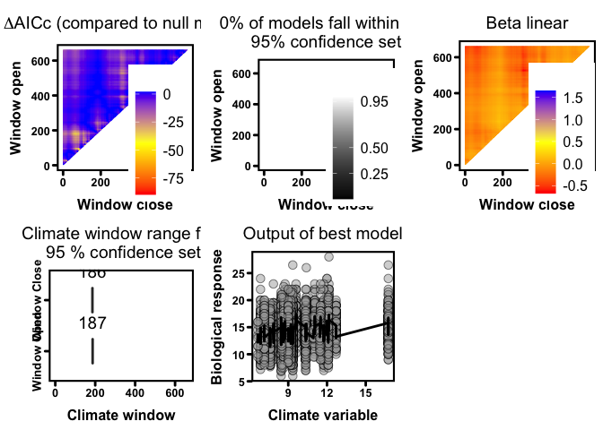<!-- -->

```r
plotdelta(dataset = ch_mass_sw_2[[1]]$Dataset)
```

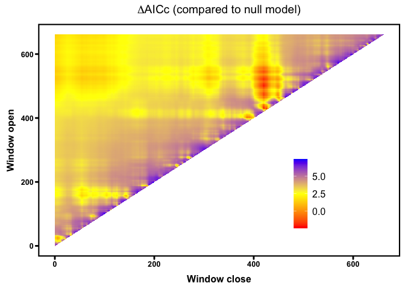<!-- -->

```r
plotdelta(dataset = ch_mass_sw_2[[2]]$Dataset)
```

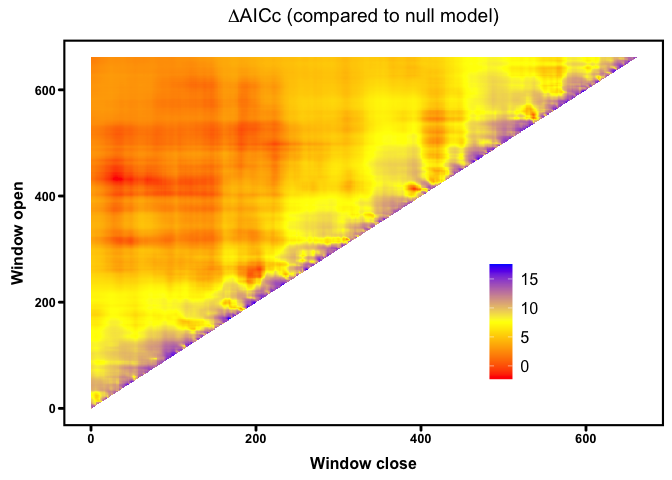<!-- -->


## Long term trends


```r
data_temp <- subset(ch_biom15, !duplicated(year))
temp_lm <- lm(temp_503_449 ~ year, data_temp)
weight_lm <- lm(weight ~ year, ch_biom15)
```

Decrease in weight (kg):

```r
(weight_lm$coeff[1] + 2018 * weight_lm$coeff[2]) - (weight_lm$coeff[1] + 1992 * weight_lm$coeff[2])
```

```
## (Intercept) 
##   -2.919858
```

Increase in temperature (°C):

```r
(temp_lm$coeff[1] + 2018 * temp_lm$coeff[2]) - (temp_lm$coeff[1] + 1992 * temp_lm$coeff[2])
```

```
## (Intercept) 
##     1.61847
```


```r
library(sjPlot)

sjPlot::tab_model(temp_lm,
    file = "Tables/model_temp_503_449s.doc",
    string.est = "Estimate",
    string.se = "SE",
    show.ci = F,
    show.se = T,
    show.stat = T,
    show.df = F,
    digits = 4,
    digits.rsq = 4
)
```

<table style="border-collapse:collapse; border:none;">
<tr>
<th style="border-top: double; text-align:center; font-style:normal; font-weight:bold; padding:0.2cm;  text-align:left; ">&nbsp;</th>
<th colspan="4" style="border-top: double; text-align:center; font-style:normal; font-weight:bold; padding:0.2cm; ">temp 503 449</th>
</tr>
<tr>
<td style=" text-align:center; border-bottom:1px solid; font-style:italic; font-weight:normal;  text-align:left; ">Predictors</td>
<td style=" text-align:center; border-bottom:1px solid; font-style:italic; font-weight:normal;  ">Estimate</td>
<td style=" text-align:center; border-bottom:1px solid; font-style:italic; font-weight:normal;  ">SE</td>
<td style=" text-align:center; border-bottom:1px solid; font-style:italic; font-weight:normal;  ">Statistic</td>
<td style=" text-align:center; border-bottom:1px solid; font-style:italic; font-weight:normal;  ">p</td>
</tr>
<tr>
<td style=" padding:0.2cm; text-align:left; vertical-align:top; text-align:left; ">(Intercept)</td>
<td style=" padding:0.2cm; text-align:left; vertical-align:top; text-align:center;  ">&#45;105.8285</td>
<td style=" padding:0.2cm; text-align:left; vertical-align:top; text-align:center;  ">51.9905</td>
<td style=" padding:0.2cm; text-align:left; vertical-align:top; text-align:center;  ">&#45;2.0355</td>
<td style=" padding:0.2cm; text-align:left; vertical-align:top; text-align:center;  ">0.053</td>
</tr>
<tr>
<td style=" padding:0.2cm; text-align:left; vertical-align:top; text-align:left; ">year</td>
<td style=" padding:0.2cm; text-align:left; vertical-align:top; text-align:center;  ">0.0622</td>
<td style=" padding:0.2cm; text-align:left; vertical-align:top; text-align:center;  ">0.0259</td>
<td style=" padding:0.2cm; text-align:left; vertical-align:top; text-align:center;  ">2.4006</td>
<td style=" padding:0.2cm; text-align:left; vertical-align:top; text-align:center;  "><strong>0.024</strong></td>
</tr>
<tr>
<td style=" padding:0.2cm; text-align:left; vertical-align:top; text-align:left; padding-top:0.1cm; padding-bottom:0.1cm; border-top:1px solid;">Observations</td>
<td style=" padding:0.2cm; text-align:left; vertical-align:top; padding-top:0.1cm; padding-bottom:0.1cm; text-align:left; border-top:1px solid;" colspan="4">27</td>
</tr>
<tr>
<td style=" padding:0.2cm; text-align:left; vertical-align:top; text-align:left; padding-top:0.1cm; padding-bottom:0.1cm;">R<sup>2</sup> / R<sup>2</sup> adjusted</td>
<td style=" padding:0.2cm; text-align:left; vertical-align:top; padding-top:0.1cm; padding-bottom:0.1cm; text-align:left;" colspan="4">0.1873 / 0.1548</td>
</tr>

</table>


```r
library(sjPlot)

sjPlot::tab_model(weight_lm,
    file = "Tables/model_weight.doc",
    string.est = "Estimate",
    string.se = "SE",
    show.ci = F,
    show.se = T,
    show.stat = T,
    show.df = F,
    digits = 4,
    digits.rsq = 4
)
```

<table style="border-collapse:collapse; border:none;">
<tr>
<th style="border-top: double; text-align:center; font-style:normal; font-weight:bold; padding:0.2cm;  text-align:left; ">&nbsp;</th>
<th colspan="4" style="border-top: double; text-align:center; font-style:normal; font-weight:bold; padding:0.2cm; ">weight</th>
</tr>
<tr>
<td style=" text-align:center; border-bottom:1px solid; font-style:italic; font-weight:normal;  text-align:left; ">Predictors</td>
<td style=" text-align:center; border-bottom:1px solid; font-style:italic; font-weight:normal;  ">Estimate</td>
<td style=" text-align:center; border-bottom:1px solid; font-style:italic; font-weight:normal;  ">SE</td>
<td style=" text-align:center; border-bottom:1px solid; font-style:italic; font-weight:normal;  ">Statistic</td>
<td style=" text-align:center; border-bottom:1px solid; font-style:italic; font-weight:normal;  ">p</td>
</tr>
<tr>
<td style=" padding:0.2cm; text-align:left; vertical-align:top; text-align:left; ">(Intercept)</td>
<td style=" padding:0.2cm; text-align:left; vertical-align:top; text-align:center;  ">239.3263</td>
<td style=" padding:0.2cm; text-align:left; vertical-align:top; text-align:center;  ">12.6384</td>
<td style=" padding:0.2cm; text-align:left; vertical-align:top; text-align:center;  ">18.9365</td>
<td style=" padding:0.2cm; text-align:left; vertical-align:top; text-align:center;  "><strong>&lt;0.001</strong></td>
</tr>
<tr>
<td style=" padding:0.2cm; text-align:left; vertical-align:top; text-align:left; ">year</td>
<td style=" padding:0.2cm; text-align:left; vertical-align:top; text-align:center;  ">&#45;0.1123</td>
<td style=" padding:0.2cm; text-align:left; vertical-align:top; text-align:center;  ">0.0063</td>
<td style=" padding:0.2cm; text-align:left; vertical-align:top; text-align:center;  ">&#45;17.8114</td>
<td style=" padding:0.2cm; text-align:left; vertical-align:top; text-align:center;  "><strong>&lt;0.001</strong></td>
</tr>
<tr>
<td style=" padding:0.2cm; text-align:left; vertical-align:top; text-align:left; padding-top:0.1cm; padding-bottom:0.1cm; border-top:1px solid;">Observations</td>
<td style=" padding:0.2cm; text-align:left; vertical-align:top; padding-top:0.1cm; padding-bottom:0.1cm; text-align:left; border-top:1px solid;" colspan="4">5635</td>
</tr>
<tr>
<td style=" padding:0.2cm; text-align:left; vertical-align:top; text-align:left; padding-top:0.1cm; padding-bottom:0.1cm;">R<sup>2</sup> / R<sup>2</sup> adjusted</td>
<td style=" padding:0.2cm; text-align:left; vertical-align:top; padding-top:0.1cm; padding-bottom:0.1cm; text-align:left;" colspan="4">0.0533 / 0.0531</td>
</tr>

</table>


```r
data_temp$year_temp <- data_temp$year - 1
plot_yr_temp <- ggplot(data_temp, aes(x = year_temp, y = temp_503_449)) +
    geom_point(size = 1, shape = 16, alpha = 0.7) +
    geom_smooth(method = "lm", formula = "y ~ x", col = "black") +
    scale_x_continuous(limits = c(1991, 2019), breaks = c(1992, 1997, 2002, 2007, 2013, 2018)) +
    xlab("") +
    ylab("Mean temperature (°C; May 9th - July 2nd)") +
    theme(
        legend.position = "none",
        panel.grid.major = element_blank(),
        panel.grid.minor = element_blank(),
        panel.background = element_blank(),
        axis.line = element_line(colour = "black")
    ) +
    annotate("text", x = 1991, y = 22.156, label = "(a)")

plot_yr_bm <- ggplot(ch_biom15, aes(x = year, y = weight)) +
    geom_point(size = 1, shape = 16, alpha = 0.1) +
    geom_smooth(method = "lm", formula = "y ~ x", col = "black") +
    scale_x_continuous(limits = c(1991, 2019), breaks = c(1992, 1997, 2002, 2007, 2013, 2018)) +
    xlab("Year") +
    ylab("Body mass of juvenile Alpine Chamois (kg)") +
    theme(
        legend.position = "none",
        panel.grid.major = element_blank(),
        panel.grid.minor = element_blank(),
        panel.background = element_blank(),
        axis.line = element_line(colour = "black")
    ) +
    annotate("text", x = 1991, y = 30, label = "(b)")
```


```r
grid.arrange(
    plot_yr_temp, plot_yr_bm,
    nrow = 2
)
```

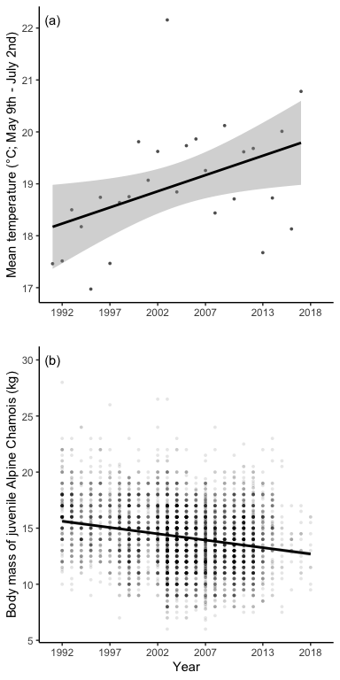

