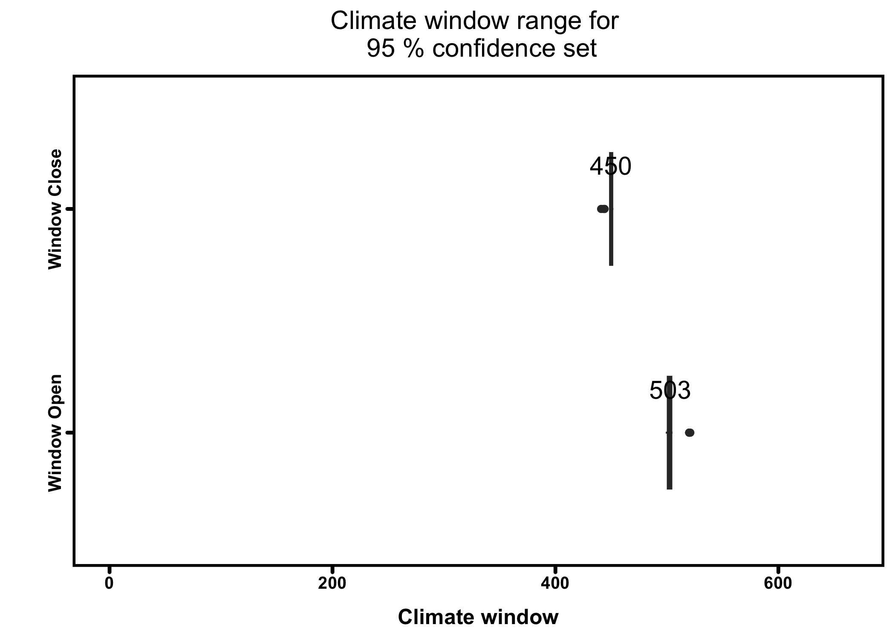
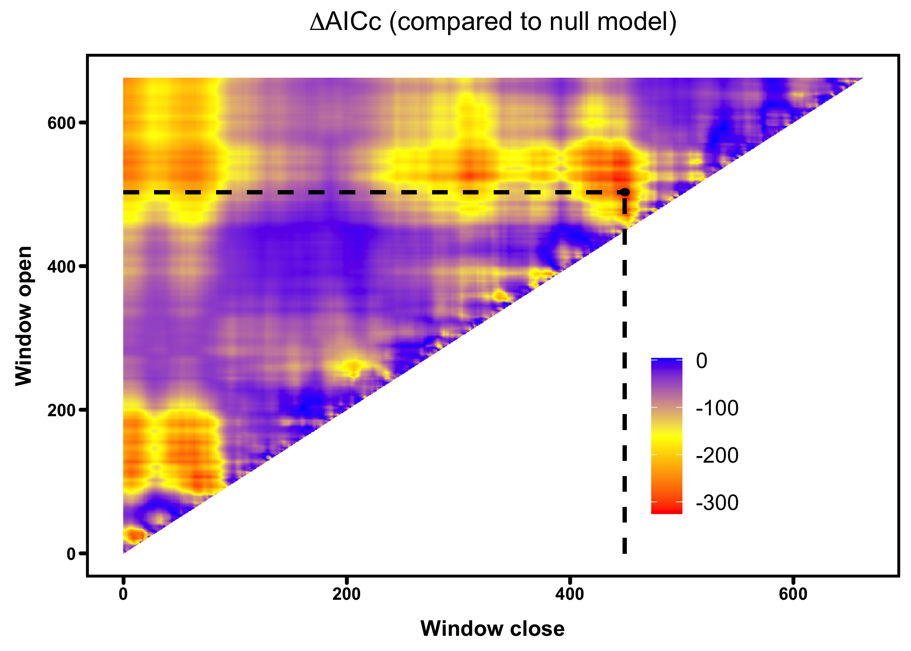
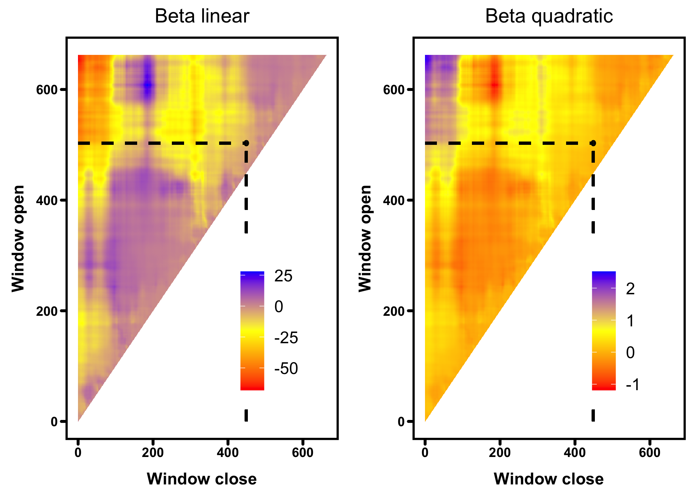
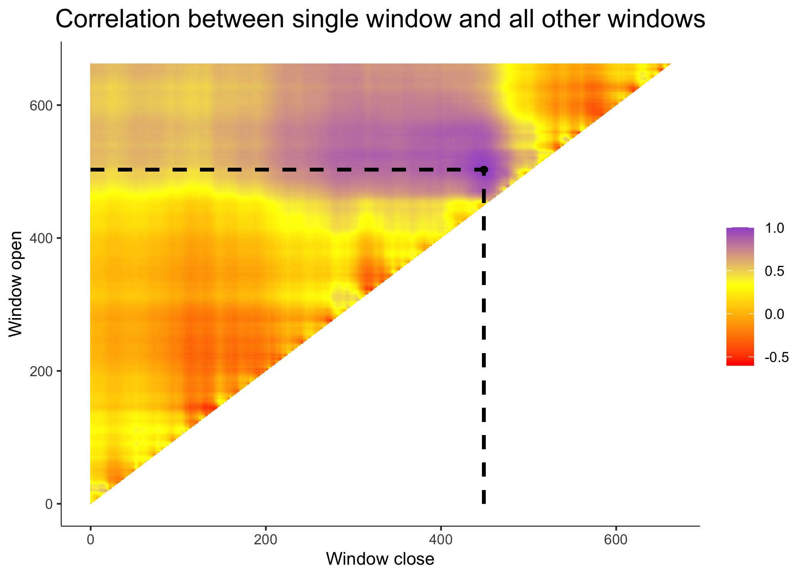
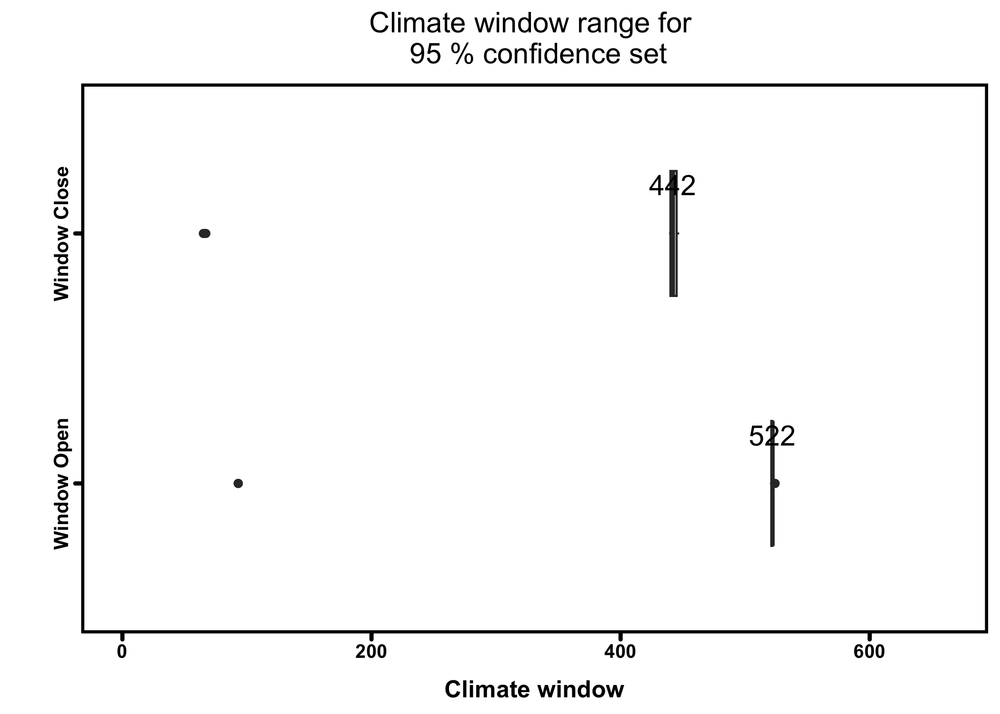
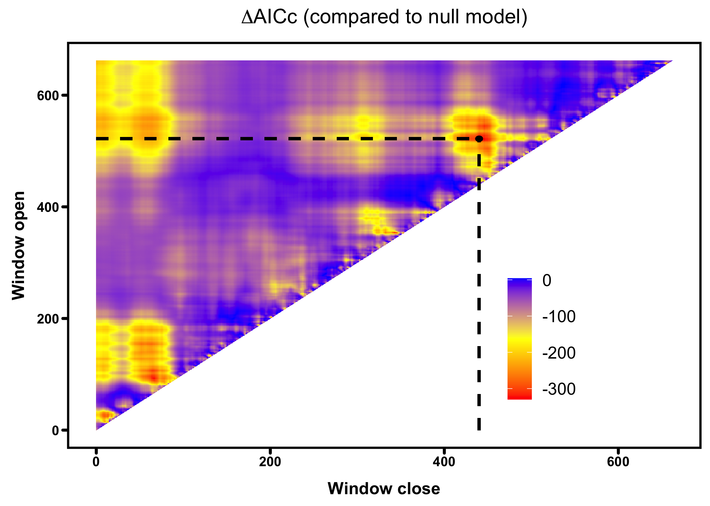
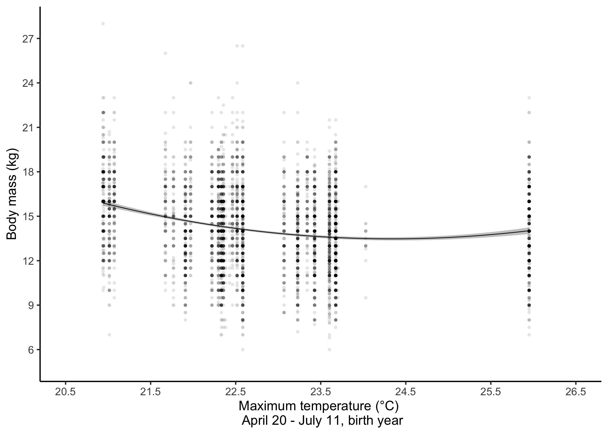
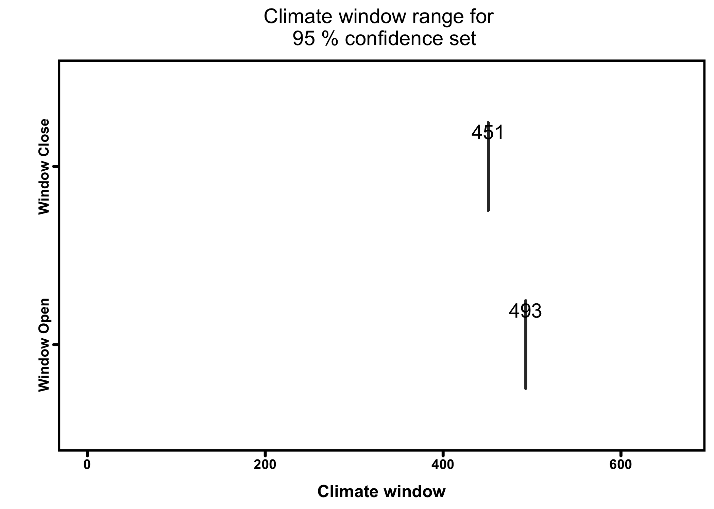
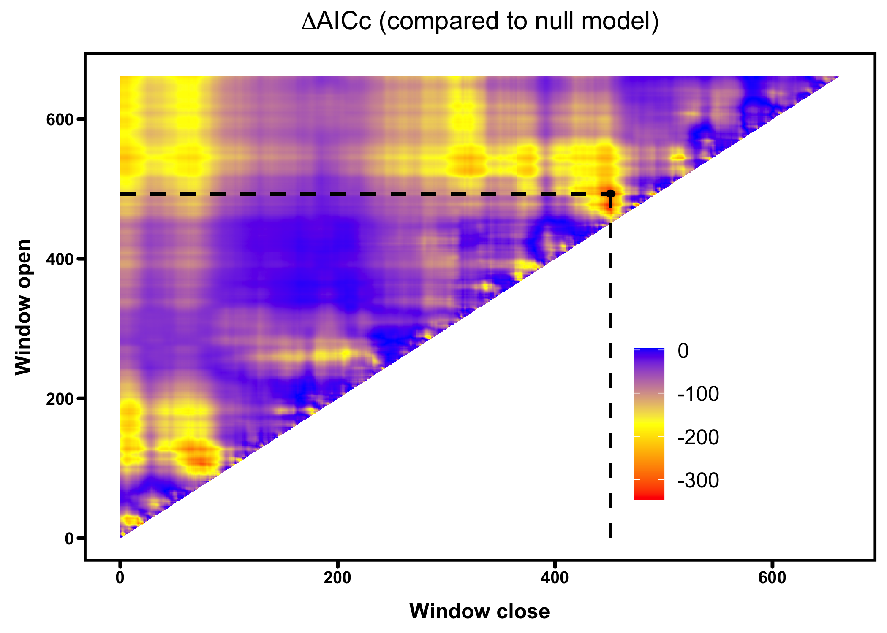
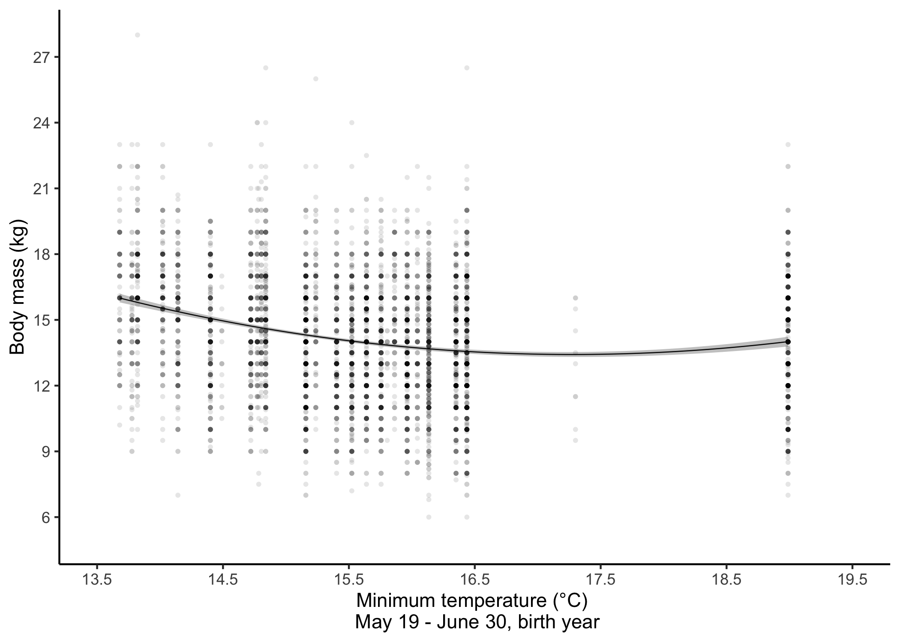

# Authors' list and affiliations

Giulia Masoero^1,2*, Kristina Georgieva Gencheva^3, Noémie Ioset^4, Louis-Félix Bersier^4, Federico Tettamanti^5,6, Pierre Bize^2,3

^1 Department of Biology, University of Ottawa, Canada

^2 Swiss Ornithological Institute, Seerose 1, 6204 Sempach, Switzerland 

^3 School of Biological Sciences, University of Aberdeen, United Kingdom

^4 Department of Biology, University of Fribourg, Chemin du Musée 10, Fribourg, Switzerland

^5 Studio alpino Tettamanti, La Campagna d Zora 15, 6678 Lodano, Switzerland

^6 Ufficio della Caccia e della Pesca del Cantone Ticino, Bellinzona, Switzerland (old address)

__*Corresponding author__: giulia.masoero@gmail.com


## ORCIDs

__GM__: 0000-0003-4429-7726

__LFB__: 0000-0001-9552-8032

__PB__: 0000-0002-6759-4371


# Abstract and keywords


__Abstract__: Although climate change is considered to be partly responsible for the size change observed in numerous species, the relevance of this hypothesis for the ungulates remains debated. We used body mass measurements of 5635 yearlings (i.e. 1.5 years old) Alpine chamois (_Rupicapra rupicapra_) harvested in September in the Swiss Alps (Ticino canton) from 1992 to 2018. In our study area, during this period, yearlings shrank by ca. 3 kg while temperatures between May and July rose by 1.7°C. We identified that warmer temperatures during birth and the early suckling period (May 9 to July 2 in the year of birth) had the strongest impact on yearling mass. Further analyses of year-detrended mass and temperature data indicate that this result was not simply due to changes in both variables over years, but that increases in temperature during this particularly sensitive time window for development and growth are responsible for the decrease in body mass of yearling chamois. Altogether, our results suggest that rising temperatures in the Alpine regions could significantly affect the ecology and evolution of this wild ungulate.


__Keywords__: climate change, climwin, ungulates, life stages, temperature, elevation

__Journal__: Royal Society Open Science


# Libraries and datasets

## Libraries

```r
knitr::opts_chunk$set(
    fig.path = "figures/",
    dev = c("png", "tiff", "postscript", "pdf"), # for papers ("png", "tiff")
    dpi = 300
)

# load the packages
library(dplyr)
```

```
## 
## Attaching package: 'dplyr'
```

```
## The following objects are masked from 'package:stats':
## 
##     filter, lag
```

```
## The following objects are masked from 'package:base':
## 
##     intersect, setdiff, setequal, union
```

```r
library(snakecase)
library(climwin)
```

```
## Loading required package: ggplot2
```

```
## Use suppressPackageStartupMessages() to eliminate package startup messages
```

```
## Loading required package: gridExtra
```

```
## 
## Attaching package: 'gridExtra'
```

```
## The following object is masked from 'package:dplyr':
## 
##     combine
```

```
## Loading required package: Matrix
```

```
## To learn how to use climwin see our vignette. 
## See help documentation and release notes for details on changes.
```

```r
library(tidyr)
```

```
## 
## Attaching package: 'tidyr'
```

```
## The following objects are masked from 'package:Matrix':
## 
##     expand, pack, unpack
```

```r
library(ggplot2)
library(effects)
```

```
## Loading required package: carData
```

```
## lattice theme set by effectsTheme()
## See ?effectsTheme for details.
```

```r
library(lme4)
library(lmerTest)
```

```
## 
## Attaching package: 'lmerTest'
```

```
## The following object is masked from 'package:lme4':
## 
##     lmer
```

```
## The following object is masked from 'package:stats':
## 
##     step
```

```r
library(stringr)
library(MuMIn)
```

## Session information
R session information is printed here for repeatability.

```r
sessionInfo()
```

```
## R version 4.3.2 (2023-10-31)
## Platform: aarch64-apple-darwin20 (64-bit)
## Running under: macOS Sonoma 14.2.1
## 
## Matrix products: default
## BLAS:   /System/Library/Frameworks/Accelerate.framework/Versions/A/Frameworks/vecLib.framework/Versions/A/libBLAS.dylib 
## LAPACK: /Library/Frameworks/R.framework/Versions/4.3-arm64/Resources/lib/libRlapack.dylib;  LAPACK version 3.11.0
## 
## locale:
## [1] en_US.UTF-8/en_US.UTF-8/en_US.UTF-8/C/en_US.UTF-8/en_US.UTF-8
## 
## time zone: Europe/Zurich
## tzcode source: internal
## 
## attached base packages:
## [1] stats     graphics  grDevices utils     datasets  methods   base     
## 
## other attached packages:
##  [1] MuMIn_1.47.5     stringr_1.5.1    lmerTest_3.1-3   lme4_1.1-35.1    effects_4.2-2   
##  [6] carData_3.0-5    tidyr_1.3.1      climwin_1.2.3    Matrix_1.6-5     gridExtra_2.3   
## [11] ggplot2_3.4.4    snakecase_0.11.1 dplyr_1.1.4     
## 
## loaded via a namespace (and not attached):
##  [1] sass_0.4.8          utf8_1.2.4          generics_0.1.3      stringi_1.8.3      
##  [5] lattice_0.22-5      digest_0.6.34       magrittr_2.0.3      timechange_0.3.0   
##  [9] evaluate_0.23       grid_4.3.2          fastmap_1.1.1       plyr_1.8.9         
## [13] jsonlite_1.8.8      nnet_7.3-19         DBI_1.2.2           reshape_0.8.9      
## [17] survival_3.5-8      purrr_1.0.2         fansi_1.0.6         scales_1.3.0       
## [21] numDeriv_2016.8-1.1 jquerylib_0.1.4     cli_3.6.2           mitools_2.4        
## [25] rlang_1.1.3         munsell_0.5.0       splines_4.3.2       withr_3.0.0        
## [29] cachem_1.0.8        yaml_2.3.8          tools_4.3.2         nloptr_2.0.3       
## [33] minqa_1.2.6         colorspace_2.1-0    boot_1.3-29         vctrs_0.6.5        
## [37] R6_2.5.1            lubridate_1.9.3     stats4_4.3.2        lifecycle_1.0.4    
## [41] MASS_7.3-60.0.1     insight_0.19.8      pkgconfig_2.0.3     pillar_1.9.0       
## [45] bslib_0.6.1         gtable_0.3.4        RcppRoll_0.3.0      glue_1.7.0         
## [49] Rcpp_1.0.12         xfun_0.42           tibble_3.2.1        tidyselect_1.2.0   
## [53] knitr_1.45          survey_4.2-1        htmltools_0.5.7     nlme_3.1-164       
## [57] rmarkdown_2.25      compiler_4.3.2      evd_2.3-6.1
```

## The datasets
The data analysed in this study are the records of the Ticino hunting bags from 1992 to 2018. In Ticino, hunting starts at the beginning of September and the harvest plan is mostly completed within three weeks.

Data were collected from the Alps in Ticino, the southernmost canton of Switzerland, over an area of 2700 km2 with an elevation varying from 250 to 2700 m asl. The climate in the mountain range is Alpine, with temperatures varying from mean temperatures of -12°C in winter to mean temperatures of 15.5°C in summer. The hottest and the sunniest month of the year is July with an average maximum temperature of 25°C, measured in the biggest city in the canton Lugano (World Weather & Climate Information, 2021). 

Overall, 34 017 animals were legally shot during the hunting period ranging from an age of 0.5 to 22.5 years old. All animals were sexed, aged and weighted (eviscerated). Both males and females have horns all year-round, even though female ones tend to be shorter. For the estimation of the age of the shot chamois, measurement of the teeth and the growth rings of their horns were used (Schroder and Elsner-Schack 1985).


```r
# load the data
ch_biom <- read.csv("data_chamois_yearlings.csv", stringsAsFactors = TRUE, na = c("", "NA"))
clim <- read.csv("data_swiss_weather.csv", stringsAsFactors = TRUE, na = c("", "NA", "-"))

colnames(ch_biom) <- snakecase::to_snake_case(colnames(ch_biom))

# fixing some variables
ch_biom$date_ymd <- as.Date(paste(ch_biom$year, ch_biom$month, ch_biom$day), "%Y %m %d")
clim$date_ymd <- as.Date(clim$date, "%d/%m/%y")
ch_biom$year_f <- as.factor(ch_biom$year)
```


### Subset

 Due to the nature of the dataset, only information on individuals shot in September was available, so for the purpose of this study, only a 1.5-year-old animals were considered (7127 individuals, 3257 females and 3870 males). As chamois are usually weaned at 3 to 6 months of age (Scornavacca et al. 2018), a 1.5-year-old individual has been feeding on their own for nearly a year, is fully grown but still very vulnerable to external abiotic and biotic threats due to the decrease in maternal care and increase in active grazing behaviour. 


```r
ch_biom15 <- ch_biom[, c("year", "year_f", "date_ymd", "elevation", "age", "sex", "weight")] %>%
    drop_na()

boxplot(ch_biom15$weight ~ ch_biom15$year)
```


```r
# standardising elevation
ch_biom15$elevation_sc <- (ch_biom15$elevation - mean(ch_biom15$elevation, na.rm = TRUE)) /
    sd(ch_biom15$elevation, na.rm = TRUE)
```


# Supplementary Material 1

## Weather correlations

Daily mean ambient temperature (°C) from 1990 until 2018 (all the years needed for the analysis) was obtained from a Swiss meteorological station in the city of Lugano (273 m asl), within the harvesting area. 

As this weather station is at a lower elevation compared to the harvesting area of the Chamois, we tested here for correlations with 2 higher elevation stations, both located close to the town of Acquarossa. 

The first one is located in Comprovasco (Coordinates: 714984/146451, Elevation: 575m a.s.l). 


```r
cor.test(clim$temp_mean_lugano, clim$temp_mean_comprovasco, method = "pearson", na.action = "omit")
```

```
## 
## 	Pearson's product-moment correlation
## 
## data:  clim$temp_mean_lugano and clim$temp_mean_comprovasco
## t = 478.83, df = 7653, p-value < 2.2e-16
## alternative hypothesis: true correlation is not equal to 0
## 95 percent confidence interval:
##  0.9829776 0.9844254
## sample estimates:
##       cor 
## 0.9837175
```

```r
plot(clim$temp_mean_lugano, clim$temp_mean_comprovasco)
```


The second one is located on the Cima del Simano (Coordinates: 717775/146825, Elevation: 2580m a.s.l). 


```r
cor.test(clim$temp_mean_lugano, clim$temp_mean_simano, method = "pearson", na.action = "omit")
```

```
## 
## 	Pearson's product-moment correlation
## 
## data:  clim$temp_mean_lugano and clim$temp_mean_simano
## t = 151.3, df = 8283, p-value < 2.2e-16
## alternative hypothesis: true correlation is not equal to 0
## 95 percent confidence interval:
##  0.8510851 0.8625318
## sample estimates:
##      cor 
## 0.856914
```

```r
plot(clim$temp_mean_lugano, clim$temp_mean_simano)
```


As both weather station present high correlation values with the station of Lugano, we decided to use this last weather station in the models as it includes all the years necessary for the analyses


```r
cor.test(clim$temp_mean_lugano, clim$temp_max_lugano, method = "pearson", na.action = "omit")
```

```
## 
## 	Pearson's product-moment correlation
## 
## data:  clim$temp_mean_lugano and clim$temp_max_lugano
## t = 655.95, df = 18626, p-value < 2.2e-16
## alternative hypothesis: true correlation is not equal to 0
## 95 percent confidence interval:
##  0.9784291 0.9796211
## sample estimates:
##       cor 
## 0.9790335
```

```r
plot(clim$temp_mean_lugano, clim$temp_max_lugano)
```


```r
cor.test(clim$temp_mean_lugano, clim$temp_min_lugano, method = "pearson", na.action = "omit")
```

```
## 
## 	Pearson's product-moment correlation
## 
## data:  clim$temp_mean_lugano and clim$temp_min_lugano
## t = 632.13, df = 18626, p-value < 2.2e-16
## alternative hypothesis: true correlation is not equal to 0
## 95 percent confidence interval:
##  0.9768293 0.9781087
## sample estimates:
##       cor 
## 0.9774779
```

```r
plot(clim$temp_mean_lugano, clim$temp_min_lugano)
```


# Supplementary Material 2

As the use of arbitrary climate periods do not always explain the biological response in the best way possible (van de Pol et al. 2016), we investigated the variation weight of yearling individuals in relation to the variation of mean ambient temperature using the R package climwin, and the function slidingwin which detects the exact time window when a biological variable is most strongly affected by climate (Bailey and van de Pol 2016). 

The overall approach for the climwin analysis is to compare the support by the data for competing hypotheses and to formalize them into regression models (van de Pol et al., 2016). 

Competing models are based upon a baseline model (called also null model, a model without weather effects) and ranked using the deltaAICc, or the difference in terms of the Akaike Information Criterion values calculated for a small sample size between the candidate model and baseline model. 

Climwin presents the models using the deltaAICc value relative to the baseline model (AICc of the candidate model - AICc of the baseline model). Therefore, a model that is more supported than the baseline model will have a negative deltaAICc value. On the same hand the model with the best support from the data, usually with lowest AICc, will be shown as the model with lowest deltaAICc in the climwin output. 

The baseline model was a linear model with the body mass of the yearling chamois in relation to sex and elevation. The function slidingwin creates a candidate set of competing models testing windows of different lengths for the weather variable of interest, in this study the mean daily ambient temperature (°C).  
 
Non-linear effects of temperature on body weight were taken into account by checking for both linear and quadratic trends. This is mentioned in the climwin output as func = lin (only linear term) func = quad (linear and quadratic terms).

As most of the chamois was shot during a two-week period at the end of September we chose an absolute time window for the analyses instead of an individual specific time window. As reference day we chose the last date of the shooting period (September 24th) and we looked for windows between September 24th and 662 days before (December 1st of 2 years before) to include the three critical periods of a young chamois life: gestation, lactation and yearling.  

## Base model

According to (van de Pol et al. 2016), we built a base model that includes variables that can affect the body size, i.e. elevation and sex.


```r
ch_basemod <- lm(
    weight ~
        sex + elevation_sc,
    data = ch_biom15
)

summary(ch_basemod)
```

```
## 
## Call:
## lm(formula = weight ~ sex + elevation_sc, data = ch_biom15)
## 
## Residuals:
##     Min      1Q  Median      3Q     Max 
## -8.2112 -1.8462  0.0268  1.7888 13.1538 
## 
## Coefficients:
##              Estimate Std. Error t value Pr(>|t|)    
## (Intercept)  13.90777    0.05335 260.668  < 2e-16 ***
## sexm          0.56032    0.07145   7.842 5.28e-15 ***
## elevation_sc  0.47942    0.03549  13.509  < 2e-16 ***
## ---
## Signif. codes:  0 '***' 0.001 '**' 0.01 '*' 0.05 '.' 0.1 ' ' 1
## 
## Residual standard error: 2.662 on 5632 degrees of freedom
## Multiple R-squared:  0.04296,	Adjusted R-squared:  0.04262 
## F-statistic: 126.4 on 2 and 5632 DF,  p-value: < 2.2e-16
```


## Climwin analysis

### Finding the best window
Using the function slidingwin allows to search for the best climatic window 


```r
ch_mass_sw <- slidingwin(
    baseline = ch_basemod,
    xvar = list(
        temp_mean = clim$temp_mean_lugano
    ),
    type = "absolute",
    refday = c(24, 9),
    range = c(662, 0),
    stat = c("mean"),
    cdate = clim$date_ymd,
    bdate = ch_biom15$date_ymd,
    func = c("lin", "quad"),
    cmissing = FALSE,
    cinterval = "day"
)
save(ch_mass_sw, file = "climwin_mass_01.rda")
```


### Investigating the models


```r
load(file = "climwin_mass_01.rda")
```

### The best linear and quadratic windows

The linear+quadratic term better explains the variation in the data (deltaAICc has the lowest value), sorted by deltaAICc such that the best supported model is on top. 

To investigate any other tested hypothesis we can simply replace the number in the double square brackets with the corresponding list number.


```r
ch_mass_sw$combos %>% arrange(DeltaAICc)
```

<div data-pagedtable="false">
  <script data-pagedtable-source type="application/json">
{"columns":[{"label":[""],"name":["_rn_"],"type":[""],"align":["left"]},{"label":["response"],"name":[1],"type":["chr"],"align":["left"]},{"label":["climate"],"name":[2],"type":["fct"],"align":["left"]},{"label":["type"],"name":[3],"type":["fct"],"align":["left"]},{"label":["stat"],"name":[4],"type":["fct"],"align":["left"]},{"label":["func"],"name":[5],"type":["fct"],"align":["left"]},{"label":["DeltaAICc"],"name":[6],"type":["dbl"],"align":["right"]},{"label":["WindowOpen"],"name":[7],"type":["int"],"align":["right"]},{"label":["WindowClose"],"name":[8],"type":["dbl"],"align":["right"]}],"data":[{"1":"weight","2":"temp_mean","3":"absolute","4":"mean","5":"quad","6":"-325.33","7":"503","8":"449","_rn_":"2"},{"1":"weight","2":"temp_mean","3":"absolute","4":"mean","5":"lin","6":"-262.02","7":"93","8":"78","_rn_":"1"}],"options":{"columns":{"min":{},"max":[10]},"rows":{"min":[10],"max":[10]},"pages":{}}}
  </script>
</div>

AICc of the Best model with the linear+quadratic term

```r
MuMIn::AICc(ch_mass_sw[[2]]$BestModel)
```

```
## [1] 26704.2
```

AICc of the Best model with the linear term

```r
MuMIn::AICc(ch_mass_sw[[1]]$BestModel)
```

```
## [1] 26767.51
```

AICc of the baseline model (no climatic factor), used by the function _slidingwin_ as a reference to obtain the deltaAICc values plotted above:

```r
MuMIn::AICc(ch_basemod)
```

```
## [1] 27029.52
```

Difference in terms of AICc between the Best model and the baseline model

```r
MuMIn::AICc(ch_mass_sw[[2]]$BestModel) - MuMIn::AICc(ch_basemod)
```

```
## [1] -325.3275
```

DeltaAICc as obtained using the function _slidingwin_ in the climwin package

```r
ch_mass_sw[[2]]$Dataset$deltaAICc[1]
```

```
## [1] -325.3275
```
They are the same!

### The 30 best quadratic models

The 30 best windows for the linear+quadratic models sorted by deltaAICc. All models with the lowest AICc (delta AICc between -325.3275 and -320.4684) present very comparable windows:
- WindowOpen and WindowClose similar (+- 3 days) to the one of the top model.


```r
head(ch_mass_sw[[2]]$Dataset, 30)
```

<div data-pagedtable="false">
  <script data-pagedtable-source type="application/json">
{"columns":[{"label":[""],"name":["_rn_"],"type":[""],"align":["left"]},{"label":["deltaAICc"],"name":[1],"type":["dbl"],"align":["right"]},{"label":["WindowOpen"],"name":[2],"type":["int"],"align":["right"]},{"label":["WindowClose"],"name":[3],"type":["dbl"],"align":["right"]},{"label":["ModelBeta"],"name":[4],"type":["dbl"],"align":["right"]},{"label":["Std.Error"],"name":[5],"type":["dbl"],"align":["right"]},{"label":["ModelBetaQ"],"name":[6],"type":["dbl"],"align":["right"]},{"label":["Std.ErrorQ"],"name":[7],"type":["dbl"],"align":["right"]},{"label":["ModelBetaC"],"name":[8],"type":["lgl"],"align":["right"]},{"label":["ModelInt"],"name":[9],"type":["dbl"],"align":["right"]},{"label":["Function"],"name":[10],"type":["chr"],"align":["left"]},{"label":["Furthest"],"name":[11],"type":["dbl"],"align":["right"]},{"label":["Closest"],"name":[12],"type":["dbl"],"align":["right"]},{"label":["Statistics"],"name":[13],"type":["chr"],"align":["left"]},{"label":["Type"],"name":[14],"type":["chr"],"align":["left"]},{"label":["K"],"name":[15],"type":["dbl"],"align":["right"]},{"label":["ModWeight"],"name":[16],"type":["dbl"],"align":["right"]},{"label":["sample.size"],"name":[17],"type":["int"],"align":["right"]},{"label":["Reference.day"],"name":[18],"type":["dbl"],"align":["right"]},{"label":["Reference.month"],"name":[19],"type":["dbl"],"align":["right"]},{"label":["Randomised"],"name":[20],"type":["chr"],"align":["left"]}],"data":[{"1":"-325.3275","2":"503","3":"449","4":"-8.526073","5":"0.06945118","6":"0.2059814","7":"0.03447871","8":"NA","9":"101.48261","10":"quad","11":"662","12":"0","13":"mean","14":"absolute","15":"0","16":"0.197304039","17":"27","18":"24","19":"9","20":"no","_rn_":"126811"},{"1":"-324.3307","2":"504","3":"449","4":"-8.531009","5":"0.06945764","6":"0.2066512","7":"0.03448269","8":"NA","9":"101.28849","10":"quad","11":"662","12":"0","13":"mean","14":"absolute","15":"0","16":"0.119865978","17":"27","18":"24","19":"9","20":"no","_rn_":"127316"},{"1":"-324.1087","2":"503","3":"450","4":"-8.433980","5":"0.06946480","6":"0.2040657","7":"0.03448220","8":"NA","9":"100.38707","10":"quad","11":"662","12":"0","13":"mean","14":"absolute","15":"0","16":"0.107273041","17":"27","18":"24","19":"9","20":"no","_rn_":"126810"},{"1":"-323.9020","2":"503","3":"451","4":"-8.289906","5":"0.06947091","6":"0.2008679","7":"0.03448253","8":"NA","9":"98.76755","10":"quad","11":"662","12":"0","13":"mean","14":"absolute","15":"0","16":"0.096740921","17":"27","18":"24","19":"9","20":"no","_rn_":"126809"},{"1":"-322.4771","2":"500","3":"451","4":"-8.012148","5":"0.06947658","6":"0.1919002","7":"0.03448501","8":"NA","9":"96.87078","10":"quad","11":"662","12":"0","13":"mean","14":"absolute","15":"0","16":"0.047444065","17":"27","18":"24","19":"9","20":"no","_rn_":"125300"},{"1":"-322.4249","2":"502","3":"449","4":"-8.362830","5":"0.06946858","6":"0.2011678","7":"0.03448662","8":"NA","9":"100.17178","10":"quad","11":"662","12":"0","13":"mean","14":"absolute","15":"0","16":"0.046222741","17":"27","18":"24","19":"9","20":"no","_rn_":"126307"},{"1":"-322.3136","2":"504","3":"450","4":"-8.415984","5":"0.06947628","6":"0.2041668","7":"0.03448861","8":"NA","9":"99.96364","10":"quad","11":"662","12":"0","13":"mean","14":"absolute","15":"0","16":"0.043720794","17":"27","18":"24","19":"9","20":"no","_rn_":"127315"},{"1":"-321.9411","2":"504","3":"451","4":"-8.276014","5":"0.06948357","6":"0.2010699","7":"0.03448941","8":"NA","9":"98.38653","10":"quad","11":"662","12":"0","13":"mean","14":"absolute","15":"0","16":"0.036291608","17":"27","18":"24","19":"9","20":"no","_rn_":"127314"},{"1":"-321.6449","2":"502","3":"450","4":"-8.280076","5":"0.06947898","6":"0.1994706","7":"0.03448879","8":"NA","9":"99.17425","10":"quad","11":"662","12":"0","13":"mean","14":"absolute","15":"0","16":"0.031295404","17":"27","18":"24","19":"9","20":"no","_rn_":"126306"},{"1":"-321.6095","2":"500","3":"450","4":"-8.142425","5":"0.06947810","6":"0.1947678","7":"0.03448787","8":"NA","9":"98.35008","10":"quad","11":"662","12":"0","13":"mean","14":"absolute","15":"0","16":"0.030746545","17":"27","18":"24","19":"9","20":"no","_rn_":"125301"},{"1":"-321.4714","2":"500","3":"449","4":"-8.206702","5":"0.06947401","6":"0.1960241","7":"0.03448848","8":"NA","9":"99.15699","10":"quad","11":"662","12":"0","13":"mean","14":"absolute","15":"0","16":"0.028694844","17":"27","18":"24","19":"9","20":"no","_rn_":"125302"},{"1":"-321.4440","2":"502","3":"451","4":"-8.128015","5":"0.06948451","6":"0.1960676","7":"0.03448916","8":"NA","9":"97.47645","10":"quad","11":"662","12":"0","13":"mean","14":"absolute","15":"0","16":"0.028304743","17":"27","18":"24","19":"9","20":"no","_rn_":"126305"},{"1":"-320.8221","2":"501","3":"449","4":"-8.253427","5":"0.06947835","6":"0.1977827","7":"0.03449090","8":"NA","9":"99.36526","10":"quad","11":"662","12":"0","13":"mean","14":"absolute","15":"0","16":"0.020740294","17":"27","18":"24","19":"9","20":"no","_rn_":"125804"},{"1":"-320.6037","2":"501","3":"451","4":"-8.032921","5":"0.06948889","6":"0.1930272","7":"0.03449114","8":"NA","9":"96.81583","10":"quad","11":"662","12":"0","13":"mean","14":"absolute","15":"0","16":"0.018594868","17":"27","18":"24","19":"9","20":"no","_rn_":"125802"},{"1":"-320.4684","2":"501","3":"450","4":"-8.180229","5":"0.06948574","6":"0.1963141","7":"0.03449178","8":"NA","9":"98.46618","10":"quad","11":"662","12":"0","13":"mean","14":"absolute","15":"0","16":"0.017377804","17":"27","18":"24","19":"9","20":"no","_rn_":"125803"},{"1":"-319.7069","2":"503","3":"448","4":"-8.639093","5":"0.06947794","6":"0.2086281","7":"0.03449611","8":"NA","9":"102.70820","10":"quad","11":"662","12":"0","13":"mean","14":"absolute","15":"0","16":"0.011875497","17":"27","18":"24","19":"9","20":"no","_rn_":"126812"},{"1":"-319.3401","2":"503","3":"452","4":"-8.095506","5":"0.06950795","6":"0.1965031","7":"0.03449620","8":"NA","9":"96.61216","10":"quad","11":"662","12":"0","13":"mean","14":"absolute","15":"0","16":"0.009885251","17":"27","18":"24","19":"9","20":"no","_rn_":"126808"},{"1":"-319.1422","2":"504","3":"448","4":"-8.655611","5":"0.06948170","6":"0.2095879","7":"0.03449878","8":"NA","9":"102.62904","10":"quad","11":"662","12":"0","13":"mean","14":"absolute","15":"0","16":"0.008954176","17":"27","18":"24","19":"9","20":"no","_rn_":"127317"},{"1":"-318.9980","2":"499","3":"451","4":"-7.833460","5":"0.06949485","6":"0.1868972","7":"0.03449516","8":"NA","9":"95.32558","10":"quad","11":"662","12":"0","13":"mean","14":"absolute","15":"0","16":"0.008331232","17":"27","18":"24","19":"9","20":"no","_rn_":"124799"},{"1":"-318.2425","2":"520","3":"444","4":"-9.246087","5":"0.06948470","6":"0.2347775","7":"0.03450557","8":"NA","9":"104.26824","10":"quad","11":"662","12":"0","13":"mean","14":"absolute","15":"0","16":"0.005710229","17":"27","18":"24","19":"9","20":"no","_rn_":"135537"},{"1":"-318.0607","2":"499","3":"450","4":"-7.963358","5":"0.06949732","6":"0.1897565","7":"0.03449819","8":"NA","9":"96.80136","10":"quad","11":"662","12":"0","13":"mean","14":"absolute","15":"0","16":"0.005213983","17":"27","18":"24","19":"9","20":"no","_rn_":"124800"},{"1":"-317.8235","2":"499","3":"449","4":"-8.026928","5":"0.06949446","6":"0.1910027","7":"0.03449908","8":"NA","9":"97.59883","10":"quad","11":"662","12":"0","13":"mean","14":"absolute","15":"0","16":"0.004630858","17":"27","18":"24","19":"9","20":"no","_rn_":"124801"},{"1":"-317.7725","2":"504","3":"452","4":"-8.104355","5":"0.06951847","6":"0.1972650","7":"0.03450184","8":"NA","9":"96.46198","10":"quad","11":"662","12":"0","13":"mean","14":"absolute","15":"0","16":"0.004514430","17":"27","18":"24","19":"9","20":"no","_rn_":"127313"},{"1":"-317.4150","2":"520","3":"443","4":"-9.415440","5":"0.06949095","6":"0.2386815","7":"0.03450836","8":"NA","9":"106.08440","10":"quad","11":"662","12":"0","13":"mean","14":"absolute","15":"0","16":"0.003775350","17":"27","18":"24","19":"9","20":"no","_rn_":"135538"},{"1":"-317.3508","2":"521","3":"444","4":"-8.982884","5":"0.06948843","6":"0.2289273","7":"0.03450806","8":"NA","9":"101.37255","10":"quad","11":"662","12":"0","13":"mean","14":"absolute","15":"0","16":"0.003656087","17":"27","18":"24","19":"9","20":"no","_rn_":"136059"},{"1":"-317.2732","2":"500","3":"452","4":"-7.786817","5":"0.06951633","6":"0.1867917","7":"0.03450075","8":"NA","9":"94.39165","10":"quad","11":"662","12":"0","13":"mean","14":"absolute","15":"0","16":"0.003516951","17":"27","18":"24","19":"9","20":"no","_rn_":"125299"},{"1":"-317.2406","2":"520","3":"441","4":"-9.745340","5":"0.06949120","6":"0.2459945","7":"0.03450894","8":"NA","9":"109.72914","10":"quad","11":"662","12":"0","13":"mean","14":"absolute","15":"0","16":"0.003460187","17":"27","18":"24","19":"9","20":"no","_rn_":"135540"},{"1":"-317.0627","2":"505","3":"449","4":"-8.309614","5":"0.06949808","6":"0.2017381","7":"0.03450580","8":"NA","9":"98.80677","10":"quad","11":"662","12":"0","13":"mean","14":"absolute","15":"0","16":"0.003165715","17":"27","18":"24","19":"9","20":"no","_rn_":"127822"},{"1":"-316.9437","2":"521","3":"441","4":"-9.497182","5":"0.06949116","6":"0.2406157","7":"0.03450961","8":"NA","9":"106.94294","10":"quad","11":"662","12":"0","13":"mean","14":"absolute","15":"0","16":"0.002982764","17":"27","18":"24","19":"9","20":"no","_rn_":"136062"},{"1":"-316.8651","2":"521","3":"440","4":"-9.588748","5":"0.06949160","6":"0.2422760","7":"0.03450975","8":"NA","9":"108.09463","10":"quad","11":"662","12":"0","13":"mean","14":"absolute","15":"0","16":"0.002867787","17":"27","18":"24","19":"9","20":"no","_rn_":"136063"}],"options":{"columns":{"min":{},"max":[10]},"rows":{"min":[10],"max":[10]},"pages":{}}}
  </script>
</div>

#### Windows plot

It's possible to extract the time windows of all the best supported models (i.e. multi-model inference). This panel shows the opening and closing points of the time windows that were best supported by the data, here those models that made up 95% model confidence set. 

```r
plotwin(ch_mass_sw[[2]]$Dataset)
```




#### Delta plot
The variation in deltaAICc between time windows can be better investigated using the following plot:


```r
plotdelta(dataset = ch_mass_sw[[2]]$Dataset, arrow = TRUE)
```



Warmer areas shows values with the lowest deltaAICc (i.e. "best models"). As explained by van de Pol et al., 2016, these deltaAICc landscapes of the different time windows shows multiple peaks (red areas) instead of a clear single peak. This can indicate the presence of multiple (e.g. possibly both long- and short-lag) weather signals within the same weather variable, but it can also occur due to collinearity or chance. 

The evidence for multiple signals can be therefore investigated by adding the best supported of the weather windows to the baseline model, and re-fitting all the different time windows again: this tests whether there is still strong model support for the second best (e.g. short-lag) weather window once the other best supported (e.g. long-lag) weather window has been accounted for in the baseline model (here in the Step 2).


#### Beta plot
This panel shows the model support (deltaAICc) for all fitted time windows tried, shown for each combination of Window open (y-axis) and Window close (x-axis). Models with the lowest deltaAICc (red) are the best supported (colours show the deltaAICc levels compared to the null model, see legend). Strongly supported windows will often be grouped together. 

```r
plotbetas(ch_mass_sw[[2]]$Dataset, arrow = TRUE)
```




#### Autocollinearity

Correlation between the mean temperature during the best supported time window and the mean temperature over all other time windows.


```r
autocoll <- autowin(
    reference = ch_mass_sw[[2]],
    baseline = ch_basemod,
    xvar = list(
        temp_mean = clim$temp_mean_lugano
    ),
    type = "absolute",
    refday = c(24, 9),
    range = c(662, 0),
    stat = "mean",
    cdate = clim$date_ymd,
    bdate = ch_biom15$date_ymd,
    func = "quad",
    cmissing = FALSE,
    cinterval = "day"
)
save(autocoll, file = "climwin_autocall_tmean.rda")
```


```r
load(file = "climwin_autocall_tmean.rda")
plotcor(autocoll, type = "A", arrow = TRUE)
```



## Main results
### The best window
Dates of the best window (as if compared to year of harvest 2018)

```r
as.Date("2018/09/24", format = "%Y/%m/%d") - ch_mass_sw$combos$WindowOpen[[2]]
```

```
## [1] "2017-05-09"
```

```r
as.Date("2018/09/24", format = "%Y/%m/%d") - ch_mass_sw$combos$WindowClose[[2]]
```

```
## [1] "2017-07-02"
```

### The model

I can add the new temperature variable for the extracted time window to the original dataset:

```r
# The best supported climate variable can be attached
# to the original dataset for further analyses

ch_biom15$temp_503_449 <- ch_mass_sw[[2]]$BestModelData$climate
```


```r
ch_final <- lm(
    weight ~
        sex + elevation_sc +
        temp_503_449 + I(temp_503_449^2),
    data = ch_biom15
)

knitr::kable(car::Anova(ch_final),
    caption =
        "ANOVA Chi-square table", digits = 4
)
```


Table: ANOVA Chi-square table

|                  |     Sum Sq|   Df|  F value| Pr(>F)|
|:-----------------|----------:|----:|--------:|------:|
|sex               |   376.4787|    1|  56.3169|      0|
|elevation_sc      |  1346.7154|    1| 201.4533|      0|
|temp_503_449      |  1190.6640|    1| 178.1098|      0|
|I(temp_503_449^2) |  1086.7630|    1| 162.5674|      0|
|Residuals         | 37636.5467| 5630|       NA|     NA|


Sex difference estimated by the model:

```r
emmeans::emmeans(ch_final, "sex")
```

```
##  sex emmean     SE   df lower.CL upper.CL
##  f     13.6 0.0559 5630     13.5     13.8
##  m     14.2 0.0517 5630     14.1     14.3
## 
## Confidence level used: 0.95
```

#### Figure

```r
ch_final2 <- lm(
    weight ~
        sex + elevation +
        temp_503_449 + I(temp_503_449^2),
    data = ch_biom15
)

eff_data <- data.frame(effects::effect("temp_503_449",
    ch_final2,
    partial.residuals = TRUE
))

plot_temp <- ggplot(eff_data, aes(x = temp_503_449, y = fit)) +
    geom_line(linewidth = 0.3) +
    geom_ribbon(
        data = eff_data, aes(ymin = lower, ymax = upper),
        linetype = 0, alpha = 0.3
    ) +
    xlab("Temperature (°C) \n May 9 - July 2, birth year") +
    theme(
        legend.position = "none",
        panel.grid.major = element_blank(),
        panel.grid.minor = element_blank(),
        panel.background = element_blank(),
        axis.line = element_line(colour = "black")
    ) +
    geom_point(
        data = ch_biom15,
        aes(x = temp_503_449, y = weight),
        size = 1, shape = 16, alpha = 0.1
    ) +
    ylab("Body mass (kg)") +
    scale_y_continuous(limits = c(6, 28), breaks = seq(0, 35, 3)) +
    scale_x_continuous(limits = c(16.5, 22.5), breaks = seq(16.5, 22.5, 1)) +
    annotate("text", x = 16.5, y = 28, label = "(a)")


eff_data <- data.frame(effects::effect("elevation",
    ch_final2,
    partial.residuals = T
))

plot_alt <- ggplot(eff_data, aes(x = elevation, y = fit)) +
    geom_line(linewidth = 0.3) +
    geom_ribbon(
        data = eff_data, aes(ymin = lower, ymax = upper),
        linetype = 0, alpha = 0.3
    ) +
    xlab("Elevation (m a.s.l)") +
    ylab("") +
    scale_y_continuous(limits = c(6, 28), breaks = seq(0, 35, 3)) +
    scale_x_continuous(limits = c(200, 2600), breaks = seq(200, 2600, 600)) +
    theme(
        legend.position = "none",
        panel.grid.major = element_blank(),
        panel.grid.minor = element_blank(),
        panel.background = element_blank(),
        axis.line = element_line(colour = "black")
    ) +
    geom_point(
        data = ch_biom15,
        aes(x = elevation, y = weight),
        size = 1, shape = 16, alpha = 0.1
    ) +
    annotate("text", x = 200, y = 28, label = "(b)")
```


```r
cowplot::plot_grid(
    plot_temp, plot_alt,
    nrow = 1, align = "h"
)
```


Note that the quadratic model is heuristic and does not imply that the relationship is parabolic over the whole range of temperatures.

### Last step: Randwin

Using randwin to randomize the identity of the chamois we are able to check if the window that was found before is actually important, or the relationship was just random.


```r
# Performing randamization to identify
# likelyhood of of dignals occuring by chance

ch_mass_rand100 <- randwin(
    repeats = 100,
    baseline = ch_basemod,
    xvar = list(Temp = clim$temp_mean_lugano),
    type = "absolute",
    refday = c(24, 9),
    range = c(662, 0),
    stat = "mean",
    cdate = clim$date_ymd,
    bdate = ch_biom15$date_ymd,
    func = c("lin", "quad"),
    cmissing = FALSE,
    cinterval = "day",
    window = "sliding"
)
save(ch_mass_rand100, file = "climwin_mass_randomization.rda")
```


```r
load("climwin_mass_randomization.rda")

pvalue(
    datasetrand = ch_mass_rand100[[1]],
    dataset = ch_mass_sw[[1]]$Dataset, metric = "C", sample.size = 27
)
```

```
## [1] 0.0006882519
```

```r
pvalue(
    datasetrand = ch_mass_rand100[[2]],
    dataset = ch_mass_sw[[2]]$Dataset, metric = "C", sample.size = 50
)
```

```
## Warning in pvalue(datasetrand = ch_mass_rand100[[2]], dataset = ch_mass_sw[[2]]$Dataset, : Pc will
## be overly conservative when sample size is greater than 47
```

```
## [1] 3.144653e-06
```

The randomization process shows that the window is actually important.

## Long term changes


```r
data_temp <- subset(ch_biom15, !duplicated(year))
temp_lm <- lm(temp_503_449 ~ year, data_temp)
weight_lm <- lm(weight ~ year, ch_biom15)
```


```r
knitr::kable(car::Anova(temp_lm),
    caption =
        "ANOVA Chi-square table", digits = 4
)
```


Table: ANOVA Chi-square table

|          |  Sum Sq| Df| F value| Pr(>F)|
|:---------|-------:|--:|-------:|------:|
|year      |  6.3471|  1|   5.763| 0.0241|
|Residuals | 27.5339| 25|      NA|     NA|

```r
knitr::kable(car::Anova(weight_lm),
    caption =
        "ANOVA Chi-square table", digits = 4
)
```


Table: ANOVA Chi-square table

|          |    Sum Sq|   Df|  F value| Pr(>F)|
|:---------|---------:|----:|--------:|------:|
|year      |  2222.902|    1| 317.2453|      0|
|Residuals | 39469.785| 5633|       NA|     NA|


Decrease in weight (kg):

```r
(weight_lm$coeff[1] + 2018 * weight_lm$coeff[2]) - (weight_lm$coeff[1] + 1992 * weight_lm$coeff[2])
```

```
## (Intercept) 
##   -2.919858
```

Increase in temperature (°C) for the period May 9 - July 2:

```r
(temp_lm$coeff[1] + 2018 * temp_lm$coeff[2]) - (temp_lm$coeff[1] + 1992 * temp_lm$coeff[2])
```

```
## (Intercept) 
##     1.61847
```


```r
plot_yr_temp <- ggplot(data_temp, aes(x = year, y = temp_503_449)) +
    geom_point(size = 1, shape = 16, alpha = 0.7) +
    geom_smooth(method = "lm", formula = "y ~ x", col = "black", linewidth = 0.3) +
    scale_x_continuous(
        limits = c(1992, 2018),
        breaks = c(1992, 1997, 2002, 2007, 2013, 2018),
        labels = c(1992, 1997, 2002, 2007, 2013, 2018) - 1
    ) +
    xlab("") +
    ylab("Temperature (°C) \n May 9 - July 2, birth year") +
    theme(
        legend.position = "none",
        panel.grid.major = element_blank(),
        panel.grid.minor = element_blank(),
        panel.background = element_blank(),
        axis.line = element_line(colour = "black")
    ) +
    scale_y_continuous(limits = c(16.5, 22.5), breaks = seq(16.5, 22.5, 1)) +
    annotate("text", x = 1992, y = 22.5, label = "(a)")

plot_yr_bm <- ggplot(ch_biom15, aes(x = year, y = weight)) +
    geom_point(size = 1, shape = 16, alpha = 0.08) +
    geom_smooth(method = "lm", formula = "y ~ x", col = "black", linewidth = 0.3) +
    scale_x_continuous(limits = c(1992, 2018), breaks = c(1992, 1997, 2002, 2007, 2013, 2018)) +
    xlab("Year") +
    ylab("Body mass (kg)") +
    theme(
        legend.position = "none",
        panel.grid.major = element_blank(),
        panel.grid.minor = element_blank(),
        panel.background = element_blank(),
        axis.line = element_line(colour = "black")
    ) +
    scale_y_continuous(limits = c(6, 28), breaks = seq(0, 30, 3)) +
    annotate("text", x = 1992, y = 30, label = "(b)")
```


## Detrended changes

Here we ran year-detrended analyses to demonstrate that year is not confounding the relationship between body mass and temperature. We extracted the residuals of linear regressions between mass and year and between temperature and year, and then ran a linear model with the residuals of body mass in relation to the residuals of temperature. 


```r
data_temp$temp_503_449_resid <- temp_lm$resid
ch_biom15$weight_resid <- weight_lm$resid

ch_biom152 <- merge(
    ch_biom15,
    data_temp[c(
        "year",
        "temp_503_449_resid"
    )]
)
```


```r
resid_qlm1 <- lm(
    weight_resid ~ temp_503_449_resid + I(temp_503_449_resid^2),
    ch_biom152
)
knitr::kable(car::Anova(resid_qlm1),
    caption =
        "ANOVA Chi-square table", digits = 4
)
```


Table: ANOVA Chi-square table

|                        |     Sum Sq|   Df| F value| Pr(>F)|
|:-----------------------|----------:|----:|-------:|------:|
|temp_503_449_resid      |   612.2390|    1| 88.7625|      0|
|I(temp_503_449_resid^2) |   278.1285|    1| 40.3231|      0|
|Residuals               | 38846.6790| 5632|      NA|     NA|

```r
eff_data <- data.frame(effects::effect("temp_503_449_resid",
    resid_qlm1,
    partial.residuals = TRUE
))


plot_resid_qlm1 <- ggplot(eff_data, aes(x = temp_503_449_resid, y = fit)) +
    geom_line(linewidth = 0.3) +
    geom_ribbon(
        data = eff_data, aes(ymin = lower, ymax = upper),
        linetype = 0, alpha = 0.3
    ) +
    xlab("Temperature (°C) residuals \n May 9 - July 2, birth year") +
    ylab("Body mass (kg) residuals") +
    theme(
        legend.position = "none",
        panel.grid.major = element_blank(),
        panel.grid.minor = element_blank(),
        panel.background = element_blank(),
        axis.line = element_line(colour = "black")
    ) +
    geom_point(data = ch_biom152, aes(x = temp_503_449_resid, y = weight_resid), size = 1, shape = 16, alpha = 0.1) +
    scale_y_continuous(limits = c(-10, 15), breaks = seq(-10, 15, 5)) +
    scale_x_continuous(limits = c(-2, 3.5)) +
    annotate("text", x = -2, y = 15, label = "(c)")
```


__Figure__


```r
cowplot::plot_grid(
    plot_yr_temp, plot_yr_bm, plot_resid_qlm1,
    ncol = 1, align = "v"
)
```

<div class="figure">

<p class="caption">Annual trend of (a) average temperature between May 9 and July 2 and (b) body mass of harvested 1.5-year-old Alpine chamois between 1992 and 2018, and (c) year-detrended relationship between body mass and temperature. Detrended values in (c) are residuals from linear models in (a) and (b). Each dot is one observation (darker dots representing a higher number of observations in (b)); fitted lines are shown with 95% confidence intervals (shaded areas).</p>
</div>


# Supplementary Material 3

Analyses with the minimum and maximum temperature, same base model as in Supplementary Material 2

## Climwin analysis

### Finding the best windows
Using the function slidingwin allows to search for the best climatic window 


```r
ch_mass_sw <- slidingwin(
    baseline = ch_basemod,
    xvar = list(
        temp_mean = clim$temp_mean_lugano,
        temp_max = clim$temp_max_lugano,
        temp_min = clim$temp_min_lugano
    ),
    type = "absolute",
    refday = c(24, 9),
    range = c(662, 0),
    stat = c("mean"),
    cdate = clim$date_ymd,
    bdate = ch_biom15$date_ymd,
    func = c("lin", "quad"),
    cmissing = FALSE,
    cinterval = "day"
)
save(ch_mass_sw, file = "climwin_mass_01b_r1.rda")
```


### Investigating the models


```r
load(file = "climwin_mass_01b_r1.rda")
```


### Results: overall best models


When considering mean, minimum or maximum temperature, the linear+quadratic term better explains the variation in the data (deltaAICc has the lowest value), sorted by deltaAICc such that the best supported model is on top. 

To investigate any other tested hypothesis we can simply replace the number in the double square brackets with the corresponding list number.


```r
ch_mass_sw$combos %>% arrange(DeltaAICc)
```

<div data-pagedtable="false">
  <script data-pagedtable-source type="application/json">
{"columns":[{"label":[""],"name":["_rn_"],"type":[""],"align":["left"]},{"label":["response"],"name":[1],"type":["chr"],"align":["left"]},{"label":["climate"],"name":[2],"type":["fct"],"align":["left"]},{"label":["type"],"name":[3],"type":["fct"],"align":["left"]},{"label":["stat"],"name":[4],"type":["fct"],"align":["left"]},{"label":["func"],"name":[5],"type":["fct"],"align":["left"]},{"label":["DeltaAICc"],"name":[6],"type":["dbl"],"align":["right"]},{"label":["WindowOpen"],"name":[7],"type":["int"],"align":["right"]},{"label":["WindowClose"],"name":[8],"type":["dbl"],"align":["right"]}],"data":[{"1":"weight","2":"temp_min","3":"absolute","4":"mean","5":"quad","6":"-346.32","7":"493","8":"451","_rn_":"6"},{"1":"weight","2":"temp_max","3":"absolute","4":"mean","5":"quad","6":"-329.94","7":"522","8":"440","_rn_":"5"},{"1":"weight","2":"temp_mean","3":"absolute","4":"mean","5":"quad","6":"-325.33","7":"503","8":"449","_rn_":"4"},{"1":"weight","2":"temp_max","3":"absolute","4":"mean","5":"lin","6":"-264.74","7":"93","8":"78","_rn_":"2"},{"1":"weight","2":"temp_min","3":"absolute","4":"mean","5":"lin","6":"-263.30","7":"492","8":"490","_rn_":"3"},{"1":"weight","2":"temp_mean","3":"absolute","4":"mean","5":"lin","6":"-262.02","7":"93","8":"78","_rn_":"1"}],"options":{"columns":{"min":{},"max":[10]},"rows":{"min":[10],"max":[10]},"pages":{}}}
  </script>
</div>


### Maximum temperature

Dates of this window (as if compared to year of harvest 2018)

```r
as.Date("2018/09/24", format = "%Y/%m/%d") - ch_mass_sw$combos$WindowOpen[[5]]
```

```
## [1] "2017-04-20"
```

```r
as.Date("2018/09/24", format = "%Y/%m/%d") - ch_mass_sw$combos$WindowClose[[5]]
```

```
## [1] "2017-07-11"
```

The maximum temperature has a wider window (earlier Open date and later Close date) compared to the mean temperature, but the window overlaps.

__windows plot__

It's possible to extract the time windows of all the best supported models (i.e. multi-model inference). This panel shows the opening and closing points of the time windows that were best supported by the data, here those models that made up 95% model confidence set. 

```r
plotwin(ch_mass_sw[[5]]$Dataset)
```



__delta plot__

```r
plotdelta(dataset = ch_mass_sw[[5]]$Dataset, arrow = TRUE)
```



__Interpretation__: Warmer areas shows values with the lowest deltaAICc (i.e. "best models"). As explained by van de Pol et al., 2016, these deltaAICc landscapes of the different time windows shows multiple peaks (red areas) instead of a clear single peak. This can indicate the presence of multiple (e.g. possibly both long- and short-lag) weather signals within the same weather variable, but it can also occur due to collinearity or chance. 

The evidence for multiple signals can be therefore investigated by adding the best supported of the weather windows to the baseline model, and re-fitting all the different time windows again: this tests whether there is still strong model support for the second best (e.g. short-lag) weather window once the other best supported (e.g. long-lag) weather window has been accounted for in the baseline model (here in the Step 2).


__Best model summary__

summary of the best model:

```r
summary(ch_mass_sw[[5]]$BestModel)
```

```
## 
## Call:
## lm(formula = yvar ~ sex + elevation_sc + climate + I(climate^2), 
##     data = modeldat)
## 
## Residuals:
##    Min     1Q Median     3Q    Max 
## -8.089 -1.803  0.037  1.744 11.889 
## 
## Coefficients:
##               Estimate Std. Error t value Pr(>|t|)    
## (Intercept)  137.42273    8.59970  15.980  < 2e-16 ***
## sexm           0.53317    0.06941   7.682 1.84e-14 ***
## elevation_sc   0.49317    0.03447  14.308  < 2e-16 ***
## climate      -10.21186    0.73323 -13.927  < 2e-16 ***
## I(climate^2)   0.20983    0.01560  13.451  < 2e-16 ***
## ---
## Signif. codes:  0 '***' 0.001 '**' 0.01 '*' 0.05 '.' 0.1 ' ' 1
## 
## Residual standard error: 2.584 on 5630 degrees of freedom
## Multiple R-squared:  0.09802,	Adjusted R-squared:  0.09738 
## F-statistic:   153 on 4 and 5630 DF,  p-value: < 2.2e-16
```

plot

```r
ch_biom15$clim_temporary <- ch_mass_sw[[5]]$BestModelData$climate

ch_mod_temporary <- lm(
    weight ~
        sex + elevation_sc + clim_temporary + I(clim_temporary^2),
    data = ch_biom15
)


eff_data <- data.frame(effects::effect("clim_temporary",
    ch_mod_temporary,
    partial.residuals = T
))

ggplot(eff_data, aes(x = clim_temporary, y = fit)) +
    geom_line(linewidth = 0.3) +
    geom_ribbon(
        data = eff_data, aes(ymin = lower, ymax = upper),
        linetype = 0, alpha = 0.3
    ) +
    xlab("Maximum temperature (°C) \n April 20 - July 11, birth year") +
    theme(
        legend.position = "none",
        panel.grid.major = element_blank(),
        panel.grid.minor = element_blank(),
        panel.background = element_blank(),
        axis.line = element_line(colour = "black")
    ) +
    geom_point(
        data = ch_biom15,
        aes(x = clim_temporary, y = weight),
        size = 1, shape = 16, alpha = 0.1
    ) +
    ylab("Body mass (kg)") +
    scale_y_continuous(limits = c(5, 28), breaks = seq(0, 35, 3)) +
    scale_x_continuous(limits = c(20.5, 26.5), breaks = seq(16.5, 28.5, 1))
```



### Minimum temperature

Dates of this window (as if compared to year of harvest 2018)

```r
as.Date("2018/09/24", format = "%Y/%m/%d") - ch_mass_sw$combos$WindowOpen[[6]]
```

```
## [1] "2017-05-19"
```

```r
as.Date("2018/09/24", format = "%Y/%m/%d") - ch_mass_sw$combos$WindowClose[[6]]
```

```
## [1] "2017-06-30"
```

The maximum temperature has a narrower window (laterer Open date and earlier Close date) compared to the mean temperature, but the window overlaps.

__windows plot__

It's possible to extract the time windows of all the best supported models (i.e. multi-model inference). This panel shows the opening and closing points of the time windows that were best supported by the data, here those models that made up 95% model confidence set. 

```r
plotwin(ch_mass_sw[[6]]$Dataset)
```



__delta plot__

```r
plotdelta(dataset = ch_mass_sw[[6]]$Dataset, arrow = TRUE)
```



__Interpretation__: Warmer areas shows values with the lowest deltaAICc (i.e. "best models"). As explained by van de Pol et al., 2016, these deltaAICc landscapes of the different time windows shows multiple peaks (red areas) instead of a clear single peak. This can indicate the presence of multiple (e.g. possibly both long- and short-lag) weather signals within the same weather variable, but it can also occur due to collinearity or chance. 

The evidence for multiple signals can be therefore investigated by adding the best supported of the weather windows to the baseline model, and re-fitting all the different time windows again: this tests whether there is still strong model support for the second best (e.g. short-lag) weather window once the other best supported (e.g. long-lag) weather window has been accounted for in the baseline model (here in the Step 2).


__Best model summary__

summary of the best model:

```r
summary(ch_mass_sw[[6]]$BestModel)
```

```
## 
## Call:
## lm(formula = yvar ~ sex + elevation_sc + climate + I(climate^2), 
##     data = modeldat)
## 
## Residuals:
##     Min      1Q  Median      3Q     Max 
## -7.9263 -1.8179 -0.0008  1.7591 12.4550 
## 
## Coefficients:
##              Estimate Std. Error t value Pr(>|t|)    
## (Intercept)  72.63273    3.81258  19.051  < 2e-16 ***
## sexm          0.52203    0.06932   7.531 5.83e-14 ***
## elevation_sc  0.48562    0.03441  14.112  < 2e-16 ***
## climate      -6.88972    0.46590 -14.788  < 2e-16 ***
## I(climate^2)  0.19943    0.01417  14.076  < 2e-16 ***
## ---
## Signif. codes:  0 '***' 0.001 '**' 0.01 '*' 0.05 '.' 0.1 ' ' 1
## 
## Residual standard error: 2.581 on 5630 degrees of freedom
## Multiple R-squared:  0.1006,	Adjusted R-squared:    0.1 
## F-statistic: 157.5 on 4 and 5630 DF,  p-value: < 2.2e-16
```

plot

```r
ch_biom15$clim_temporary <- ch_mass_sw[[6]]$BestModelData$climate

ch_mod_temporary <- lm(
    weight ~
        sex + elevation_sc + clim_temporary + I(clim_temporary^2),
    data = ch_biom15
)


eff_data <- data.frame(effects::effect("clim_temporary",
    ch_mod_temporary,
    partial.residuals = T
))

ggplot(eff_data, aes(x = clim_temporary, y = fit)) +
    geom_line(linewidth = 0.3) +
    geom_ribbon(
        data = eff_data, aes(ymin = lower, ymax = upper),
        linetype = 0, alpha = 0.3
    ) +
    xlab("Minimum temperature (°C) \n May 19 - June 30, birth year") +
    theme(
        legend.position = "none",
        panel.grid.major = element_blank(),
        panel.grid.minor = element_blank(),
        panel.background = element_blank(),
        axis.line = element_line(colour = "black")
    ) +
    geom_point(
        data = ch_biom15,
        aes(x = clim_temporary, y = weight),
        size = 1, shape = 16, alpha = 0.1
    ) +
    ylab("Body mass (kg)") +
    scale_y_continuous(limits = c(5, 28), breaks = seq(0, 35, 3)) +
    scale_x_continuous(limits = c(13.5, 19.5), breaks = seq(13.5, 28.5, 1))
```



# Acknowledgements
We thank the managers of the hunting and fishing cantonal office of Ticino, Switzerland, and the Swiss federal office of meteorology and climatology (MeteoSchweiz) for collecting the data and making them available to us. 

# Funding
This project has received funding from the European Union’s Horizon 2020 research and innovation programme under the Marie Skłodowska-Curie grant agreement No 101025938 to GM.

# Data accessibility
All data and code used for statistical analysis and plots are provided via the Open Science Framework at https://osf.io/p9c4m/ and were shared with editor and reviewers at first submission.

# Authors' contributions
G.M. and P.B. conceived the study. F.T. compiled the data, and L.F.B and N.I curated the data. G.M. and K.G.G. performed the statistical analyses with the help of P.B. G.M. and K.G.G. drafted the manuscript, and all authors provided inputs at all stages. All authors approved the final version of this manuscript, and all authors agree to be held accountable for the work performed therein.

# Competing interests
We declare we have no competing interests.

